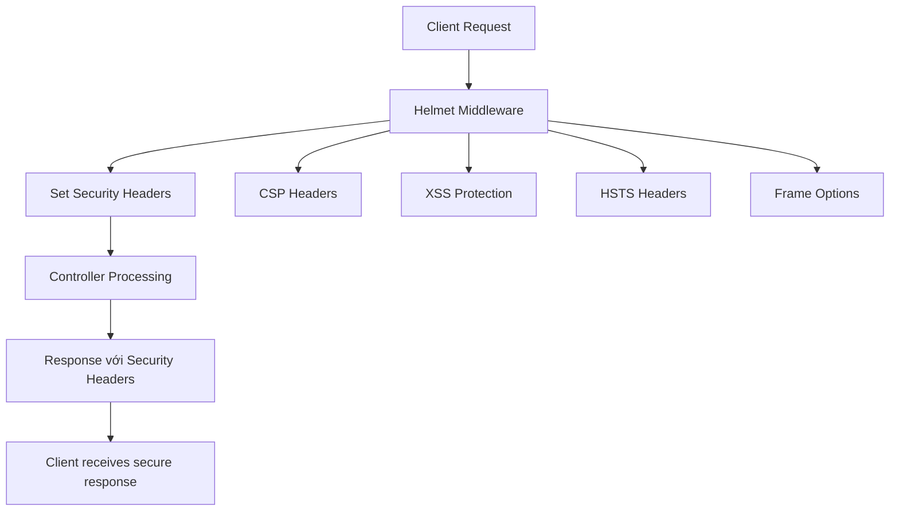

# 🛡️ Helmet trong NestJS

## 🔍 Helmet là gì?

**Helmet** là một middleware bảo mật mạnh mẽ giúp bảo vệ Express/NestJS applications bằng cách thiết lập các HTTP security headers. Trong ecosystem NestJS, Helmet đóng vai trò quan trọng:

- **Security Headers**: Tự động thiết lập các security headers quan trọng
- **Attack Prevention**: Bảo vệ khỏi common web vulnerabilities
- **Compliance**: Đáp ứng security standards và best practices
- **Zero Configuration**: Works out of the box với reasonable defaults

### 🔄 Cách hoạt động trong NestJS Ecosystem



**Execution Order & Lifecycle:**

1. **Request Interception**: Helmet intercepts all incoming requests
2. **Header Injection**: Adds security headers to response
3. **Middleware Chain**: Passes control to next middleware
4. **Response Enhancement**: Enhances outgoing response với security headers
5. **Client Protection**: Browser enforces security policies

### 🏗️ Security Headers Overview

```typescript
// Core Security Headers được Helmet provides
interface HelmetSecurityHeaders {
  'Content-Security-Policy': 'Prevents XSS, injection attacks'
  'X-DNS-Prefetch-Control': 'Controls DNS prefetching'
  'X-Frame-Options': 'Prevents clickjacking attacks'
  'X-Powered-By': 'Removes server fingerprinting'
  'Strict-Transport-Security': 'Enforces HTTPS connections'
  'X-Content-Type-Options': 'Prevents MIME type sniffing'
  'Referrer-Policy': 'Controls referrer information'
  'Permissions-Policy': 'Controls browser features'
}
```

---

## 🎯 Cách implement Helmet

### 1. Basic Implementation

**Bước 1: Cài đặt dependencies**

```bash
npm install --save helmet
npm install --save-dev @types/helmet
```

**Bước 2: Basic Setup trong main.ts**

```typescript
// src/main.ts
import { NestFactory } from '@nestjs/core'
import helmet from 'helmet'
import { AppModule } from './app.module'

async function bootstrap() {
  const app = await NestFactory.create(AppModule)

  // Basic Helmet setup với default configuration
  app.use(helmet())

  await app.listen(3000)
}

bootstrap()
```

**Response Headers được thiết lập:**

```http
Content-Security-Policy: default-src 'self';base-uri 'self';font-src 'self' https: data:;form-action 'self';frame-ancestors 'none';img-src 'self' data:;object-src 'none';script-src 'self';script-src-attr 'none';style-src 'self' https: 'unsafe-inline';upgrade-insecure-requests
Cross-Origin-Embedder-Policy: require-corp
Cross-Origin-Opener-Policy: same-origin
Cross-Origin-Resource-Policy: same-origin
Origin-Agent-Cluster: ?1
Referrer-Policy: no-referrer
Strict-Transport-Security: max-age=15552000; includeSubDomains
X-Content-Type-Options: nosniff
X-DNS-Prefetch-Control: off
X-Download-Options: noopen
X-Frame-Options: SAMEORIGIN
X-Permitted-Cross-Domain-Policies: none
X-XSS-Protection: 0
```

### 2. Custom Configuration cho Production

```typescript
// src/main.ts
import { NestFactory } from '@nestjs/core'
import helmet from 'helmet'

async function bootstrap() {
  const app = await NestFactory.create(AppModule)

  // Production-ready Helmet configuration
  app.use(
    helmet({
      // Content Security Policy
      contentSecurityPolicy: {
        directives: {
          defaultSrc: ["'self'"],
          styleSrc: [
            "'self'",
            "'unsafe-inline'", // Allow inline styles (use carefully)
            'https://fonts.googleapis.com',
            'https://cdn.jsdelivr.net',
          ],
          fontSrc: ["'self'", 'https://fonts.gstatic.com', 'https://cdn.jsdelivr.net'],
          imgSrc: [
            "'self'",
            'data:',
            'https:', // Allow HTTPS images
            'blob:', // Allow blob URLs for uploaded images
          ],
          scriptSrc: [
            "'self'",
            "'unsafe-eval'", // Allow eval (needed for some libraries)
            'https://cdn.jsdelivr.net',
            'https://unpkg.com',
          ],
          connectSrc: [
            "'self'",
            'https://api.example.com', // Your API domains
            'https://*.amazonaws.com', // AWS services
            'wss:', // WebSocket connections
          ],
          frameSrc: [
            "'self'",
            'https://www.youtube.com', // Embedded videos
            'https://docs.google.com', // Google Docs embeds
          ],
          objectSrc: ["'none'"], // Disable object/embed tags
          upgradeInsecureRequests: [], // Force HTTPS
        },
      },

      // HTTP Strict Transport Security
      hsts: {
        maxAge: 31536000, // 1 year
        includeSubDomains: true,
        preload: true,
      },

      // Frame Options (prevent clickjacking)
      frameguard: {
        action: 'deny', // or 'sameorigin' for internal frames
      },

      // Remove X-Powered-By header
      hidePoweredBy: true,

      // Referrer Policy
      referrerPolicy: {
        policy: ['no-referrer-when-downgrade', 'strict-origin-when-cross-origin'],
      },

      // Permissions Policy (Feature Policy)
      permissionsPolicy: {
        camera: ['self'],
        microphone: ['self'],
        geolocation: ['self'],
        fullscreen: ['self'],
        payment: ['self'],
        usb: [], // Disable USB access
        bluetooth: [], // Disable Bluetooth access
      },

      // Cross-Origin policies
      crossOriginEmbedderPolicy: {
        policy: 'require-corp',
      },
      crossOriginOpenerPolicy: {
        policy: 'same-origin',
      },
      crossOriginResourcePolicy: {
        policy: 'cross-origin', // Allow cross-origin resources
      },

      // DNS Prefetch Control
      dnsPrefetchControl: {
        allow: false,
      },

      // X-Content-Type-Options
      noSniff: true,

      // Origin Agent Cluster
      originAgentCluster: true,

      // XSS Protection (disabled in modern browsers, use CSP instead)
      xssFilter: false,
    }),
  )

  await app.listen(3000)
}
```

### 3. Environment-specific Configuration

```typescript
// src/config/helmet.config.ts
export function getHelmetConfig() {
  const isProduction = process.env.NODE_ENV === 'production'
  const isDevelopment = process.env.NODE_ENV === 'development'

  const baseConfig = {
    contentSecurityPolicy: {
      directives: {
        defaultSrc: ["'self'"],
        styleSrc: ["'self'", 'https://fonts.googleapis.com'],
        fontSrc: ["'self'", 'https://fonts.gstatic.com'],
        imgSrc: ["'self'", 'data:', 'https:'],
        scriptSrc: ["'self'"],
        connectSrc: ["'self'"],
        frameSrc: ["'none'"],
        objectSrc: ["'none'"],
      },
    },
    hsts: {
      maxAge: 31536000,
      includeSubDomains: true,
      preload: true,
    },
    frameguard: { action: 'deny' },
    hidePoweredBy: true,
    noSniff: true,
    xssFilter: false,
  }

  if (isDevelopment) {
    return {
      ...baseConfig,
      contentSecurityPolicy: {
        directives: {
          ...baseConfig.contentSecurityPolicy.directives,
          scriptSrc: [
            "'self'",
            "'unsafe-eval'", // Allow eval for development
            "'unsafe-inline'", // Allow inline scripts for HMR
          ],
          styleSrc: [
            "'self'",
            "'unsafe-inline'", // Allow inline styles for HMR
            'https://fonts.googleapis.com',
          ],
          connectSrc: [
            "'self'",
            'ws:', // WebSocket for HMR
            'wss:',
            'http://localhost:*', // Development servers
          ],
        },
      },
      hsts: false, // Disable HSTS in development
    }
  }

  if (isProduction) {
    return {
      ...baseConfig,
      contentSecurityPolicy: {
        directives: {
          ...baseConfig.contentSecurityPolicy.directives,
          upgradeInsecureRequests: [], // Force HTTPS in production
          reportUri: '/api/csp-report', // CSP violation reporting
        },
      },
      expectCt: {
        maxAge: 86400,
        enforce: true,
        reportUri: '/api/ct-report',
      },
    }
  }

  return baseConfig
}

// src/main.ts
import helmet from 'helmet'
import { getHelmetConfig } from './config/helmet.config'

async function bootstrap() {
  const app = await NestFactory.create(AppModule)

  app.use(helmet(getHelmetConfig()))

  await app.listen(3000)
}
```

### 4. Advanced CSP Configuration

```typescript
// src/security/csp.config.ts
interface CSPConfig {
  nonce?: string
  reportUri?: string
  allowInlineStyles?: boolean
  allowInlineScripts?: boolean
  allowedDomains?: string[]
}

export class CSPConfigService {
  static generateNonce(): string {
    return Buffer.from(Date.now().toString() + Math.random().toString()).toString('base64')
  }

  static buildCSPDirectives(config: CSPConfig = {}) {
    const { nonce, reportUri, allowInlineStyles = false, allowInlineScripts = false, allowedDomains = [] } = config

    const directives: Record<string, string[]> = {
      defaultSrc: ["'self'"],

      // Script sources
      scriptSrc: [
        "'self'",
        ...(allowInlineScripts ? ["'unsafe-inline'"] : []),
        ...(nonce ? [`'nonce-${nonce}'`] : []),
        'https://cdn.jsdelivr.net',
        'https://unpkg.com',
        ...allowedDomains,
      ],

      // Style sources
      styleSrc: [
        "'self'",
        ...(allowInlineStyles ? ["'unsafe-inline'"] : []),
        'https://fonts.googleapis.com',
        'https://cdn.jsdelivr.net',
        ...allowedDomains,
      ],

      // Image sources
      imgSrc: ["'self'", 'data:', 'blob:', 'https:', ...allowedDomains],

      // Font sources
      fontSrc: ["'self'", 'https://fonts.gstatic.com', 'https://cdn.jsdelivr.net', ...allowedDomains],

      // Connection sources
      connectSrc: ["'self'", 'https://api.example.com', 'wss:', 'ws:', ...allowedDomains],

      // Frame sources
      frameSrc: ["'self'", 'https://www.youtube.com', 'https://player.vimeo.com', ...allowedDomains],

      // Media sources
      mediaSrc: ["'self'", 'https:', 'blob:', ...allowedDomains],

      // Object sources (disabled for security)
      objectSrc: ["'none'"],

      // Base URI
      baseUri: ["'self'"],

      // Form action
      formAction: ["'self'"],

      // Frame ancestors (prevent embedding)
      frameAncestors: ["'none'"],
    }

    // Add report URI if specified
    if (reportUri) {
      directives.reportUri = [reportUri]
    }

    return directives
  }

  static getHelmetConfigWithCSP(cspConfig: CSPConfig = {}) {
    return {
      contentSecurityPolicy: {
        directives: this.buildCSPDirectives(cspConfig),
        reportOnly: false, // Set to true for testing
      },

      // Additional security headers
      crossOriginEmbedderPolicy: {
        policy: 'require-corp',
      },

      crossOriginOpenerPolicy: {
        policy: 'same-origin',
      },

      crossOriginResourcePolicy: {
        policy: 'cross-origin',
      },

      dnsPrefetchControl: {
        allow: false,
      },

      frameguard: {
        action: 'deny',
      },

      hidePoweredBy: true,

      hsts: {
        maxAge: 31536000,
        includeSubDomains: true,
        preload: true,
      },

      ieNoOpen: true,

      noSniff: true,

      originAgentCluster: true,

      permittedCrossDomainPolicies: false,

      referrerPolicy: {
        policy: 'strict-origin-when-cross-origin',
      },

      xssFilter: false, // Use CSP instead
    }
  }
}
```

---

## 💡 Các cách sử dụng thông dụng

### 1. API-only Applications

```typescript
// src/main.ts - API-only configuration
import helmet from 'helmet'

async function bootstrap() {
  const app = await NestFactory.create(AppModule)

  // Minimal Helmet config for API-only apps
  app.use(
    helmet({
      // Disable CSP (not needed for API-only)
      contentSecurityPolicy: false,

      // Keep essential security headers
      hsts: {
        maxAge: 31536000,
        includeSubDomains: true,
      },

      frameguard: { action: 'deny' },
      hidePoweredBy: true,
      noSniff: true,

      // API-specific headers
      crossOriginResourcePolicy: {
        policy: 'cross-origin', // Allow cross-origin API calls
      },

      // Remove unnecessary headers for APIs
      dnsPrefetchControl: false,
      ieNoOpen: false,
      xssFilter: false,
    }),
  )

  // Enable CORS for API
  app.enableCors({
    origin: process.env.ALLOWED_ORIGINS?.split(',') || ['http://localhost:3000'],
    credentials: true,
    methods: ['GET', 'POST', 'PUT', 'DELETE', 'PATCH', 'OPTIONS'],
    allowedHeaders: ['Content-Type', 'Authorization', 'X-Requested-With'],
  })

  await app.listen(3000)
}
```

### 2. Full-stack Applications với Static Assets

```typescript
// src/main.ts - Full-stack application
import helmet from 'helmet'
import { join } from 'path'
import { ServeStaticModule } from '@nestjs/serve-static'

async function bootstrap() {
  const app = await NestFactory.create(AppModule)

  // Nonce generation for inline scripts
  const scriptNonce = Buffer.from(Date.now().toString()).toString('base64')

  app.use(
    helmet({
      contentSecurityPolicy: {
        directives: {
          defaultSrc: ["'self'"],

          // Allow inline scripts with nonce
          scriptSrc: [
            "'self'",
            `'nonce-${scriptNonce}'`,
            'https://cdnjs.cloudflare.com',
            'https://cdn.jsdelivr.net',
          ],

          // Allow inline styles (needed for CSS-in-JS)
          styleSrc: [
            "'self'",
            "'unsafe-inline'",
            'https://fonts.googleapis.com',
            'https://cdnjs.cloudflare.com',
          ],

          // Image sources
          imgSrc: [
            "'self'",
            'data:',
            'blob:',
            'https:', // Allow all HTTPS images
            // CDN domains
            'https://cdn.example.com',
            'https://images.unsplash.com',
          ],

          // Font sources
          fontSrc: [
            "'self'",
            'https://fonts.gstatic.com',
            'https://cdnjs.cloudflare.com',
          ],

          // API connections
          connectSrc: [
            "'self'",
            'https://api.example.com',
            'wss://ws.example.com',
            // Analytics
            'https://www.google-analytics.com',
            'https://analytics.google.com',
          ],

          // Embedded content
          frameSrc: [
            "'self'",
            'https://www.youtube.com',
            'https://player.vimeo.com',
            'https://docs.google.com',
          ],

          // Workers
          workerSrc: [
            "'self'",
            'blob:', // Service workers
          ],

          objectSrc: ["'none'"],
          baseUri: ["'self'"],
          formAction: ["'self'"],
          frameAncestors: ["'none'"],
          upgradeInsecureRequests: [],
        },
      },

      // HSTS configuration
      hsts: {
        maxAge: 31536000, // 1 year
        includeSubDomains: true,
        preload: true,
      },

      // Prevent clickjacking
      frameguard: { action: 'deny' },

      // Hide server information
      hidePoweredBy: true,

      // MIME type sniffing protection
      noSniff: true,

      // Referrer policy
      referrerPolicy: {
        policy: 'strict-origin-when-cross-origin',
      },

      // Feature Policy
      permissionsPolicy: {
        camera: ['self'],
        microphone: ['self'],
        geolocation: ['self'],
        fullscreen: ['self'],
        payment: ['self'],
        accelerometer: [],
        ambient-light-sensor: [],
        autoplay: [],
        battery: [],
        bluetooth: [],
        display-capture: [],
        document-domain: [],
        encrypted-media: [],
        execution-while-not-rendered: [],
        execution-while-out-of-viewport: [],
        gyroscope: [],
        magnetometer: [],
        midi: [],
        navigation-override: [],
        picture-in-picture: [],
        publickey-credentials-get: [],
        screen-wake-lock: [],
        sync-xhr: [],
        usb: [],
        web-share: [],
        xr-spatial-tracking: [],
      },
    }),
  )

  // Serve static files
  app.useStaticAssets(join(__dirname, '..', 'public'), {
    prefix: '/static/',
    // Add security headers for static files
    setHeaders: (res, path) => {
      if (path.endsWith('.js')) {
        res.setHeader('Content-Type', 'application/javascript')
        res.setHeader('X-Content-Type-Options', 'nosniff')
      }
      if (path.endsWith('.css')) {
        res.setHeader('Content-Type', 'text/css')
        res.setHeader('X-Content-Type-Options', 'nosniff')
      }
    },
  })

  await app.listen(3000)
}
```

### 3. CSP Violation Reporting

```typescript
// src/security/csp-report.controller.ts
import { Controller, Post, Body, Logger } from '@nestjs/common'
import { ApiTags, ApiOperation } from '@nestjs/swagger'

interface CSPViolationReport {
  'csp-report': {
    'document-uri': string
    referrer: string
    'violated-directive': string
    'effective-directive': string
    'original-policy': string
    disposition: string
    'blocked-uri': string
    'line-number': number
    'column-number': number
    'source-file': string
    'status-code': number
    'script-sample': string
  }
}

@ApiTags('security')
@Controller('api')
export class CSPReportController {
  private readonly logger = new Logger(CSPReportController.name)

  @Post('csp-report')
  @ApiOperation({ summary: 'Receive CSP violation reports' })
  async handleCSPViolation(@Body() report: CSPViolationReport) {
    const violation = report['csp-report']

    // Log violation for monitoring
    this.logger.warn('CSP Violation detected', {
      documentUri: violation['document-uri'],
      violatedDirective: violation['violated-directive'],
      blockedUri: violation['blocked-uri'],
      sourceFile: violation['source-file'],
      lineNumber: violation['line-number'],
      columnNumber: violation['column-number'],
      scriptSample: violation['script-sample'],
      userAgent: violation.referrer,
    })

    // Store in database for analysis
    await this.storeViolation(violation)

    // Alert if critical violation
    if (this.isCriticalViolation(violation)) {
      await this.alertSecurityTeam(violation)
    }

    return { status: 'received' }
  }

  @Post('ct-report')
  @ApiOperation({ summary: 'Receive Certificate Transparency reports' })
  async handleCTReport(@Body() report: any) {
    this.logger.warn('Certificate Transparency violation', report)
    return { status: 'received' }
  }

  private async storeViolation(violation: any) {
    // Implementation to store in database
    // This helps identify common violations and adjust CSP
  }

  private isCriticalViolation(violation: any): boolean {
    const criticalDirectives = ['script-src', 'object-src', 'base-uri', 'frame-ancestors']

    return criticalDirectives.some((directive) => violation['violated-directive'].includes(directive))
  }

  private async alertSecurityTeam(violation: any) {
    // Implementation to alert security team
    // Could be Slack, email, or monitoring system
  }
}
```

### 4. Dynamic CSP với Nonce Generation

```typescript
// src/security/csp-nonce.interceptor.ts
import { Injectable, NestInterceptor, ExecutionContext, CallHandler } from '@nestjs/common'
import { Observable } from 'rxjs'
import { tap } from 'rxjs/operators'
import { Response } from 'express'

@Injectable()
export class CSPNonceInterceptor implements NestInterceptor {
  intercept(context: ExecutionContext, next: CallHandler): Observable<any> {
    const response = context.switchToHttp().getResponse<Response>()

    // Generate unique nonce for this request
    const nonce = this.generateNonce()

    // Store nonce in response locals for template use
    response.locals.nonce = nonce

    // Update CSP header with nonce
    const existingCSP = response.getHeader('Content-Security-Policy') as string
    if (existingCSP) {
      const updatedCSP = existingCSP.replace(/script-src ([^;]+)/, `script-src $1 'nonce-${nonce}'`)
      response.setHeader('Content-Security-Policy', updatedCSP)
    }

    return next.handle().pipe(
      tap(() => {
        // Additional processing after response
      }),
    )
  }

  private generateNonce(): string {
    return Buffer.from(Date.now().toString() + Math.random().toString()).toString('base64')
  }
}

// src/templates/layout.hbs
// Usage trong Handlebars template
;`
<!DOCTYPE html>
<html>
<head>
  <title>Secure App</title>
  <!-- Inline script với nonce -->
  <script nonce="{{nonce}}">
    // Safe inline script
    console.log('This script is allowed by CSP')
  </script>
</head>
<body>
  {{{body}}}
  
  <!-- External script -->
  <script src="/static/app.js"></script>
</body>
</html>
`

// Apply interceptor globally
@Module({
  providers: [
    {
      provide: APP_INTERCEPTOR,
      useClass: CSPNonceInterceptor,
    },
  ],
})
export class AppModule {}
```

### 5. Helmet với Custom Middleware

```typescript
// src/security/custom-security.middleware.ts
import { Injectable, NestMiddleware } from '@nestjs/common'
import { Request, Response, NextFunction } from 'express'

@Injectable()
export class CustomSecurityMiddleware implements NestMiddleware {
  use(req: Request, res: Response, next: NextFunction) {
    // Custom security headers
    res.setHeader('X-Request-ID', this.generateRequestId())
    res.setHeader('X-API-Version', process.env.API_VERSION || '1.0')

    // Remove sensitive headers
    res.removeHeader('X-Powered-By')
    res.removeHeader('Server')

    // Add custom security headers
    res.setHeader('X-Content-Type-Options', 'nosniff')
    res.setHeader('X-Frame-Options', 'DENY')
    res.setHeader('X-XSS-Protection', '0') // Disabled in favor of CSP

    // Rate limiting info
    if (req.headers['x-rate-limit-remaining']) {
      res.setHeader('X-Rate-Limit-Remaining', req.headers['x-rate-limit-remaining'])
    }

    // Audit trail
    this.logSecurityEvent(req, res)

    next()
  }

  private generateRequestId(): string {
    return `req-${Date.now()}-${Math.random().toString(36).substr(2, 9)}`
  }

  private logSecurityEvent(req: Request, res: Response) {
    const securityContext = {
      requestId: res.getHeader('X-Request-ID'),
      ip: req.ip,
      userAgent: req.get('User-Agent'),
      method: req.method,
      url: req.originalUrl,
      timestamp: new Date().toISOString(),
      headers: {
        authorization: req.headers.authorization ? '[REDACTED]' : undefined,
        'x-api-key': req.headers['x-api-key'] ? '[REDACTED]' : undefined,
        'x-forwarded-for': req.headers['x-forwarded-for'],
        'x-real-ip': req.headers['x-real-ip'],
      },
    }

    // Log for security monitoring
    console.log('Security Event:', securityContext)
  }
}

// Apply custom middleware
@Module({
  providers: [CustomSecurityMiddleware],
})
export class SecurityModule implements NestModule {
  configure(consumer: MiddlewareConsumer) {
    consumer.apply(CustomSecurityMiddleware).forRoutes('*') // Apply to all routes
  }
}
```

---

## ⚠️ Các vấn đề thường gặp

### 1. CSP Blocking Legitimate Resources

**Vấn đề:**

```typescript
// ❌ Quá strict CSP blocks legitimate resources
app.use(
  helmet({
    contentSecurityPolicy: {
      directives: {
        scriptSrc: ["'self'"], // Blocks CDN scripts
        styleSrc: ["'self'"], // Blocks Google Fonts
        imgSrc: ["'self'"], // Blocks external images
      },
    },
  }),
)
```

**Giải pháp:**

```typescript
// ✅ Balanced CSP configuration
app.use(
  helmet({
    contentSecurityPolicy: {
      directives: {
        scriptSrc: [
          "'self'",
          'https://cdn.jsdelivr.net',
          'https://cdnjs.cloudflare.com',
          // Add specific trusted domains
        ],
        styleSrc: [
          "'self'",
          "'unsafe-inline'", // For CSS-in-JS (use with caution)
          'https://fonts.googleapis.com',
        ],
        imgSrc: [
          "'self'",
          'data:', // For base64 images
          'https:', // Allow all HTTPS images
        ],
        fontSrc: ["'self'", 'https://fonts.gstatic.com'],
      },
    },
  }),
)

// ✅ Report-only mode for testing
app.use(
  helmet({
    contentSecurityPolicy: {
      reportOnly: true, // Don't block, just report violations
      directives: {
        // Your directives
      },
    },
  }),
)
```

### 2. HSTS Issues với Development

**Vấn đề:**

```typescript
// ❌ HSTS enabled trong development
app.use(
  helmet({
    hsts: {
      maxAge: 31536000,
      includeSubDomains: true,
      preload: true,
    },
  }),
)
// Browser caches HSTS policy, causing issues với localhost
```

**Giải pháp:**

```typescript
// ✅ Environment-specific HSTS
app.use(
  helmet({
    hsts:
      process.env.NODE_ENV === 'production'
        ? {
            maxAge: 31536000,
            includeSubDomains: true,
            preload: true,
          }
        : false, // Disable HSTS in development
  }),
)

// ✅ Conditional HSTS based on protocol
app.use(
  helmet({
    hsts: (req, res) => {
      // Only enable HSTS for HTTPS requests
      return req.secure
        ? {
            maxAge: 31536000,
            includeSubDomains: true,
          }
        : false
    },
  }),
)
```

### 3. Frame Options Conflicts

**Vấn đề:**

```typescript
// ❌ Frame options too restrictive
app.use(
  helmet({
    frameguard: { action: 'deny' }, // Prevents ALL iframe embedding
  }),
)
// Blocks legitimate embeds like documentation, demos
```

**Giải pháp:**

```typescript
// ✅ Flexible frame options
app.use(
  helmet({
    frameguard: {
      action: 'sameorigin', // Allow same-origin framing
    },
  }),
)

// ✅ Route-specific frame options
@Controller('embed')
export class EmbedController {
  @Get('widget')
  @Header('X-Frame-Options', 'ALLOWALL') // Override for specific route
  getWidget() {
    return { widget: 'data' }
  }
}

// ✅ Dynamic frame options
app.use(
  helmet({
    frameguard: (req, res) => {
      // Allow framing for embed routes
      if (req.path.startsWith('/embed/')) {
        return { action: 'sameorigin' }
      }
      return { action: 'deny' }
    },
  }),
)
```

### 4. CSP Violations với Third-party Scripts

**Vấn đề:**

```javascript
// ❌ Third-party scripts injecting inline code
// Google Analytics, Facebook Pixel, etc. often use inline scripts
```

**Giải pháp:**

```typescript
// ✅ Specific allowances for trusted third-parties
app.use(
  helmet({
    contentSecurityPolicy: {
      directives: {
        scriptSrc: [
          "'self'",

          // Google Analytics
          'https://www.google-analytics.com',
          'https://www.googletagmanager.com',
          "'sha256-<hash-of-inline-script>'", // Specific hash for GA inline script

          // Facebook Pixel
          'https://connect.facebook.net',

          // Stripe
          'https://js.stripe.com',

          // For development only
          ...(process.env.NODE_ENV === 'development' ? ["'unsafe-inline'"] : []),
        ],

        connectSrc: [
          "'self'",
          'https://www.google-analytics.com',
          'https://analytics.google.com',
          'https://www.facebook.com',
          'https://api.stripe.com',
        ],
      },
    },
  }),
)

// ✅ CSP hash generation for inline scripts
function generateCSPHash(script: string): string {
  const crypto = require('crypto')
  const hash = crypto.createHash('sha256').update(script).digest('base64')
  return `'sha256-${hash}'`
}

// Usage
const inlineScript = 'console.log("Hello World")'
const scriptHash = generateCSPHash(inlineScript)
// Add to CSP: 'sha256-<generated-hash>'
```

---

## 🔧 Advanced Patterns

### 1. Custom Security Headers Factory

```typescript
// src/security/security-headers.factory.ts
interface SecurityConfig {
  environment: 'development' | 'staging' | 'production'
  apiOnly: boolean
  allowedOrigins: string[]
  cdnDomains: string[]
  reportUri?: string
}

export class SecurityHeadersFactory {
  static create(config: SecurityConfig) {
    const { environment, apiOnly, allowedOrigins, cdnDomains, reportUri } = config

    const baseConfig = {
      hidePoweredBy: true,
      noSniff: true,
      originAgentCluster: true,
      referrerPolicy: {
        policy: 'strict-origin-when-cross-origin' as const,
      },
    }

    // API-only configuration
    if (apiOnly) {
      return {
        ...baseConfig,
        contentSecurityPolicy: false, // Not needed for APIs
        crossOriginResourcePolicy: {
          policy: 'cross-origin' as const,
        },
        frameguard: { action: 'deny' as const },
        hsts:
          environment === 'production'
            ? {
                maxAge: 31536000,
                includeSubDomains: true,
                preload: true,
              }
            : false,
      }
    }

    // Full web application configuration
    const webConfig = {
      ...baseConfig,

      contentSecurityPolicy: {
        directives: {
          defaultSrc: ["'self'"],

          scriptSrc: [
            "'self'",
            ...cdnDomains,
            ...(environment === 'development' ? ["'unsafe-inline'", "'unsafe-eval'"] : []),
          ],

          styleSrc: [
            "'self'",
            "'unsafe-inline'", // Often needed for CSS-in-JS
            'https://fonts.googleapis.com',
            ...cdnDomains,
          ],

          imgSrc: ["'self'", 'data:', 'blob:', 'https:'],

          fontSrc: ["'self'", 'https://fonts.gstatic.com', ...cdnDomains],

          connectSrc: ["'self'", ...allowedOrigins, ...(environment === 'development' ? ['ws:', 'wss:'] : [])],

          frameSrc: environment === 'production' ? ["'none'"] : ["'self'"],
          objectSrc: ["'none'"],
          baseUri: ["'self'"],
          formAction: ["'self'"],
          frameAncestors: ["'none'"],

          ...(environment === 'production' && {
            upgradeInsecureRequests: [],
            ...(reportUri && { reportUri: [reportUri] }),
          }),
        },

        reportOnly: environment !== 'production',
      },

      frameguard: { action: 'deny' as const },

      hsts:
        environment === 'production'
          ? {
              maxAge: 31536000,
              includeSubDomains: true,
              preload: true,
            }
          : false,

      crossOriginEmbedderPolicy: {
        policy: 'require-corp' as const,
      },

      crossOriginOpenerPolicy: {
        policy: 'same-origin' as const,
      },

      crossOriginResourcePolicy: {
        policy: 'same-origin' as const,
      },

      permissionsPolicy: {
        camera: ['self'],
        microphone: ['self'],
        geolocation: ['self'],
        payment: ['self'],
        usb: [],
        bluetooth: [],
        'ambient-light-sensor': [],
        accelerometer: [],
        gyroscope: [],
        magnetometer: [],
      },
    }

    return webConfig
  }
}

// Usage
const securityConfig = SecurityHeadersFactory.create({
  environment: process.env.NODE_ENV as any,
  apiOnly: false,
  allowedOrigins: process.env.ALLOWED_ORIGINS?.split(',') || [],
  cdnDomains: ['https://cdn.jsdelivr.net', 'https://cdnjs.cloudflare.com'],
  reportUri: '/api/csp-report',
})

app.use(helmet(securityConfig))
```

### 2. Runtime CSP Updates

```typescript
// src/security/dynamic-csp.service.ts
@Injectable()
export class DynamicCSPService {
  private baseCsp: string = ''
  private allowedDomains = new Set<string>()

  constructor() {
    this.initializeBaseCsp()
  }

  private initializeBaseCsp() {
    const directives = [
      "default-src 'self'",
      "script-src 'self' https://cdn.jsdelivr.net",
      "style-src 'self' 'unsafe-inline' https://fonts.googleapis.com",
      "img-src 'self' data: https:",
      "font-src 'self' https://fonts.gstatic.com",
      "connect-src 'self'",
      "frame-src 'none'",
      "object-src 'none'",
      "base-uri 'self'",
      "form-action 'self'",
      "frame-ancestors 'none'",
    ]

    this.baseCsp = directives.join('; ')
  }

  addAllowedDomain(domain: string, directive: string = 'connect-src') {
    this.allowedDomains.add(`${directive}:${domain}`)
  }

  removeAllowedDomain(domain: string, directive: string = 'connect-src') {
    this.allowedDomains.delete(`${directive}:${domain}`)
  }

  generateCSPHeader(): string {
    let csp = this.baseCsp

    // Add dynamic domains
    for (const entry of this.allowedDomains) {
      const [directive, domain] = entry.split(':')
      const regex = new RegExp(`(${directive}[^;]+)`)
      csp = csp.replace(regex, `$1 ${domain}`)
    }

    return csp
  }

  // Middleware to apply dynamic CSP
  middleware() {
    return (req: any, res: any, next: any) => {
      const csp = this.generateCSPHeader()
      res.setHeader('Content-Security-Policy', csp)
      next()
    }
  }
}

// Usage trong feature modules
@Module({
  controllers: [IntegrationController],
  providers: [DynamicCSPService],
})
export class IntegrationModule implements OnModuleInit {
  constructor(private cspService: DynamicCSPService) {}

  onModuleInit() {
    // Add third-party domains when module loads
    this.cspService.addAllowedDomain('https://api.stripe.com', 'connect-src')
    this.cspService.addAllowedDomain('https://js.stripe.com', 'script-src')
  }
}
```

### 3. Security Headers Testing

```typescript
// src/security/security-headers.spec.ts
import { Test, TestBootstrap } from '@nestjs/testing'
import helmet from 'helmet'
import * as request from 'supertest'

describe('Security Headers', () => {
  let app: any

  beforeEach(async () => {
    const moduleRef = await Test.createTestingModule({
      imports: [AppModule],
    }).compile()

    app = moduleRef.createNestApplication()
    app.use(helmet())
    await app.init()
  })

  afterEach(async () => {
    await app.close()
  })

  it('should include security headers', async () => {
    const response = await request(app.getHttpServer()).get('/').expect(200)

    // Test essential security headers
    expect(response.headers['x-content-type-options']).toBe('nosniff')
    expect(response.headers['x-frame-options']).toBeDefined()
    expect(response.headers['content-security-policy']).toBeDefined()
    expect(response.headers['strict-transport-security']).toBeDefined()
    expect(response.headers['x-powered-by']).toBeUndefined()
  })

  it('should have proper CSP directives', async () => {
    const response = await request(app.getHttpServer()).get('/').expect(200)

    const csp = response.headers['content-security-policy']

    expect(csp).toContain("default-src 'self'")
    expect(csp).toContain("object-src 'none'")
    expect(csp).toContain("frame-ancestors 'none'")
  })

  it('should not expose server information', async () => {
    const response = await request(app.getHttpServer()).get('/').expect(200)

    expect(response.headers['x-powered-by']).toBeUndefined()
    expect(response.headers['server']).toBeUndefined()
  })

  it('should include HSTS header in production', async () => {
    process.env.NODE_ENV = 'production'

    const response = await request(app.getHttpServer()).get('/').expect(200)

    const hsts = response.headers['strict-transport-security']
    expect(hsts).toContain('max-age=')
    expect(hsts).toContain('includeSubDomains')
  })
})
```

### 4. Security Audit Middleware

```typescript
// src/security/security-audit.middleware.ts
@Injectable()
export class SecurityAuditMiddleware implements NestMiddleware {
  private readonly logger = new Logger(SecurityAuditMiddleware.name)

  use(req: Request, res: Response, next: NextFunction) {
    // Audit security-related headers
    this.auditRequest(req)

    // Monitor response headers
    const originalSetHeader = res.setHeader
    res.setHeader = function (name: string, value: string | string[]) {
      // Log security header changes
      if (this.isSecurityHeader(name)) {
        this.logger.debug(`Security header set: ${name} = ${value}`)
      }

      return originalSetHeader.call(this, name, value)
    }.bind(this)

    next()
  }

  private auditRequest(req: Request) {
    const securityContext = {
      timestamp: new Date().toISOString(),
      ip: req.ip,
      userAgent: req.get('User-Agent'),
      method: req.method,
      url: req.originalUrl,

      // Security-relevant headers
      headers: {
        authorization: req.headers.authorization ? '[PRESENT]' : '[MISSING]',
        'x-api-key': req.headers['x-api-key'] ? '[PRESENT]' : '[MISSING]',
        'x-forwarded-for': req.headers['x-forwarded-for'],
        'x-real-ip': req.headers['x-real-ip'],
        origin: req.headers.origin,
        referer: req.headers.referer,
      },

      // Security flags
      isHTTPS: req.secure,
      hasAuth: !!req.headers.authorization,
      isCrossDomain: this.isCrossDomainRequest(req),
    }

    // Log suspicious patterns
    if (this.isSuspiciousRequest(req)) {
      this.logger.warn('Suspicious request detected', securityContext)
    }

    // Store audit trail
    this.storeAuditTrail(securityContext)
  }

  private isSecurityHeader(name: string): boolean {
    const securityHeaders = [
      'content-security-policy',
      'strict-transport-security',
      'x-frame-options',
      'x-content-type-options',
      'x-xss-protection',
      'referrer-policy',
      'permissions-policy',
      'cross-origin-opener-policy',
      'cross-origin-embedder-policy',
      'cross-origin-resource-policy',
    ]

    return securityHeaders.includes(name.toLowerCase())
  }

  private isCrossDomainRequest(req: Request): boolean {
    const origin = req.headers.origin
    const host = req.headers.host

    return origin && !origin.includes(host)
  }

  private isSuspiciousRequest(req: Request): boolean {
    const suspiciousPatterns = [
      // SQL injection attempts
      /union\s+select/i,
      /script\s*:/i,
      // XSS attempts
      /<script/i,
      /javascript:/i,
      // Path traversal
      /\.\.\//,
      // Command injection
      /;|\||&/,
    ]

    const checkString = `${req.originalUrl} ${JSON.stringify(req.query)} ${JSON.stringify(req.body)}`

    return suspiciousPatterns.some((pattern) => pattern.test(checkString))
  }

  private async storeAuditTrail(context: any) {
    // Implementation to store audit trail
    // Could be database, log file, or external service
  }
}
```

---

## 📝 Best Practices

### ✅ DO's

**1. Start với Report-Only Mode**

```typescript
// ✅ Test CSP với report-only trước khi enforce
app.use(
  helmet({
    contentSecurityPolicy: {
      reportOnly: true, // Don't block, just report
      directives: {
        // Your directives
      },
    },
  }),
)
```

**2. Environment-specific Configuration**

```typescript
// ✅ Different security levels per environment
const getSecurityConfig = () => {
  if (process.env.NODE_ENV === 'production') {
    return {
      hsts: { maxAge: 31536000, includeSubDomains: true, preload: true },
      contentSecurityPolicy: {
        /* strict policy */
      },
    }
  } else if (process.env.NODE_ENV === 'development') {
    return {
      hsts: false, // Disable HSTS in development
      contentSecurityPolicy: {
        /* relaxed policy */
      },
    }
  }
}
```

**3. Monitor CSP Violations**

```typescript
// ✅ Implement violation reporting
@Post('csp-report')
async handleCSPViolation(@Body() report: any) {
  this.logger.warn('CSP Violation', report)
  await this.securityService.analyzeViolation(report)
}
```

### ❌ DON'Ts

**1. One-size-fits-all Configuration**

```typescript
// ❌ Same config for all routes
app.use(helmet()) // Too generic
```

**2. Ignoring CSP Violations**

```typescript
// ❌ No violation handling
// CSP violations are logged to console but ignored
```

**3. Hardcoded Security Settings**

```typescript
// ❌ Hardcoded domains
scriptSrc: ["'self'", 'https://specific-domain.com'] // Should be configurable
```

### 🎯 Configuration Strategy

**1. Layered Security Approach**

```typescript
// ✅ Multiple layers of security
app.use(helmet()) // Base security
app.use(customSecurityMiddleware) // Additional security
app.use(auditMiddleware) // Security monitoring
```

**2. Graceful Degradation**

```typescript
// ✅ Fallback for legacy browsers
app.use(
  helmet({
    contentSecurityPolicy: {
      directives: {
        defaultSrc: ["'self'"],
        // Add 'unsafe-inline' as fallback for old browsers
        scriptSrc: ["'self'", "'unsafe-inline'"],
      },
      // Use feature detection
      browserSniff: false,
    },
  }),
)
```

---

## 🚨 Common Pitfalls

### 1. CSP Breaking Production

**❌ Pitfall: Untested CSP**

```typescript
// ❌ Deploy strict CSP without testing
app.use(
  helmet({
    contentSecurityPolicy: {
      directives: {
        scriptSrc: ["'self'"], // Breaks all external scripts
      },
    },
  }),
)
```

**✅ Solution: Gradual Rollout**

```typescript
// ✅ Phase 1: Report-only
app.use(
  helmet({
    contentSecurityPolicy: {
      reportOnly: true,
      directives: {
        /* new policy */
      },
    },
  }),
)

// ✅ Phase 2: Enforce after analysis
// After analyzing reports, deploy enforcing policy
```

### 2. HSTS Lock-out

**❌ Pitfall: Aggressive HSTS**

```typescript
// ❌ Long HSTS duration without testing
app.use(
  helmet({
    hsts: {
      maxAge: 31536000, // 1 year - hard to undo
      includeSubDomains: true, // Affects all subdomains
      preload: true, // Added to browser preload lists
    },
  }),
)
```

**✅ Solution: Progressive HSTS**

```typescript
// ✅ Start với shorter duration
app.use(
  helmet({
    hsts: {
      maxAge: 300, // 5 minutes initially
      includeSubDomains: false, // Test main domain first
      preload: false, // Don't preload until stable
    },
  }),
)

// Gradually increase duration:
// 300 (5 min) → 3600 (1 hour) → 86400 (1 day) → 31536000 (1 year)
```

### 3. Frame Options Blocking Legitimate Use

**❌ Pitfall: Blanket Frame Denial**

```typescript
// ❌ Blocks all iframe usage
app.use(
  helmet({
    frameguard: { action: 'deny' }, // Blocks documentation embeds, demos, etc.
  }),
)
```

**✅ Solution: Selective Frame Policy**

```typescript
// ✅ Route-specific frame policies
app.use(
  '/embed/*',
  helmet({
    frameguard: { action: 'sameorigin' },
  }),
)

app.use(
  helmet({
    frameguard: { action: 'deny' }, // Default deny
  }),
)
```

### 4. Missing Security Headers Monitoring

**❌ Pitfall: No Monitoring**

```typescript
// ❌ Set headers but never check if they're working
app.use(helmet())
// No monitoring, testing, or validation
```

**✅ Solution: Continuous Monitoring**

```typescript
// ✅ Monitor security headers
@Injectable()
export class SecurityMonitoringService {
  async checkSecurityHeaders(url: string) {
    const response = await fetch(url)
    const headers = response.headers

    const checks = {
      csp: !!headers.get('content-security-policy'),
      hsts: !!headers.get('strict-transport-security'),
      frameOptions: !!headers.get('x-frame-options'),
      contentTypeOptions: !!headers.get('x-content-type-options'),
    }

    if (Object.values(checks).some((check) => !check)) {
      await this.alertMissingHeaders(url, checks)
    }

    return checks
  }
}
```

---

## 📋 Tóm tắt

### 🎯 Key Takeaways

1. **Defense in Depth**: Helmet provides multiple layers of security protection
2. **Environment Awareness**: Different configs for dev/staging/production
3. **CSP First**: Content Security Policy is your primary XSS defense
4. **Monitor Violations**: Always implement CSP violation reporting
5. **Test Thoroughly**: Use report-only mode before enforcing
6. **Keep Updated**: Security headers evolve, keep Helmet updated

### 🚀 When to Use Helmet

**✅ Essential for:**

- All production web applications
- APIs serving web content
- Applications handling sensitive data
- Public-facing applications
- Apps requiring compliance (PCI, HIPAA, etc.)

**❌ Consider carefully for:**

- Pure API-only services (minimal config needed)
- Internal tools với controlled access
- Legacy applications với compatibility issues

### 🔄 Implementation Strategy

1. **Development**: Relaxed config, report-only CSP
2. **Testing**: Production-like config với extensive testing
3. **Staging**: Full production config
4. **Production**: Enforced security headers với monitoring
5. **Monitoring**: Continuous violation reporting và analysis

---

**🛡️ Với Helmet, bạn có thể bảo vệ ứng dụng khỏi nhiều loại web vulnerabilities một cách tự động và hiệu quả!**
