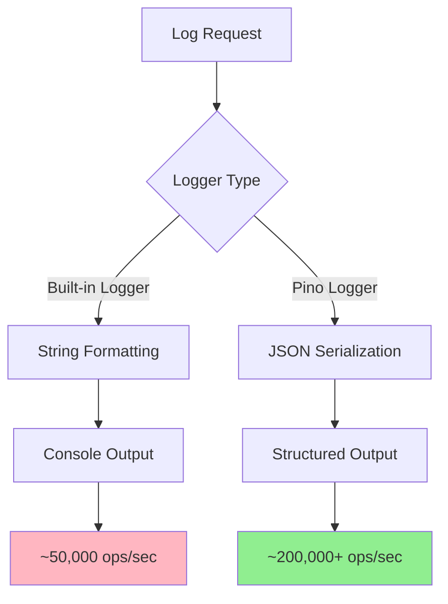

# 🚀 Logger với Pino trong NestJS

## 🔍 Pino Logger là gì?

**Pino** là một extremely fast JSON logger cho Node.js applications, được thiết kế để có performance cao nhất trong ecosystem. Trong NestJS, Pino Logger cung cấp:

- **Ultra-High Performance**: Fastest JSON logger available
- **Low Overhead**: Minimal impact trên application performance
- **Structured Logging**: Native JSON output format
- **Child Loggers**: Hierarchical logging với inherited context
- **Serializers**: Custom object serialization
- **Pretty Printing**: Human-readable output for development

### 🔄 Pino vs Built-in Logger Performance



**Performance Comparison:**

- **Built-in Logger**: ~50,000 operations/second
- **Pino Logger**: ~200,000+ operations/second
- **Memory Usage**: 60% less memory allocation
- **CPU Usage**: 40% less CPU overhead

### 🏗️ Pino Architecture trong NestJS

```typescript
// Core Pino Components
interface PinoLogger {
  level: string
  child(bindings: object): PinoLogger
  trace(obj: object, msg?: string): void
  debug(obj: object, msg?: string): void
  info(obj: object, msg?: string): void
  warn(obj: object, msg?: string): void
  error(obj: object, msg?: string): void
  fatal(obj: object, msg?: string): void
}

// NestJS Integration
interface NestPinoLogger extends LoggerService {
  pinoLogger: PinoLogger
  setContext(context: string): void
  assign(obj: object): void
}
```

---

## 🎯 Cách implement Pino Logger

### 1. Basic Setup và Installation

**Bước 1: Cài đặt dependencies**

```bash
npm install --save pino
npm install --save nestjs-pino
npm install --save-dev pino-pretty
```

**Bước 2: Basic Configuration**

```typescript
// src/main.ts
import { NestFactory } from '@nestjs/core'
import { Logger } from 'nestjs-pino'
import { AppModule } from './app.module'

async function bootstrap() {
  const app = await NestFactory.create(AppModule, { bufferLogs: true })

  // Use Pino logger
  app.useLogger(app.get(Logger))

  await app.listen(3000)
}

bootstrap()
```

**Bước 3: Module Configuration**

```typescript
// src/app.module.ts
import { Module } from '@nestjs/common'
import { LoggerModule } from 'nestjs-pino'

@Module({
  imports: [
    LoggerModule.forRoot({
      pinoHttp: {
        transport: {
          target: 'pino-pretty',
          options: {
            colorize: true,
            singleLine: true,
            ignore: 'pid,hostname',
          },
        },
      },
    }),
    // Other modules...
  ],
})
export class AppModule {}
```

### 2. Environment-specific Configuration

```typescript
// src/config/pino.config.ts
import { Params } from 'nestjs-pino'

export function getPinoConfig(): Params {
  const isProduction = process.env.NODE_ENV === 'production'
  const isDevelopment = process.env.NODE_ENV === 'development'

  const baseConfig: Params = {
    pinoHttp: {
      level: process.env.LOG_LEVEL || 'info',

      // Custom log serializers
      serializers: {
        req: (req) => ({
          id: req.id,
          method: req.method,
          url: req.url,
          query: req.query,
          params: req.params,
          headers: {
            host: req.headers.host,
            'user-agent': req.headers['user-agent'],
            'content-type': req.headers['content-type'],
          },
        }),
        res: (res) => ({
          statusCode: res.statusCode,
          headers: {
            'content-type': res.getHeader('content-type'),
            'content-length': res.getHeader('content-length'),
          },
        }),
        err: (err) => ({
          type: err.constructor.name,
          message: err.message,
          stack: err.stack,
        }),
      },

      // Custom request ID generation
      genReqId: (req) => req.headers['x-request-id'] || generateRequestId(),

      // Custom log level assignment
      customLogLevel: (req, res, err) => {
        if (res.statusCode >= 400 && res.statusCode < 500) return 'warn'
        if (res.statusCode >= 500 || err) return 'error'
        if (res.statusCode >= 300 && res.statusCode < 400) return 'debug'
        return 'info'
      },

      // Request/Response logging options
      autoLogging: {
        ignore: (req) => {
          // Ignore health check endpoints
          return req.url === '/health' || req.url === '/metrics'
        },
      },
    },
  }

  if (isDevelopment) {
    return {
      ...baseConfig,
      pinoHttp: {
        ...baseConfig.pinoHttp,
        level: 'debug',
        transport: {
          target: 'pino-pretty',
          options: {
            colorize: true,
            singleLine: false,
            ignore: 'pid,hostname',
            translateTime: 'SYS:yyyy-mm-dd HH:MM:ss.l',
            messageFormat: '{req.method} {req.url} - {msg}',
          },
        },
      },
    }
  }

  if (isProduction) {
    return {
      ...baseConfig,
      pinoHttp: {
        ...baseConfig.pinoHttp,
        level: 'info',
        // Production: JSON output (no pretty printing)
        formatters: {
          level: (label) => ({ level: label }),
          log: (object) => object,
        },
        timestamp: () => `,"timestamp":"${new Date().toISOString()}"`,

        // Add production metadata
        base: {
          pid: process.pid,
          hostname: require('os').hostname(),
          env: process.env.NODE_ENV,
          version: process.env.npm_package_version,
        },
      },
    }
  }

  return baseConfig
}

function generateRequestId(): string {
  return `req-${Date.now()}-${Math.random().toString(36).substr(2, 9)}`
}

// Usage trong AppModule
@Module({
  imports: [LoggerModule.forRoot(getPinoConfig())],
})
export class AppModule {}
```

### 3. Advanced Service Implementation

```typescript
// src/logger/pino-logger.service.ts
import { Injectable, Inject } from '@nestjs/common'
import { PARAMS_PROVIDER_TOKEN, PinoLogger } from 'nestjs-pino'

@Injectable()
export class AdvancedPinoLoggerService {
  constructor(
    private readonly logger: PinoLogger,
    @Inject(PARAMS_PROVIDER_TOKEN) private readonly params: any,
  ) {
    this.logger.setContext(AdvancedPinoLoggerService.name)
  }

  // Structured logging methods
  logUserAction(action: string, userId: string, metadata?: any) {
    this.logger.info(
      {
        event: 'user_action',
        action,
        userId,
        metadata,
        timestamp: new Date().toISOString(),
      },
      `User action: ${action}`,
    )
  }

  logDatabaseQuery(query: string, duration: number, params?: any) {
    const child = this.logger.child({
      component: 'database',
      query: query.substring(0, 100), // Truncate long queries
      duration,
      params,
    })

    if (duration > 1000) {
      child.warn('Slow database query detected')
    } else {
      child.debug('Database query executed')
    }
  }

  logAPICall(url: string, method: string, statusCode: number, duration: number) {
    const child = this.logger.child({
      component: 'api',
      url,
      method,
      statusCode,
      duration,
    })

    const message = `${method} ${url} ${statusCode} - ${duration}ms`

    if (statusCode >= 500) {
      child.error(message)
    } else if (statusCode >= 400) {
      child.warn(message)
    } else if (duration > 2000) {
      child.warn(`${message} (slow response)`)
    } else {
      child.info(message)
    }
  }

  logSecurityEvent(event: string, details: any, severity: 'low' | 'medium' | 'high' | 'critical') {
    const child = this.logger.child({
      component: 'security',
      event,
      severity,
      details,
      timestamp: new Date().toISOString(),
    })

    const message = `Security event: ${event}`

    switch (severity) {
      case 'critical':
        child.fatal(message)
        break
      case 'high':
        child.error(message)
        break
      case 'medium':
        child.warn(message)
        break
      case 'low':
      default:
        child.info(message)
        break
    }
  }

  // Performance monitoring
  logPerformanceMetric(operation: string, duration: number, metadata?: any) {
    const child = this.logger.child({
      component: 'performance',
      operation,
      duration,
      metadata,
    })

    if (duration > 5000) {
      child.error(`Very slow operation: ${operation} took ${duration}ms`)
    } else if (duration > 2000) {
      child.warn(`Slow operation: ${operation} took ${duration}ms`)
    } else {
      child.debug(`Operation completed: ${operation} in ${duration}ms`)
    }
  }

  // Error logging với enhanced context
  logError(error: Error, context: any = {}) {
    const child = this.logger.child({
      component: 'error',
      errorType: error.constructor.name,
      errorMessage: error.message,
      context,
      stack: error.stack,
    })

    child.error(error, `Error occurred: ${error.message}`)
  }

  // Business event logging
  logBusinessEvent(event: string, data: any) {
    const child = this.logger.child({
      component: 'business',
      event,
      data,
      timestamp: new Date().toISOString(),
    })

    child.info(`Business event: ${event}`)
  }

  // Create contextual child logger
  createChildLogger(context: any) {
    return this.logger.child(context)
  }

  // Assign additional context to current logger
  assignContext(context: any) {
    this.logger.assign(context)
  }
}
```

---

## 💡 Specialized Use Cases

### 1. Request Tracing với Correlation IDs

```typescript
// src/middleware/correlation.middleware.ts
import { Injectable, NestMiddleware } from '@nestjs/common'
import { Request, Response, NextFunction } from 'express'
import { PinoLogger } from 'nestjs-pino'
import { v4 as uuidv4 } from 'uuid'

@Injectable()
export class CorrelationMiddleware implements NestMiddleware {
  constructor(private readonly logger: PinoLogger) {}

  use(req: Request, res: Response, next: NextFunction) {
    const correlationId = (req.headers['x-correlation-id'] as string) || uuidv4()
    const requestId = (req.headers['x-request-id'] as string) || uuidv4()

    // Add to request object
    req['correlationId'] = correlationId
    req['requestId'] = requestId

    // Add to response headers
    res.setHeader('X-Correlation-ID', correlationId)
    res.setHeader('X-Request-ID', requestId)

    // Create child logger với correlation context
    const childLogger = this.logger.child({
      correlationId,
      requestId,
      userAgent: req.headers['user-agent'],
      ip: req.ip,
    })

    // Attach child logger to request
    req['logger'] = childLogger

    // Log request start
    childLogger.info(
      {
        method: req.method,
        url: req.originalUrl,
        query: req.query,
        body: this.sanitizeBody(req.body),
      },
      'Request started',
    )

    next()
  }

  private sanitizeBody(body: any): any {
    if (!body || typeof body !== 'object') return body

    const sensitiveFields = ['password', 'token', 'secret', 'key']
    const sanitized = { ...body }

    for (const field of sensitiveFields) {
      if (sanitized[field]) {
        sanitized[field] = '[REDACTED]'
      }
    }

    return sanitized
  }
}

// Usage trong services
@Injectable()
export class UserService {
  constructor(private readonly logger: PinoLogger) {
    this.logger.setContext(UserService.name)
  }

  async createUser(userData: CreateUserDto, req?: any) {
    // Use request logger if available, fallback to service logger
    const logger = req?.logger || this.logger

    const childLogger = logger.child({
      operation: 'createUser',
      userEmail: userData.email,
    })

    childLogger.info('Starting user creation')

    try {
      const user = await this.userRepository.save(userData)

      childLogger.info(
        {
          userId: user.id,
          success: true,
        },
        'User created successfully',
      )

      return user
    } catch (error) {
      childLogger.error(
        {
          error: error.message,
          success: false,
        },
        'User creation failed',
      )

      throw error
    }
  }
}
```

### 2. Performance Monitoring với Pino

```typescript
// src/monitoring/performance-monitor.service.ts
import { Injectable } from '@nestjs/common'
import { PinoLogger } from 'nestjs-pino'

interface PerformanceMetric {
  operation: string
  duration: number
  memory: NodeJS.MemoryUsage
  cpu: NodeJS.CpuUsage
  timestamp: Date
}

@Injectable()
export class PerformanceMonitorService {
  constructor(private readonly logger: PinoLogger) {
    this.logger.setContext(PerformanceMonitorService.name)
  }

  // Performance decorator
  monitor(target: any, propertyName: string, descriptor: PropertyDescriptor) {
    const originalMethod = descriptor.value
    const logger = this.logger

    descriptor.value = async function (...args: any[]) {
      const startTime = process.hrtime.bigint()
      const startMemory = process.memoryUsage()
      const startCpu = process.cpuUsage()

      const childLogger = logger.child({
        component: 'performance',
        operation: `${target.constructor.name}.${propertyName}`,
        args: args.length,
      })

      try {
        const result = await originalMethod.apply(this, args)

        const endTime = process.hrtime.bigint()
        const duration = Number(endTime - startTime) / 1000000 // Convert to ms
        const endMemory = process.memoryUsage()
        const endCpu = process.cpuUsage(startCpu)

        const metric: PerformanceMetric = {
          operation: `${target.constructor.name}.${propertyName}`,
          duration,
          memory: {
            rss: endMemory.rss - startMemory.rss,
            heapTotal: endMemory.heapTotal - startMemory.heapTotal,
            heapUsed: endMemory.heapUsed - startMemory.heapUsed,
            external: endMemory.external - startMemory.external,
            arrayBuffers: endMemory.arrayBuffers - startMemory.arrayBuffers,
          },
          cpu: endCpu,
          timestamp: new Date(),
        }

        // Log performance metric
        if (duration > 1000) {
          childLogger.warn(metric, `Slow operation: ${duration.toFixed(2)}ms`)
        } else {
          childLogger.debug(metric, `Operation completed: ${duration.toFixed(2)}ms`)
        }

        return result
      } catch (error) {
        const endTime = process.hrtime.bigint()
        const duration = Number(endTime - startTime) / 1000000

        childLogger.error(
          {
            operation: `${target.constructor.name}.${propertyName}`,
            duration,
            error: error.message,
          },
          `Operation failed: ${duration.toFixed(2)}ms`,
        )

        throw error
      }
    }

    return descriptor
  }

  // System performance monitoring
  startSystemMonitoring(intervalMs = 30000) {
    setInterval(() => {
      const memUsage = process.memoryUsage()
      const cpuUsage = process.cpuUsage()

      this.logger.info(
        {
          component: 'system',
          memory: {
            rss: Math.round(memUsage.rss / 1024 / 1024), // MB
            heapTotal: Math.round(memUsage.heapTotal / 1024 / 1024),
            heapUsed: Math.round(memUsage.heapUsed / 1024 / 1024),
            external: Math.round(memUsage.external / 1024 / 1024),
          },
          cpu: {
            user: cpuUsage.user,
            system: cpuUsage.system,
          },
          uptime: Math.round(process.uptime()),
        },
        'System performance metrics',
      )
    }, intervalMs)
  }
}

// Usage
@Injectable()
export class UserService {
  constructor(private readonly performanceMonitor: PerformanceMonitorService) {}

  @PerformanceMonitorService.prototype.monitor
  async createUser(userData: CreateUserDto) {
    // Method implementation
  }
}
```

### 3. Custom Transports và Destinations

```typescript
// src/logger/custom-transports.ts
import { Transform } from 'stream'
import * as fs from 'fs'
import * as path from 'path'

// File rotation transport
export class FileRotationTransport extends Transform {
  private currentFile: string
  private fileStream: fs.WriteStream
  private maxFileSize: number
  private maxFiles: number
  private baseFileName: string

  constructor(options: { baseFileName: string; maxFileSize: number; maxFiles: number }) {
    super({ objectMode: true })

    this.baseFileName = options.baseFileName
    this.maxFileSize = options.maxFileSize
    this.maxFiles = options.maxFiles

    this.initializeFileStream()
  }

  _transform(chunk: any, encoding: string, callback: Function) {
    const logEntry = JSON.stringify(chunk) + '\n'

    // Check if rotation is needed
    if (this.shouldRotate()) {
      this.rotateFile()
    }

    this.fileStream.write(logEntry)
    callback()
  }

  private initializeFileStream() {
    this.currentFile = `${this.baseFileName}.log`
    this.fileStream = fs.createWriteStream(this.currentFile, { flags: 'a' })
  }

  private shouldRotate(): boolean {
    if (!fs.existsSync(this.currentFile)) return false

    const stats = fs.statSync(this.currentFile)
    return stats.size >= this.maxFileSize
  }

  private rotateFile() {
    this.fileStream.end()

    // Rotate existing files
    for (let i = this.maxFiles - 1; i > 0; i--) {
      const oldFile = `${this.baseFileName}.${i}.log`
      const newFile = `${this.baseFileName}.${i + 1}.log`

      if (fs.existsSync(oldFile)) {
        if (i === this.maxFiles - 1) {
          fs.unlinkSync(oldFile) // Remove oldest file
        } else {
          fs.renameSync(oldFile, newFile)
        }
      }
    }

    // Move current file to .1
    fs.renameSync(this.currentFile, `${this.baseFileName}.1.log`)

    // Create new current file
    this.initializeFileStream()
  }
}

// External service transport
export class ExternalServiceTransport extends Transform {
  private buffer: any[] = []
  private bufferSize: number
  private flushInterval: number
  private serviceUrl: string

  constructor(options: { serviceUrl: string; bufferSize?: number; flushInterval?: number }) {
    super({ objectMode: true })

    this.serviceUrl = options.serviceUrl
    this.bufferSize = options.bufferSize || 100
    this.flushInterval = options.flushInterval || 5000

    // Flush buffer periodically
    setInterval(() => this.flush(), this.flushInterval)
  }

  _transform(chunk: any, encoding: string, callback: Function) {
    this.buffer.push(chunk)

    if (this.buffer.length >= this.bufferSize) {
      this.flush()
    }

    callback()
  }

  private async flush() {
    if (this.buffer.length === 0) return

    const logs = [...this.buffer]
    this.buffer = []

    try {
      await fetch(this.serviceUrl, {
        method: 'POST',
        headers: {
          'Content-Type': 'application/json',
        },
        body: JSON.stringify({ logs }),
      })
    } catch (error) {
      // Handle failed delivery - could implement retry logic
      console.error('Failed to send logs to external service:', error.message)
    }
  }
}

// Usage trong configuration
export function getPinoConfigWithCustomTransports(): any {
  return {
    pinoHttp: {
      level: 'info',
      transport: {
        targets: [
          // Console output
          {
            target: 'pino-pretty',
            level: 'debug',
            options: {
              colorize: true,
              singleLine: true,
            },
          },
          // File output với rotation
          {
            target: './dist/logger/file-transport.js',
            level: 'info',
            options: {
              baseFileName: './logs/app',
              maxFileSize: 10 * 1024 * 1024, // 10MB
              maxFiles: 5,
            },
          },
          // External service
          {
            target: './dist/logger/external-transport.js',
            level: 'warn',
            options: {
              serviceUrl: 'https://logs.example.com/api/logs',
              bufferSize: 50,
              flushInterval: 3000,
            },
          },
        ],
      },
    },
  }
}
```

### 4. Error Handling và Recovery

````typescript
// src/logger/error-handler.service.ts
import { Injectable, Logger } from '@nestjs/common'
import { PinoLogger } from 'nestjs-pino'

interface ErrorContext {
  component: string
  operation: string
  userId?: string
  requestId?: string
  metadata?: any
}

@Injectable()
export class ErrorHandlerService {
  constructor(private readonly logger: PinoLogger) {
    this.logger.setContext(ErrorHandlerService.name)
  }

  handleError(error: Error, context: ErrorContext) {
    const errorInfo = {
      name: error.name,
      message: error.message,
      stack: error.stack,
      ...context,
      timestamp: new Date().toISOString(),
      severity: this.determineSeverity(error),
    }

    const childLogger = this.logger.child({
      component: 'error-handler',
      errorType: error.constructor.name,
      ...context,
    })

    // Log based on severity
    switch (errorInfo.severity) {
      case 'critical':
        childLogger.fatal(errorInfo, `Critical error: ${error.message}`)
        this.handleCriticalError(error, context)
        break

      case 'high':
        childLogger.error(errorInfo, `High severity error: ${error.message}`)
        this.handleHighSeverityError(error, context)
        break

      case 'medium':
        childLogger.warn(errorInfo, `Medium severity error: ${error.message}`)
        break

      case 'low':
      default:
        childLogger.info(errorInfo, `Low severity error: ${error.message}`)
        break
    }

    // Store error for analysis
    this.storeError(errorInfo)

    return errorInfo
  }

  private determineSeverity(error: Error): 'low' | 'medium' | 'high' | 'critical' {
    // Database errors
    if (error.name.includes('Database') || error.message.includes('connection')) {
      return 'critical'
    }

    // Authentication/Authorization errors
    if (error.name.includes('Auth') || error.message.includes('unauthorized')) {
      return 'high'
    }

    // Validation errors
    if (error.name.includes('Validation') || error.name.includes('BadRequest')) {
      return 'medium'
    }

    // Default
    return 'low'
  }

  private async handleCriticalError(error: Error, context: ErrorContext) {
    // Send immediate alerts
    await this.sendAlert('critical', error, context)

    // Log to separate critical error file
    const criticalLogger = this.logger.child({
      component: 'critical-errors',
      alertSent: true,
    })

    criticalLogger.fatal({
      error: error.message,
      stack: error.stack,
      context,
      alertTimestamp: new Date().toISOString(),
    }, 'Critical error - alert sent')
  }

  private async handleHighSeverityError(error: Error, context: ErrorContext) {
    // Send alert với delay để avoid spam
    setTimeout(() => {
      this.sendAlert('high', error, context)
    }, 1000)
  }

  private async sendAlert(severity: string, error: Error, context: ErrorContext) {
    // Implementation for alerting system
    this.logger.info({
      component: 'alerting',
      severity,
      error: error.message,
      context,
    }, `Alert sent for ${severity} severity error`)
  }

  private async storeError(errorInfo: any) {
    // Store error trong database cho analysis
    this.logger.debug({
      component: 'error-storage',
      errorId: this.generateErrorId(),
    }, 'Error stored for analysis')
  }

  private generateErrorId(): string {
    return `err-${Date.now()}-${Math.random().toString(36).substr(2, 9)}`
  }

  // Global error decorator
  static catchAndLog(target: any, propertyName: string, descriptor: PropertyDescriptor) {
    const originalMethod = descriptor.value

    descriptor.value = async function (...args: any[]) {
      try {
        return await originalMethod.apply(this, args)
      } catch (error) {
        const errorHandler = this.errorHandler as ErrorHandlerService

        if (errorHandler) {
          errorHandler.handleError(error, {
            component: target.constructor.name,
            operation: propertyName,
            metadata: { args: args.length },
          })
        }

        throw error
      }
    }

    return descriptor
  }
}

---

## 🔗 Integration với External Systems

### 1. ELK Stack Integration

```typescript
// src/logger/elk-integration.service.ts
import { Injectable } from '@nestjs/common'
import { PinoLogger } from 'nestjs-pino'
import { Client } from '@elastic/elasticsearch'

@Injectable()
export class ELKIntegrationService {
  private elasticsearchClient: Client

  constructor(private readonly logger: PinoLogger) {
    this.logger.setContext(ELKIntegrationService.name)

    this.elasticsearchClient = new Client({
      node: process.env.ELASTICSEARCH_URL || 'http://localhost:9200',
      auth: {
        username: process.env.ELASTICSEARCH_USERNAME || 'elastic',
        password: process.env.ELASTICSEARCH_PASSWORD || 'password',
      },
    })
  }

  // Custom Elasticsearch transport
  async sendToElasticsearch(logData: any) {
    try {
      await this.elasticsearchClient.index({
        index: `app-logs-${new Date().toISOString().slice(0, 7)}`, // Monthly indices
        body: {
          ...logData,
          '@timestamp': new Date().toISOString(),
          environment: process.env.NODE_ENV,
          service: 'nestjs-app',
        },
      })
    } catch (error) {
      this.logger.error({
        component: 'elk-integration',
        error: error.message,
      }, 'Failed to send log to Elasticsearch')
    }
  }

  // Kibana dashboard queries
  async createLogDashboard() {
    const dashboardConfig = {
      title: 'NestJS Application Logs',
      panels: [
        {
          title: 'Error Rate',
          type: 'line',
          query: {
            bool: {
              must: [
                { match: { level: 'error' } },
                { range: { '@timestamp': { gte: 'now-1h' } } },
              ],
            },
          },
        },
        {
          title: 'Response Times',
          type: 'histogram',
          query: {
            bool: {
              must: [
                { exists: { field: 'responseTime' } },
                { range: { '@timestamp': { gte: 'now-1h' } } },
              ],
            },
          },
        },
      ],
    }

    // Send dashboard config to Kibana
    this.logger.info({
      component: 'kibana',
      dashboard: 'created',
    }, 'Kibana dashboard configuration created')
  }
}

// Logstash-compatible format
export function createLogstashTransport() {
  return {
    target: 'pino-socket',
    options: {
      address: process.env.LOGSTASH_HOST || 'localhost',
      port: parseInt(process.env.LOGSTASH_PORT || '5000'),
      mode: 'tcp',
    },
  }
}
````

### 2. Datadog Integration

```typescript
// src/logger/datadog-integration.service.ts
import { Injectable } from '@nestjs/common'
import { PinoLogger } from 'nestjs-pino'

@Injectable()
export class DatadogIntegrationService {
  private datadogApiKey: string
  private datadogHost: string

  constructor(private readonly logger: PinoLogger) {
    this.logger.setContext(DatadogIntegrationService.name)
    this.datadogApiKey = process.env.DATADOG_API_KEY || ''
    this.datadogHost = process.env.DATADOG_HOST || 'https://http-intake.logs.datadoghq.com'
  }

  // Datadog log format
  formatForDatadog(logEntry: any) {
    return {
      ddsource: 'nestjs',
      ddtags: `env:${process.env.NODE_ENV},service:nestjs-app`,
      hostname: require('os').hostname(),
      message: logEntry.msg || logEntry.message,
      level: this.mapLogLevel(logEntry.level),
      timestamp: logEntry.time || new Date().toISOString(),
      ...logEntry,
    }
  }

  private mapLogLevel(pinoLevel: number): string {
    const levelMap = {
      10: 'trace',
      20: 'debug',
      30: 'info',
      40: 'warn',
      50: 'error',
      60: 'fatal',
    }
    return levelMap[pinoLevel] || 'info'
  }

  // Send logs to Datadog
  async sendToDatadog(logs: any[]) {
    const formattedLogs = logs.map((log) => this.formatForDatadog(log))

    try {
      const response = await fetch(`${this.datadogHost}/v1/input/${this.datadogApiKey}`, {
        method: 'POST',
        headers: {
          'Content-Type': 'application/json',
        },
        body: JSON.stringify(formattedLogs),
      })

      if (!response.ok) {
        throw new Error(`Datadog API responded với ${response.status}`)
      }

      this.logger.debug(
        {
          component: 'datadog',
          logCount: logs.length,
        },
        'Logs sent to Datadog successfully',
      )
    } catch (error) {
      this.logger.error(
        {
          component: 'datadog',
          error: error.message,
          logCount: logs.length,
        },
        'Failed to send logs to Datadog',
      )
    }
  }

  // Create custom metrics từ logs
  createMetricsFromLogs(logs: any[]) {
    const metrics = {
      errorCount: logs.filter((log) => log.level >= 50).length,
      warnCount: logs.filter((log) => log.level === 40).length,
      avgResponseTime: this.calculateAverageResponseTime(logs),
      uniqueUsers: new Set(logs.map((log) => log.userId).filter(Boolean)).size,
    }

    this.logger.info(
      {
        component: 'metrics',
        metrics,
      },
      'Metrics calculated from logs',
    )

    return metrics
  }

  private calculateAverageResponseTime(logs: any[]): number {
    const responseTimes = logs.filter((log) => log.responseTime).map((log) => log.responseTime)

    if (responseTimes.length === 0) return 0

    return responseTimes.reduce((sum, time) => sum + time, 0) / responseTimes.length
  }
}
```

### 3. Slack/Discord Alerts Integration

````typescript
// src/logger/alerts.service.ts
import { Injectable } from '@nestjs/common'
import { PinoLogger } from 'nestjs-pino'

interface AlertConfig {
  webhookUrl: string
  channel?: string
  username?: string
  iconEmoji?: string
  minLevel: 'error' | 'warn' | 'fatal'
}

@Injectable()
export class AlertsService {
  private slackConfig: AlertConfig
  private discordConfig: AlertConfig

  constructor(private readonly logger: PinoLogger) {
    this.logger.setContext(AlertsService.name)

    this.slackConfig = {
      webhookUrl: process.env.SLACK_WEBHOOK_URL || '',
      channel: '#alerts',
      username: 'NestJS Logger',
      iconEmoji: ':warning:',
      minLevel: 'error',
    }

    this.discordConfig = {
      webhookUrl: process.env.DISCORD_WEBHOOK_URL || '',
      minLevel: 'error',
    }
  }

  async sendSlackAlert(logEntry: any) {
    if (!this.shouldSendAlert(logEntry, this.slackConfig.minLevel)) return

    const color = this.getAlertColor(logEntry.level)
    const message = {
      channel: this.slackConfig.channel,
      username: this.slackConfig.username,
      icon_emoji: this.slackConfig.iconEmoji,
      attachments: [
        {
          color,
          title: `${this.getLevelName(logEntry.level)} Alert`,
          text: logEntry.msg || logEntry.message,
          fields: [
            {
              title: 'Environment',
              value: process.env.NODE_ENV,
              short: true,
            },
            {
              title: 'Service',
              value: 'NestJS App',
              short: true,
            },
            {
              title: 'Timestamp',
              value: new Date(logEntry.time).toISOString(),
              short: true,
            },
            {
              title: 'Context',
              value: JSON.stringify(logEntry.context || {}, null, 2),
              short: false,
            },
          ],
          footer: 'NestJS Logger',
          ts: Math.floor(Date.now() / 1000),
        },
      ],
    }

    try {
      await fetch(this.slackConfig.webhookUrl, {
        method: 'POST',
        headers: { 'Content-Type': 'application/json' },
        body: JSON.stringify(message),
      })

      this.logger.debug(
        {
          component: 'slack-alerts',
          level: logEntry.level,
        },
        'Slack alert sent successfully',
      )
    } catch (error) {
      this.logger.error(
        {
          component: 'slack-alerts',
          error: error.message,
        },
        'Failed to send Slack alert',
      )
    }
  }

  async sendDiscordAlert(logEntry: any) {
    if (!this.shouldSendAlert(logEntry, this.discordConfig.minLevel)) return

    const embed = {
      title: `${this.getLevelName(logEntry.level)} Alert`,
      description: logEntry.msg || logEntry.message,
      color: this.getDiscordColor(logEntry.level),
      timestamp: new Date(logEntry.time).toISOString(),
      fields: [
        {
          name: 'Environment',
          value: process.env.NODE_ENV,
          inline: true,
        },
        {
          name: 'Service',
          value: 'NestJS App',
          inline: true,
        },
        {
          name: 'Context',
          value: '```json\n' + JSON.stringify(logEntry.context || {}, null, 2) + '\n```',
          inline: false,
        },
      ],
      footer: {
        text: 'NestJS Logger',
      },
    }

    const message = {
      embeds: [embed],
    }

    try {
      await fetch(this.discordConfig.webhookUrl, {
        method: 'POST',
        headers: { 'Content-Type': 'application/json' },
        body: JSON.stringify(message),
      })

      this.logger.debug(
        {
          component: 'discord-alerts',
          level: logEntry.level,
        },
        'Discord alert sent successfully',
      )
    } catch (error) {
      this.logger.error(
        {
          component: 'discord-alerts',
          error: error.message,
        },
        'Failed to send Discord alert',
      )
    }
  }

  private shouldSendAlert(logEntry: any, minLevel: string): boolean {
    const levelMap = { warn: 40, error: 50, fatal: 60 }
    return logEntry.level >= levelMap[minLevel]
  }

  private getLevelName(level: number): string {
    const levelMap = {
      10: 'TRACE',
      20: 'DEBUG',
      30: 'INFO',
      40: 'WARN',
      50: 'ERROR',
      60: 'FATAL',
    }
    return levelMap[level] || 'UNKNOWN'
  }

  private getAlertColor(level: number): string {
    if (level >= 60) return 'danger' // Fatal - red
    if (level >= 50) return 'danger' // Error - red
    if (level >= 40) return 'warning' // Warn - yellow
    return 'good' // Info/Debug - green
  }

  private getDiscordColor(level: number): number {
    if (level >= 60) return 0xff0000 // Fatal - red
    if (level >= 50) return 0xff0000 // Error - red
    if (level >= 40) return 0xffff00 // Warn - yellow
    return 0x00ff00 // Info/Debug - green
  }
}
````

---

## 🧪 Testing Pino Logger

### 1. Unit Testing Logger Services

```typescript
// src/logger/__tests__/pino-logger.service.spec.ts
import { Test } from '@nestjs/testing'
import { PinoLogger, PARAMS_PROVIDER_TOKEN } from 'nestjs-pino'
import { AdvancedPinoLoggerService } from '../pino-logger.service'

describe('AdvancedPinoLoggerService', () => {
  let service: AdvancedPinoLoggerService
  let mockPinoLogger: jest.Mocked<PinoLogger>

  beforeEach(async () => {
    mockPinoLogger = {
      setContext: jest.fn(),
      info: jest.fn(),
      warn: jest.fn(),
      error: jest.fn(),
      debug: jest.fn(),
      child: jest.fn().mockReturnThis(),
      assign: jest.fn(),
    } as any

    const module = await Test.createTestingModule({
      providers: [
        AdvancedPinoLoggerService,
        {
          provide: PinoLogger,
          useValue: mockPinoLogger,
        },
        {
          provide: PARAMS_PROVIDER_TOKEN,
          useValue: {},
        },
      ],
    }).compile()

    service = module.get<AdvancedPinoLoggerService>(AdvancedPinoLoggerService)
  })

  it('should be defined', () => {
    expect(service).toBeDefined()
  })

  it('should log user actions với correct format', () => {
    const action = 'login'
    const userId = 'user123'
    const metadata = { ip: '192.168.1.1' }

    service.logUserAction(action, userId, metadata)

    expect(mockPinoLogger.info).toHaveBeenCalledWith(
      expect.objectContaining({
        event: 'user_action',
        action,
        userId,
        metadata,
        timestamp: expect.any(String),
      }),
      `User action: ${action}`,
    )
  })

  it('should log slow database queries as warnings', () => {
    const query = 'SELECT * FROM users'
    const slowDuration = 1500

    service.logDatabaseQuery(query, slowDuration)

    expect(mockPinoLogger.child).toHaveBeenCalledWith({
      component: 'database',
      query: query.substring(0, 100),
      duration: slowDuration,
      params: undefined,
    })
    expect(mockPinoLogger.warn).toHaveBeenCalledWith('Slow database query detected')
  })

  it('should log fast database queries as debug', () => {
    const query = 'SELECT * FROM users'
    const fastDuration = 50

    service.logDatabaseQuery(query, fastDuration)

    expect(mockPinoLogger.debug).toHaveBeenCalledWith('Database query executed')
  })

  it('should log security events với correct severity', () => {
    const event = 'failed_login'
    const details = { email: 'test@example.com' }
    const severity = 'medium'

    service.logSecurityEvent(event, details, severity)

    expect(mockPinoLogger.child).toHaveBeenCalledWith({
      component: 'security',
      event,
      severity,
      details,
      timestamp: expect.any(String),
    })
    expect(mockPinoLogger.warn).toHaveBeenCalledWith(`Security event: ${event}`)
  })

  it('should create child logger với context', () => {
    const context = { requestId: 'req123' }

    service.createChildLogger(context)

    expect(mockPinoLogger.child).toHaveBeenCalledWith(context)
  })
})
```

### 2. Integration Testing

```typescript
// src/logger/__tests__/logger-integration.spec.ts
import { Test } from '@nestjs/testing'
import { INestApplication } from '@nestjs/common'
import { LoggerModule } from 'nestjs-pino'
import * as request from 'supertest'
import { AppModule } from '../../app.module'

describe('Logger Integration', () => {
  let app: INestApplication
  let logSpy: jest.SpyInstance

  beforeEach(async () => {
    const moduleRef = await Test.createTestingModule({
      imports: [AppModule],
    })
      .overrideModule(LoggerModule)
      .useModule(
        LoggerModule.forRoot({
          pinoHttp: {
            level: 'debug',
            transport: {
              target: 'pino-pretty',
              options: { destination: '/dev/null' }, // Suppress output during tests
            },
          },
        }),
      )
      .compile()

    app = moduleRef.createNestApplication()

    // Spy trên console methods
    logSpy = jest.spyOn(console, 'log').mockImplementation()

    await app.init()
  })

  afterEach(async () => {
    logSpy.mockRestore()
    await app.close()
  })

  it('should log HTTP requests', async () => {
    await request(app.getHttpServer()).get('/health').expect(200)

    // Verify that request was logged
    expect(logSpy).toHaveBeenCalledWith(expect.stringContaining('GET /health'))
  })

  it('should include correlation ID trong logs', async () => {
    const correlationId = 'test-correlation-id'

    await request(app.getHttpServer()).get('/users').set('X-Correlation-ID', correlationId).expect(200)

    expect(logSpy).toHaveBeenCalledWith(expect.stringContaining(correlationId))
  })

  it('should log errors với full context', async () => {
    await request(app.getHttpServer()).get('/nonexistent').expect(404)

    expect(logSpy).toHaveBeenCalledWith(expect.stringContaining('404'))
  })
})
```

### 3. Performance Testing

```typescript
// src/logger/__tests__/logger-performance.spec.ts
import { PinoLogger } from 'nestjs-pino'
import { performance } from 'perf_hooks'

describe('Logger Performance', () => {
  let logger: PinoLogger

  beforeEach(() => {
    logger = new PinoLogger({}, {})
  })

  it('should handle high volume logging', () => {
    const iterations = 10000
    const startTime = performance.now()

    for (let i = 0; i < iterations; i++) {
      logger.info({ iteration: i, data: 'test data' }, `Log message ${i}`)
    }

    const endTime = performance.now()
    const duration = endTime - startTime
    const opsPerSecond = (iterations / duration) * 1000

    console.log(`Logged ${iterations} messages trong ${duration.toFixed(2)}ms`)
    console.log(`Performance: ${opsPerSecond.toFixed(0)} ops/second`)

    // Expect at least 10,000 ops/second
    expect(opsPerSecond).toBeGreaterThan(10000)
  })

  it('should have minimal memory overhead', () => {
    const initialMemory = process.memoryUsage()

    // Log 1000 messages
    for (let i = 0; i < 1000; i++) {
      logger.info(
        {
          iteration: i,
          data: 'some test data that simulates real log content',
          timestamp: new Date().toISOString(),
        },
        `Test log message number ${i}`,
      )
    }

    const finalMemory = process.memoryUsage()
    const memoryIncrease = finalMemory.heapUsed - initialMemory.heapUsed

    console.log(`Memory increase: ${(memoryIncrease / 1024 / 1024).toFixed(2)} MB`)

    // Memory increase should be reasonable (less than 10MB for 1000 logs)
    expect(memoryIncrease).toBeLessThan(10 * 1024 * 1024)
  })
})
```

---

## 🔧 Advanced Patterns

### 1. Log Sampling và Rate Limiting

```typescript
// src/logger/sampling.service.ts
import { Injectable } from '@nestjs/common'
import { PinoLogger } from 'nestjs-pino'

interface SamplingConfig {
  sampleRate: number // 0.0 to 1.0
  maxLogsPerSecond: number
  burstLimit: number
  levelOverrides: Record<string, number>
}

@Injectable()
export class LogSamplingService {
  private config: SamplingConfig
  private counters = new Map<string, number>()
  private lastReset = Date.now()

  constructor(private readonly logger: PinoLogger) {
    this.config = {
      sampleRate: parseFloat(process.env.LOG_SAMPLE_RATE || '1.0'),
      maxLogsPerSecond: parseInt(process.env.MAX_LOGS_PER_SECOND || '1000'),
      burstLimit: parseInt(process.env.LOG_BURST_LIMIT || '2000'),
      levelOverrides: {
        error: 1.0, // Always log errors
        fatal: 1.0, // Always log fatal
        warn: 0.8, // 80% of warnings
        info: 0.1, // 10% of info
        debug: 0.01, // 1% of debug
      },
    }
  }

  shouldLog(level: string, context?: string): boolean {
    // Check sampling rate
    const sampleRate = this.config.levelOverrides[level] || this.config.sampleRate
    if (Math.random() > sampleRate) {
      return false
    }

    // Check rate limiting
    const key = context || 'default'
    return this.checkRateLimit(key)
  }

  private checkRateLimit(key: string): boolean {
    const now = Date.now()

    // Reset counters every second
    if (now - this.lastReset > 1000) {
      this.counters.clear()
      this.lastReset = now
    }

    const currentCount = this.counters.get(key) || 0

    if (currentCount >= this.config.maxLogsPerSecond) {
      return false
    }

    this.counters.set(key, currentCount + 1)
    return true
  }

  // Wrapper methods với sampling
  log(message: string, obj?: any, context?: string) {
    if (this.shouldLog('info', context)) {
      this.logger.info(obj, message)
    }
  }

  warn(message: string, obj?: any, context?: string) {
    if (this.shouldLog('warn', context)) {
      this.logger.warn(obj, message)
    }
  }

  error(message: string, obj?: any, context?: string) {
    if (this.shouldLog('error', context)) {
      this.logger.error(obj, message)
    }
  }

  debug(message: string, obj?: any, context?: string) {
    if (this.shouldLog('debug', context)) {
      this.logger.debug(obj, message)
    }
  }

  // Adjust sampling at runtime
  setSampleRate(rate: number) {
    this.config.sampleRate = Math.max(0, Math.min(1, rate))
  }

  setLevelSampleRate(level: string, rate: number) {
    this.config.levelOverrides[level] = Math.max(0, Math.min(1, rate))
  }

  getStats() {
    return {
      config: this.config,
      currentCounts: Object.fromEntries(this.counters),
      lastReset: this.lastReset,
    }
  }
}
```

### 2. Log Aggregation và Analytics

```typescript
// src/logger/analytics.service.ts
import { Injectable } from '@nestjs/common'
import { PinoLogger } from 'nestjs-pino'
import { Cron } from '@nestjs/schedule'

interface LogMetrics {
  errorCount: number
  warnCount: number
  infoCount: number
  debugCount: number
  avgResponseTime: number
  slowQueries: number
  uniqueUsers: number
  topErrors: Array<{ error: string; count: number }>
  topEndpoints: Array<{ endpoint: string; count: number }>
}

@Injectable()
export class LogAnalyticsService {
  private logBuffer: any[] = []
  private maxBufferSize = 10000

  constructor(private readonly logger: PinoLogger) {
    this.logger.setContext(LogAnalyticsService.name)
  }

  // Collect log for analysis
  collectLog(logEntry: any) {
    this.logBuffer.push({
      ...logEntry,
      timestamp: new Date(),
    })

    // Prevent memory overflow
    if (this.logBuffer.length > this.maxBufferSize) {
      this.logBuffer.shift()
    }
  }

  // Analyze logs every hour
  @Cron('0 * * * *') // Every hour
  async analyzeLogsHourly() {
    const metrics = this.calculateMetrics()
    await this.sendMetricsToMonitoring(metrics)

    this.logger.info(
      {
        component: 'analytics',
        metrics,
      },
      'Hourly log analysis completed',
    )
  }

  // Analyze logs daily
  @Cron('0 0 * * *') // Every day at midnight
  async analyzeLogsDaily() {
    const dailyMetrics = this.calculateDailyMetrics()
    await this.generateDailyReport(dailyMetrics)

    // Clear old logs
    this.clearOldLogs()
  }

  private calculateMetrics(): LogMetrics {
    const now = new Date()
    const oneHourAgo = new Date(now.getTime() - 60 * 60 * 1000)

    const recentLogs = this.logBuffer.filter((log) => log.timestamp >= oneHourAgo)

    return {
      errorCount: recentLogs.filter((log) => log.level >= 50).length,
      warnCount: recentLogs.filter((log) => log.level === 40).length,
      infoCount: recentLogs.filter((log) => log.level === 30).length,
      debugCount: recentLogs.filter((log) => log.level <= 20).length,
      avgResponseTime: this.calculateAverageResponseTime(recentLogs),
      slowQueries: recentLogs.filter((log) => log.component === 'database' && log.duration > 1000).length,
      uniqueUsers: new Set(recentLogs.map((log) => log.userId).filter(Boolean)).size,
      topErrors: this.getTopErrors(recentLogs),
      topEndpoints: this.getTopEndpoints(recentLogs),
    }
  }

  private calculateDailyMetrics() {
    const now = new Date()
    const oneDayAgo = new Date(now.getTime() - 24 * 60 * 60 * 1000)

    const dailyLogs = this.logBuffer.filter((log) => log.timestamp >= oneDayAgo)

    return {
      totalLogs: dailyLogs.length,
      errorRate: dailyLogs.filter((log) => log.level >= 50).length / dailyLogs.length,
      averageResponseTime: this.calculateAverageResponseTime(dailyLogs),
      peakHour: this.findPeakHour(dailyLogs),
      errorTrends: this.calculateErrorTrends(dailyLogs),
      performanceTrends: this.calculatePerformanceTrends(dailyLogs),
    }
  }

  private calculateAverageResponseTime(logs: any[]): number {
    const responseTimes = logs.filter((log) => log.responseTime).map((log) => log.responseTime)

    if (responseTimes.length === 0) return 0

    return responseTimes.reduce((sum, time) => sum + time, 0) / responseTimes.length
  }

  private getTopErrors(logs: any[]): Array<{ error: string; count: number }> {
    const errorCounts = new Map<string, number>()

    logs
      .filter((log) => log.level >= 50 && log.msg)
      .forEach((log) => {
        const error = log.msg
        errorCounts.set(error, (errorCounts.get(error) || 0) + 1)
      })

    return Array.from(errorCounts.entries())
      .map(([error, count]) => ({ error, count }))
      .sort((a, b) => b.count - a.count)
      .slice(0, 10)
  }

  private getTopEndpoints(logs: any[]): Array<{ endpoint: string; count: number }> {
    const endpointCounts = new Map<string, number>()

    logs
      .filter((log) => log.req && log.req.url)
      .forEach((log) => {
        const endpoint = `${log.req.method} ${log.req.url}`
        endpointCounts.set(endpoint, (endpointCounts.get(endpoint) || 0) + 1)
      })

    return Array.from(endpointCounts.entries())
      .map(([endpoint, count]) => ({ endpoint, count }))
      .sort((a, b) => b.count - a.count)
      .slice(0, 10)
  }

  private findPeakHour(logs: any[]): number {
    const hourCounts = new Array(24).fill(0)

    logs.forEach((log) => {
      const hour = log.timestamp.getHours()
      hourCounts[hour]++
    })

    return hourCounts.indexOf(Math.max(...hourCounts))
  }

  private calculateErrorTrends(logs: any[]) {
    // Group by hour and calculate error rates
    const hourlyErrors = new Map<number, number>()
    const hourlyTotal = new Map<number, number>()

    logs.forEach((log) => {
      const hour = log.timestamp.getHours()
      hourlyTotal.set(hour, (hourlyTotal.get(hour) || 0) + 1)

      if (log.level >= 50) {
        hourlyErrors.set(hour, (hourlyErrors.get(hour) || 0) + 1)
      }
    })

    const trends = []
    for (let hour = 0; hour < 24; hour++) {
      const errors = hourlyErrors.get(hour) || 0
      const total = hourlyTotal.get(hour) || 0
      const rate = total > 0 ? errors / total : 0

      trends.push({ hour, errorRate: rate, totalLogs: total })
    }

    return trends
  }

  private calculatePerformanceTrends(logs: any[]) {
    // Similar implementation for performance trends
    return logs
      .filter((log) => log.responseTime)
      .map((log) => ({
        hour: log.timestamp.getHours(),
        responseTime: log.responseTime,
      }))
  }

  private async sendMetricsToMonitoring(metrics: LogMetrics) {
    // Send to monitoring service (Datadog, New Relic, etc.)
    this.logger.debug(
      {
        component: 'monitoring',
        metrics,
      },
      'Metrics sent to monitoring service',
    )
  }

  private async generateDailyReport(metrics: any) {
    // Generate and send daily report
    this.logger.info(
      {
        component: 'reporting',
        reportType: 'daily',
        metrics,
      },
      'Daily report generated',
    )
  }

  private clearOldLogs() {
    const threeDaysAgo = new Date(Date.now() - 3 * 24 * 60 * 60 * 1000)
    this.logBuffer = this.logBuffer.filter((log) => log.timestamp >= threeDaysAgo)
  }
}
```

---

## ⚠️ Các vấn đề thường gặp

### 1. Memory Leaks với Child Loggers

**❌ Pitfall: Creating too many child loggers**

```typescript
// ❌ Memory leak - creating new child loggers continuously
setInterval(() => {
  const childLogger = logger.child({ timestamp: Date.now() })
  childLogger.info('Periodic log')
}, 1000)
```

**✅ Solution: Reuse child loggers**

```typescript
// ✅ Reuse child loggers
const periodicLogger = logger.child({ component: 'periodic' })

setInterval(() => {
  periodicLogger.info({ timestamp: Date.now() }, 'Periodic log')
}, 1000)
```

### 2. Performance Issues với Large Objects

**❌ Pitfall: Logging large objects**

```typescript
// ❌ Expensive serialization
const largeObject = {
  /* thousands of properties */
}
logger.info({ data: largeObject }, 'Processing data')
```

**✅ Solution: Selective logging**

```typescript
// ✅ Log only relevant data
const summary = {
  id: largeObject.id,
  type: largeObject.type,
  size: Object.keys(largeObject).length,
}
logger.info({ data: summary }, 'Processing data')
```

### 3. Circular References trong Objects

**❌ Pitfall: Objects với circular references**

```typescript
// ❌ JSON serialization fails
const user = { name: 'John' }
user.self = user // Circular reference
logger.info({ user }, 'User data') // Throws error
```

**✅ Solution: Custom serializers**

```typescript
// ✅ Handle circular references
const pinoConfig = {
  serializers: {
    user: (user) => ({
      name: user.name,
      id: user.id,
      // Exclude circular references
    }),
  },
}
```

---

## 📝 Best Practices

### ✅ DO's

**1. Use Structured Logging**

```typescript
// ✅ Structured format
logger.info(
  {
    event: 'user_login',
    userId: 'user123',
    ip: '192.168.1.1',
    timestamp: new Date().toISOString(),
  },
  'User logged in successfully',
)
```

**2. Use Child Loggers for Context**

```typescript
// ✅ Context inheritance
const requestLogger = logger.child({ requestId: 'req-123' })
const userLogger = requestLogger.child({ userId: 'user-456' })
```

**3. Configure Appropriate Levels**

```typescript
// ✅ Environment-specific levels
const logLevel = process.env.NODE_ENV === 'production' ? 'info' : 'debug'
```

### ❌ DON'Ts

**1. Log Sensitive Information**

```typescript
// ❌ Sensitive data
logger.info({ password: 'secret123' }, 'User data')
```

**2. Block Event Loop**

```typescript
// ❌ Expensive operations
logger.info({ data: JSON.stringify(hugeObject) }, 'Data')
```

**3. Ignore Log Rotation**

```typescript
// ❌ No file size limits
// Leads to disk space issues
```

---

## 📋 Tóm tắt

### 🎯 Key Takeaways

1. **Performance**: Pino is 5x faster than built-in logger
2. **Structured**: Native JSON output for better analysis
3. **Child Loggers**: Hierarchical context inheritance
4. **Serializers**: Custom object formatting
5. **Transports**: Multiple output destinations
6. **Integration**: Works với ELK, Datadog, monitoring systems

### 🚀 When to Use Pino

**✅ Ideal for:**

- High-performance applications
- Production environments với high log volume
- Microservices architectures
- Applications requiring structured logging
- Integration với log analysis tools

**❌ Consider alternatives for:**

- Simple applications với minimal logging
- Applications requiring custom formatting
- Legacy systems với specific log formats

### 🔄 Migration Strategy

1. **Phase 1**: Install Pino alongside existing logger
2. **Phase 2**: Migrate critical services to Pino
3. **Phase 3**: Configure transports và external integrations
4. **Phase 4**: Replace all logging với Pino
5. **Phase 5**: Optimize configuration và add monitoring

---

**🚀 Với Pino Logger, bạn có thể achieve ultra-high performance logging với rich structured data cho production-ready NestJS applications!**
