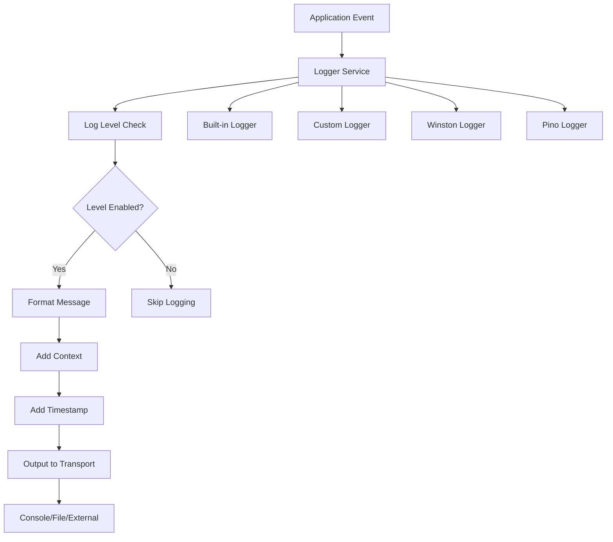

# 📝 Logger trong NestJS

## 🔍 Logger là gì?

**Logger** trong NestJS là hệ thống ghi log tích hợp sẵn, cung cấp structured logging capabilities cho ứng dụng. NestJS Logger được thiết kế để:

- **Structured Logging**: Format logs theo chuẩn và dễ đọc
- **Context Awareness**: Tự động include context thông tin
- **Level Management**: Support multiple log levels (error, warn, log, debug, verbose)
- **Customizable**: Có thể thay thế bằng external loggers như Winston, Pino
- **Performance**: Optimized cho production environments

### 🔄 Cách hoạt động trong NestJS Ecosystem



**Core Components:**

1. **Logger Service**: Main logging interface
2. **Log Levels**: Error, Warn, Log, Debug, Verbose
3. **Context**: Automatic context injection
4. **Transports**: Where logs are output (console, file, external)
5. **Formatters**: How logs are structured and displayed

### 🏗️ Logger Architecture

```typescript
// Core Logger Interface
interface LoggerService {
  log(message: any, context?: string): void
  error(message: any, trace?: string, context?: string): void
  warn(message: any, context?: string): void
  debug?(message: any, context?: string): void
  verbose?(message: any, context?: string): void
}

// NestJS Logger Features
interface NestJSLogger extends LoggerService {
  setContext(context: string): void
  setLogLevels(levels: LogLevel[]): void
  localInstance?: boolean
  isLevelEnabled(level: LogLevel): boolean
}
```

---

## 🎯 Cách implement Logger

### 1. Basic Logger Usage

**Built-in Logger trong Controllers**

```typescript
// src/app.controller.ts
import { Controller, Get, Logger } from '@nestjs/common'

@Controller()
export class AppController {
  // Create logger instance với automatic context
  private readonly logger = new Logger(AppController.name)

  @Get()
  getHello(): string {
    // Basic logging
    this.logger.log('Hello endpoint called')
    this.logger.debug('Debug information')
    this.logger.warn('Warning message')

    return 'Hello World!'
  }

  @Get('error-demo')
  errorDemo() {
    try {
      throw new Error('Demo error')
    } catch (error) {
      // Error logging với stack trace
      this.logger.error('Error occurred in errorDemo', error.stack, AppController.name)
      throw error
    }
  }
}
```

**Service Logger Implementation**

```typescript
// src/user/user.service.ts
import { Injectable, Logger } from '@nestjs/common'

@Injectable()
export class UserService {
  private readonly logger = new Logger(UserService.name)

  async findUser(id: string) {
    this.logger.log(`Finding user với ID: ${id}`)

    try {
      const user = await this.userRepository.findById(id)

      if (!user) {
        this.logger.warn(`User not found: ${id}`)
        return null
      }

      this.logger.debug(`User found: ${user.email}`)
      return user
    } catch (error) {
      this.logger.error(`Failed to find user ${id}`, error.stack, UserService.name)
      throw error
    }
  }

  async createUser(userData: CreateUserDto) {
    this.logger.log(`Creating new user: ${userData.email}`)

    const startTime = Date.now()

    try {
      const user = await this.userRepository.create(userData)

      const duration = Date.now() - startTime
      this.logger.log(`User created successfully in ${duration}ms: ${user.id}`)

      return user
    } catch (error) {
      this.logger.error(`Failed to create user: ${userData.email}`, error.stack, UserService.name)
      throw error
    }
  }
}
```

### 2. Global Logger Configuration

**Main.ts Setup**

```typescript
// src/main.ts
import { NestFactory } from '@nestjs/core'
import { Logger } from '@nestjs/common'
import { AppModule } from './app.module'

async function bootstrap() {
  // Create application với custom logger
  const app = await NestFactory.create(AppModule, {
    logger: ['error', 'warn', 'log'], // Production log levels
  })

  // Global logger instance
  const globalLogger = new Logger('Bootstrap')

  globalLogger.log('Application starting...')

  // Configure global exception handling
  app.useGlobalFilters(new HttpExceptionFilter(globalLogger))

  const port = process.env.PORT || 3000
  await app.listen(port)

  globalLogger.log(`Application listening on port ${port}`)
}

bootstrap().catch((error) => {
  const logger = new Logger('Bootstrap')
  logger.error('Failed to start application', error.stack)
  process.exit(1)
})
```

**Environment-based Logger Configuration**

```typescript
// src/config/logger.config.ts
import { LogLevel } from '@nestjs/common'

interface LoggerConfig {
  levels: LogLevel[]
  context: string
  timestamp: boolean
}

export function getLoggerConfig(): LoggerConfig {
  const environment = process.env.NODE_ENV || 'development'

  switch (environment) {
    case 'production':
      return {
        levels: ['error', 'warn', 'log'],
        context: true,
        timestamp: true,
      }

    case 'staging':
      return {
        levels: ['error', 'warn', 'log', 'debug'],
        context: true,
        timestamp: true,
      }

    case 'development':
    default:
      return {
        levels: ['error', 'warn', 'log', 'debug', 'verbose'],
        context: true,
        timestamp: true,
      }
  }
}

// Usage trong main.ts
const loggerConfig = getLoggerConfig()
const app = await NestFactory.create(AppModule, {
  logger: loggerConfig.levels,
})
```

### 3. Custom Logger Implementation

**Custom Logger Service**

```typescript
// src/logger/custom-logger.service.ts
import { Injectable, LoggerService, LogLevel } from '@nestjs/common'

interface LogEntry {
  level: LogLevel
  message: string
  context?: string
  timestamp: string
  trace?: string
  metadata?: Record<string, any>
}

@Injectable()
export class CustomLoggerService implements LoggerService {
  private logLevels: LogLevel[] = ['error', 'warn', 'log', 'debug', 'verbose']

  log(message: any, context?: string) {
    this.printMessage('log', message, context)
  }

  error(message: any, trace?: string, context?: string) {
    this.printMessage('error', message, context, trace)
  }

  warn(message: any, context?: string) {
    this.printMessage('warn', message, context)
  }

  debug(message: any, context?: string) {
    this.printMessage('debug', message, context)
  }

  verbose(message: any, context?: string) {
    this.printMessage('verbose', message, context)
  }

  setLogLevels(levels: LogLevel[]) {
    this.logLevels = levels
  }

  private printMessage(level: LogLevel, message: any, context?: string, trace?: string) {
    if (!this.isLevelEnabled(level)) return

    const logEntry: LogEntry = {
      level,
      message: this.formatMessage(message),
      context,
      timestamp: new Date().toISOString(),
      trace,
      metadata: this.getMetadata(),
    }

    // Output formatting
    const formattedLog = this.formatLogEntry(logEntry)

    // Output to appropriate stream
    if (level === 'error') {
      console.error(formattedLog)
    } else {
      console.log(formattedLog)
    }

    // Additional outputs
    this.writeToFile(logEntry)
    this.sendToExternalService(logEntry)
  }

  private formatMessage(message: any): string {
    if (typeof message === 'object') {
      return JSON.stringify(message, null, 2)
    }
    return String(message)
  }

  private formatLogEntry(entry: LogEntry): string {
    const { level, message, context, timestamp, trace } = entry

    const contextStr = context ? ` [${context}]` : ''
    const levelStr = level.toUpperCase().padEnd(7)
    const timestampStr = timestamp

    let formatted = `${timestampStr} ${levelStr}${contextStr} ${message}`

    if (trace) {
      formatted += `\n${trace}`
    }

    return formatted
  }

  private getMetadata(): Record<string, any> {
    return {
      pid: process.pid,
      hostname: require('os').hostname(),
      version: process.env.npm_package_version,
      environment: process.env.NODE_ENV,
    }
  }

  private isLevelEnabled(level: LogLevel): boolean {
    return this.logLevels.includes(level)
  }

  private async writeToFile(entry: LogEntry) {
    // Implement file writing logic
    if (process.env.LOG_TO_FILE === 'true') {
      // Write to log file
    }
  }

  private async sendToExternalService(entry: LogEntry) {
    // Send to external logging service (ELK, Datadog, etc.)
    if (process.env.EXTERNAL_LOGGING === 'true') {
      // Send to external service
    }
  }
}

// Register custom logger
@Module({
  providers: [CustomLoggerService],
  exports: [CustomLoggerService],
})
export class LoggerModule {}

// Usage trong main.ts
const app = await NestFactory.create(AppModule, {
  bufferLogs: true, // Buffer logs until custom logger is ready
})

app.useLogger(app.get(CustomLoggerService))
```

### 4. Request Logging Interceptor

```typescript
// src/interceptors/logging.interceptor.ts
import { Injectable, NestInterceptor, ExecutionContext, CallHandler, Logger } from '@nestjs/common'
import { Observable } from 'rxjs'
import { tap, catchError } from 'rxjs/operators'
import { Request, Response } from 'express'

@Injectable()
export class LoggingInterceptor implements NestInterceptor {
  private readonly logger = new Logger(LoggingInterceptor.name)

  intercept(context: ExecutionContext, next: CallHandler): Observable<any> {
    const request = context.switchToHttp().getRequest<Request>()
    const response = context.switchToHttp().getResponse<Response>()

    const { method, originalUrl, ip, headers } = request
    const userAgent = headers['user-agent'] || ''

    const requestId = this.generateRequestId()
    const startTime = Date.now()

    // Log incoming request
    this.logger.log(`${method} ${originalUrl} - ${ip} - ${userAgent}`, `Request-${requestId}`)

    return next.handle().pipe(
      tap(() => {
        // Log successful response
        const duration = Date.now() - startTime
        const { statusCode } = response

        this.logger.log(`${method} ${originalUrl} ${statusCode} - ${duration}ms`, `Response-${requestId}`)
      }),
      catchError((error) => {
        // Log error response
        const duration = Date.now() - startTime

        this.logger.error(
          `${method} ${originalUrl} ${error.status || 500} - ${duration}ms - ${error.message}`,
          error.stack,
          `Error-${requestId}`,
        )

        throw error
      }),
    )
  }

  private generateRequestId(): string {
    return Math.random().toString(36).substr(2, 9)
  }
}

// Apply globally
@Module({
  providers: [
    {
      provide: APP_INTERCEPTOR,
      useClass: LoggingInterceptor,
    },
  ],
})
export class AppModule {}
```

---

## 💡 Các cách sử dụng thông dụng

### 1. Structured Logging với Metadata

```typescript
// src/services/analytics.service.ts
import { Injectable, Logger } from '@nestjs/common'

@Injectable()
export class AnalyticsService {
  private readonly logger = new Logger(AnalyticsService.name)

  async trackEvent(event: string, userId: string, data: any) {
    // Structured logging với metadata
    const logData = {
      event,
      userId,
      data,
      timestamp: new Date().toISOString(),
      sessionId: this.getCurrentSessionId(),
      userAgent: this.getCurrentUserAgent(),
      ip: this.getCurrentIP(),
    }

    this.logger.log(`Event tracked: ${event}`, JSON.stringify(logData, null, 2))

    // Send to analytics service
    await this.sendToAnalytics(logData)
  }

  async trackError(error: Error, context: any) {
    const errorData = {
      name: error.name,
      message: error.message,
      stack: error.stack,
      context,
      timestamp: new Date().toISOString(),
      severity: this.getErrorSeverity(error),
    }

    this.logger.error(`Error tracked: ${error.message}`, JSON.stringify(errorData, null, 2))

    // Send to error tracking service
    await this.sendToErrorTracking(errorData)
  }

  private getErrorSeverity(error: Error): string {
    // Determine error severity based on error type
    if (error.name.includes('Database')) return 'high'
    if (error.name.includes('Validation')) return 'medium'
    return 'low'
  }
}
```

### 2. Performance Logging

```typescript
// src/decorators/performance-log.decorator.ts
import { Logger } from '@nestjs/common'

export function PerformanceLog(target: any, propertyName: string, descriptor: PropertyDescriptor) {
  const method = descriptor.value
  const logger = new Logger(`${target.constructor.name}::${propertyName}`)

  descriptor.value = async function (...args: any[]) {
    const startTime = Date.now()

    logger.debug(`Starting ${propertyName} với args: ${JSON.stringify(args)}`)

    try {
      const result = await method.apply(this, args)
      const duration = Date.now() - startTime

      logger.log(`${propertyName} completed in ${duration}ms`)

      // Log slow operations
      if (duration > 1000) {
        logger.warn(`Slow operation detected: ${propertyName} took ${duration}ms`)
      }

      return result
    } catch (error) {
      const duration = Date.now() - startTime

      logger.error(`${propertyName} failed after ${duration}ms: ${error.message}`, error.stack)

      throw error
    }
  }

  return descriptor
}

// Usage
@Injectable()
export class UserService {
  @PerformanceLog
  async findUser(id: string) {
    // Method implementation
  }

  @PerformanceLog
  async createUser(userData: CreateUserDto) {
    // Method implementation
  }
}
```

### 3. Database Query Logging

```typescript
// src/database/query-logger.ts
import { Logger } from '@nestjs/common'
import { Logger as TypeORMLogger } from 'typeorm'

export class DatabaseQueryLogger implements TypeORMLogger {
  private readonly logger = new Logger('DatabaseQuery')

  logQuery(query: string, parameters?: any[]) {
    // Log all database queries
    this.logger.debug(`Query: ${query}`)

    if (parameters && parameters.length) {
      this.logger.debug(`Parameters: ${JSON.stringify(parameters)}`)
    }
  }

  logQueryError(error: string, query: string, parameters?: any[]) {
    this.logger.error(`Query failed: ${query}`, `Error: ${error}\nParameters: ${JSON.stringify(parameters)}`)
  }

  logQuerySlow(time: number, query: string, parameters?: any[]) {
    this.logger.warn(`Slow query detected (${time}ms): ${query}`, `Parameters: ${JSON.stringify(parameters)}`)
  }

  logSchemaBuild(message: string) {
    this.logger.log(`Schema: ${message}`)
  }

  logMigration(message: string) {
    this.logger.log(`Migration: ${message}`)
  }

  log(level: 'log' | 'info' | 'warn', message: any) {
    switch (level) {
      case 'log':
      case 'info':
        this.logger.log(message)
        break
      case 'warn':
        this.logger.warn(message)
        break
    }
  }
}

// Configure trong database module
@Module({
  imports: [
    TypeOrmModule.forRoot({
      // Database configuration
      logging: true,
      logger: new DatabaseQueryLogger(),
      // Log slow queries (queries taking more than 1 second)
      maxQueryExecutionTime: 1000,
    }),
  ],
})
export class DatabaseModule {}
```

### 4. Security Event Logging

```typescript
// src/security/security-logger.service.ts
import { Injectable, Logger } from '@nestjs/common'

interface SecurityEvent {
  type: 'login' | 'logout' | 'failed_login' | 'permission_denied' | 'suspicious_activity'
  userId?: string
  ip: string
  userAgent: string
  details: any
  timestamp: Date
  severity: 'low' | 'medium' | 'high' | 'critical'
}

@Injectable()
export class SecurityLoggerService {
  private readonly logger = new Logger(SecurityLoggerService.name)

  logSecurityEvent(event: SecurityEvent) {
    const logMessage = `Security Event: ${event.type}`
    const context = {
      ...event,
      timestamp: event.timestamp.toISOString(),
    }

    // Log based on severity
    switch (event.severity) {
      case 'critical':
        this.logger.error(logMessage, JSON.stringify(context, null, 2))
        this.alertSecurityTeam(event)
        break

      case 'high':
        this.logger.error(logMessage, JSON.stringify(context, null, 2))
        break

      case 'medium':
        this.logger.warn(logMessage, JSON.stringify(context, null, 2))
        break

      case 'low':
      default:
        this.logger.log(logMessage, JSON.stringify(context, null, 2))
        break
    }

    // Store trong security database
    this.storeSecurityEvent(event)
  }

  logLoginSuccess(userId: string, ip: string, userAgent: string) {
    this.logSecurityEvent({
      type: 'login',
      userId,
      ip,
      userAgent,
      details: { success: true },
      timestamp: new Date(),
      severity: 'low',
    })
  }

  logLoginFailure(email: string, ip: string, userAgent: string, reason: string) {
    this.logSecurityEvent({
      type: 'failed_login',
      ip,
      userAgent,
      details: { email, reason },
      timestamp: new Date(),
      severity: 'medium',
    })
  }

  logSuspiciousActivity(details: any, ip: string, userAgent: string) {
    this.logSecurityEvent({
      type: 'suspicious_activity',
      ip,
      userAgent,
      details,
      timestamp: new Date(),
      severity: 'high',
    })
  }

  private async storeSecurityEvent(event: SecurityEvent) {
    // Store trong database cho forensic analysis
  }

  private async alertSecurityTeam(event: SecurityEvent) {
    // Send alert to security team
    this.logger.error(`CRITICAL SECURITY EVENT: ${event.type}`, {
      event,
      action: 'SECURITY_TEAM_ALERTED',
    })
  }
}
```

### 5. Application Lifecycle Logging

```typescript
// src/lifecycle/lifecycle-logger.service.ts
import { Injectable, Logger, OnModuleInit, OnModuleDestroy } from '@nestjs/common'

@Injectable()
export class LifecycleLoggerService implements OnModuleInit, OnModuleDestroy {
  private readonly logger = new Logger(LifecycleLoggerService.name)
  private readonly startTime = Date.now()

  onModuleInit() {
    this.logger.log('Application lifecycle started')
    this.logSystemInfo()
    this.startHealthCheck()
  }

  onModuleDestroy() {
    const uptime = Date.now() - this.startTime
    this.logger.log(`Application shutting down after ${uptime}ms uptime`)
  }

  private logSystemInfo() {
    const systemInfo = {
      nodeVersion: process.version,
      platform: process.platform,
      arch: process.arch,
      pid: process.pid,
      memory: process.memoryUsage(),
      environment: process.env.NODE_ENV,
      timestamp: new Date().toISOString(),
    }

    this.logger.log('System Information', JSON.stringify(systemInfo, null, 2))
  }

  private startHealthCheck() {
    setInterval(() => {
      const health = {
        uptime: process.uptime(),
        memory: process.memoryUsage(),
        cpu: process.cpuUsage(),
        timestamp: new Date().toISOString(),
      }

      this.logger.debug('Health Check', JSON.stringify(health, null, 2))
    }, 30000) // Every 30 seconds
  }

  logApplicationEvent(event: string, data?: any) {
    this.logger.log(`Application Event: ${event}`, data ? JSON.stringify(data, null, 2) : '')
  }
}
```

---

## ⚠️ Các vấn đề thường gặp

### 1. Over-logging trong Production

**Vấn đề:**

```typescript
// ❌ Too much logging in production
private readonly logger = new Logger(SomeService.name)

async someMethod() {
  this.logger.debug('Method started')
  this.logger.debug('Processing step 1')
  this.logger.debug('Processing step 2')
  this.logger.debug('Processing step 3')
  this.logger.debug('Method completed')
  // Too verbose for production
}
```

**Giải pháp:**

```typescript
// ✅ Environment-aware logging
private readonly logger = new Logger(SomeService.name)

async someMethod() {
  this.logger.log('Processing important operation')

  // Only debug in development
  if (process.env.NODE_ENV === 'development') {
    this.logger.debug('Detailed processing steps...')
  }

  this.logger.log('Operation completed successfully')
}

// ✅ Conditional logging với log levels
async someMethod() {
  // This will only show in development (if debug level is enabled)
  this.logger.debug('Detailed processing information')

  // This will show in all environments
  this.logger.log('Important business event')

  // This will always show
  this.logger.error('Critical error occurred')
}
```

### 2. Sensitive Data trong Logs

**Vấn đề:**

```typescript
// ❌ Logging sensitive information
this.logger.log(`User login: ${JSON.stringify(loginData)}`)
// Logs password, tokens, personal information
```

**Giải pháp:**

```typescript
// ✅ Sanitize sensitive data
private sanitizeLogData(data: any): any {
  const sensitiveFields = ['password', 'token', 'ssn', 'creditCard', 'apiKey']
  const sanitized = { ...data }

  sensitiveFields.forEach(field => {
    if (sanitized[field]) {
      sanitized[field] = '[REDACTED]'
    }
  })

  return sanitized
}

// Usage
this.logger.log(`User login: ${JSON.stringify(this.sanitizeLogData(loginData))}`)

// ✅ Create utility function
class LogSanitizer {
  static sanitize(obj: any): any {
    if (typeof obj !== 'object' || obj === null) return obj

    const sanitized = Array.isArray(obj) ? [] : {}

    for (const key in obj) {
      if (this.isSensitiveField(key)) {
        sanitized[key] = '[REDACTED]'
      } else if (typeof obj[key] === 'object') {
        sanitized[key] = this.sanitize(obj[key])
      } else {
        sanitized[key] = obj[key]
      }
    }

    return sanitized
  }

  private static isSensitiveField(field: string): boolean {
    const sensitive = ['password', 'token', 'secret', 'key', 'ssn', 'credit']
    return sensitive.some(s => field.toLowerCase().includes(s))
  }
}
```

### 3. Performance Issues với Synchronous Logging

**Vấn đề:**

```typescript
// ❌ Blocking operations cho logging
this.logger.log('Processing user data')
// Logger blocks event loop
```

**Giải pháp:**

```typescript
// ✅ Asynchronous logging service
@Injectable()
export class AsyncLoggerService {
  private logQueue: any[] = []
  private processing = false

  log(message: string, context?: string) {
    this.logQueue.push({ level: 'log', message, context, timestamp: Date.now() })
    this.processQueue()
  }

  private async processQueue() {
    if (this.processing) return

    this.processing = true

    while (this.logQueue.length > 0) {
      const batch = this.logQueue.splice(0, 100) // Process trong batches
      await this.processBatch(batch)
    }

    this.processing = false
  }

  private async processBatch(logs: any[]) {
    // Process logs asynchronously
    await Promise.all(logs.map((log) => this.writeLog(log)))
  }

  private async writeLog(log: any) {
    // Non-blocking log writing
    setImmediate(() => {
      console.log(`${log.timestamp} [${log.context}] ${log.message}`)
    })
  }
}
```

### 4. Missing Context Information

**Vấn đề:**

```typescript
// ❌ No context information
this.logger.log('User created')
// No way to trace which user, request, or operation
```

**Giải pháp:**

```typescript
// ✅ Rich context logging
@Injectable()
export class ContextualLoggerService {
  private context: Map<string, any> = new Map()

  setContext(key: string, value: any) {
    this.context.set(key, value)
  }

  clearContext() {
    this.context.clear()
  }

  log(message: string, additionalContext?: any) {
    const fullContext = {
      ...Object.fromEntries(this.context),
      ...additionalContext,
      timestamp: new Date().toISOString(),
      requestId: this.getRequestId(),
    }

    console.log(`${message} | Context: ${JSON.stringify(fullContext)}`)
  }

  private getRequestId(): string {
    // Get from AsyncLocalStorage or request context
    return 'req-' + Math.random().toString(36)
  }
}

// ✅ Request-scoped context
@Injectable({ scope: Scope.REQUEST })
export class RequestLoggerService {
  private requestId: string
  private userId?: string
  private startTime: number

  constructor(@Inject(REQUEST) private request: Request) {
    this.requestId = this.generateRequestId()
    this.startTime = Date.now()
    this.userId = this.extractUserId(request)
  }

  log(message: string) {
    const context = {
      requestId: this.requestId,
      userId: this.userId,
      duration: Date.now() - this.startTime,
      method: this.request.method,
      url: this.request.url,
    }

    console.log(`${message} | ${JSON.stringify(context)}`)
  }
}
```

---

## 🔧 Advanced Patterns

### 1. Logger Factory Pattern

```typescript
// src/logger/logger.factory.ts
interface LoggerOptions {
  context: string
  level?: 'debug' | 'info' | 'warn' | 'error'
  format?: 'json' | 'text'
  transports?: string[]
}

@Injectable()
export class LoggerFactory {
  private loggers = new Map<string, Logger>()

  createLogger(options: LoggerOptions): Logger {
    const key = `${options.context}-${options.level || 'info'}`

    if (this.loggers.has(key)) {
      return this.loggers.get(key)!
    }

    const logger = new CustomLogger(options)
    this.loggers.set(key, logger)

    return logger
  }

  getLogger(context: string): Logger {
    return this.createLogger({ context })
  }

  // Create specialized loggers
  createSecurityLogger(): Logger {
    return this.createLogger({
      context: 'Security',
      level: 'warn',
      transports: ['console', 'file', 'external'],
    })
  }

  createPerformanceLogger(): Logger {
    return this.createLogger({
      context: 'Performance',
      level: 'debug',
      format: 'json',
      transports: ['console', 'metrics'],
    })
  }

  createAuditLogger(): Logger {
    return this.createLogger({
      context: 'Audit',
      level: 'info',
      transports: ['file', 'database'],
    })
  }
}

// Usage
@Injectable()
export class UserService {
  private readonly logger: Logger
  private readonly securityLogger: Logger
  private readonly auditLogger: Logger

  constructor(private loggerFactory: LoggerFactory) {
    this.logger = loggerFactory.getLogger(UserService.name)
    this.securityLogger = loggerFactory.createSecurityLogger()
    this.auditLogger = loggerFactory.createAuditLogger()
  }

  async authenticateUser(credentials: LoginDto) {
    this.logger.log('User authentication attempt')

    try {
      const user = await this.validateCredentials(credentials)

      // Audit log
      this.auditLogger.log(`User authenticated: ${user.id}`)

      // Security log
      this.securityLogger.log(`Successful login: ${user.email}`)

      return user
    } catch (error) {
      this.securityLogger.warn(`Failed login attempt: ${credentials.email}`)
      throw error
    }
  }
}
```

### 2. Log Aggregation và Correlation

```typescript
// src/logger/log-correlation.service.ts
import { AsyncLocalStorage } from 'async_hooks'

interface CorrelationContext {
  requestId: string
  userId?: string
  sessionId?: string
  traceId?: string
  spanId?: string
}

@Injectable()
export class LogCorrelationService {
  private static asyncLocalStorage = new AsyncLocalStorage<CorrelationContext>()

  static run<T>(context: CorrelationContext, callback: () => T): T {
    return this.asyncLocalStorage.run(context, callback)
  }

  static getContext(): CorrelationContext | undefined {
    return this.asyncLocalStorage.getStore()
  }

  static setUserId(userId: string) {
    const context = this.getContext()
    if (context) {
      context.userId = userId
    }
  }

  static generateRequestId(): string {
    return `req-${Date.now()}-${Math.random().toString(36).substr(2, 9)}`
  }
}

// Middleware để set correlation context
@Injectable()
export class CorrelationMiddleware implements NestMiddleware {
  use(req: Request, res: Response, next: NextFunction) {
    const requestId = (req.headers['x-request-id'] as string) || LogCorrelationService.generateRequestId()

    const context: CorrelationContext = {
      requestId,
      traceId: req.headers['x-trace-id'] as string,
      spanId: req.headers['x-span-id'] as string,
    }

    // Set response header
    res.setHeader('X-Request-ID', requestId)

    // Run request trong correlation context
    LogCorrelationService.run(context, () => {
      next()
    })
  }
}

// Enhanced logger với correlation
@Injectable()
export class CorrelatedLogger {
  private readonly logger = new Logger()

  log(message: string, context?: string) {
    const correlation = LogCorrelationService.getContext()
    const enhancedMessage = this.enhanceMessage(message, correlation)

    this.logger.log(enhancedMessage, context)
  }

  error(message: string, trace?: string, context?: string) {
    const correlation = LogCorrelationService.getContext()
    const enhancedMessage = this.enhanceMessage(message, correlation)

    this.logger.error(enhancedMessage, trace, context)
  }

  private enhanceMessage(message: string, correlation?: CorrelationContext): string {
    if (!correlation) return message

    const correlationInfo = [
      correlation.requestId && `requestId=${correlation.requestId}`,
      correlation.userId && `userId=${correlation.userId}`,
      correlation.traceId && `traceId=${correlation.traceId}`,
    ]
      .filter(Boolean)
      .join(' ')

    return `[${correlationInfo}] ${message}`
  }
}
```

### 3. Metrics Integration

```typescript
// src/logger/metrics-logger.service.ts
interface MetricData {
  name: string
  value: number
  tags?: Record<string, string>
  timestamp?: Date
}

@Injectable()
export class MetricsLoggerService {
  private readonly logger = new Logger(MetricsLoggerService.name)
  private metrics: MetricData[] = []

  // Counter metrics
  incrementCounter(name: string, tags?: Record<string, string>) {
    this.recordMetric({
      name: `${name}.count`,
      value: 1,
      tags,
    })
  }

  // Gauge metrics
  recordGauge(name: string, value: number, tags?: Record<string, string>) {
    this.recordMetric({
      name: `${name}.gauge`,
      value,
      tags,
    })
  }

  // Histogram metrics (timing)
  recordTiming(name: string, durationMs: number, tags?: Record<string, string>) {
    this.recordMetric({
      name: `${name}.timing`,
      value: durationMs,
      tags,
    })
  }

  // Timer decorator
  timer(metricName: string) {
    return (target: any, propertyName: string, descriptor: PropertyDescriptor) => {
      const method = descriptor.value

      descriptor.value = async function (...args: any[]) {
        const startTime = Date.now()

        try {
          const result = await method.apply(this, args)
          const duration = Date.now() - startTime

          // Record successful timing
          this.metricsLogger?.recordTiming(metricName, duration, {
            method: propertyName,
            status: 'success',
          })

          return result
        } catch (error) {
          const duration = Date.now() - startTime

          // Record error timing
          this.metricsLogger?.recordTiming(metricName, duration, {
            method: propertyName,
            status: 'error',
            errorType: error.constructor.name,
          })

          throw error
        }
      }

      return descriptor
    }
  }

  private recordMetric(metric: MetricData) {
    metric.timestamp = metric.timestamp || new Date()

    this.metrics.push(metric)

    // Log metric
    this.logger.debug(`Metric recorded: ${metric.name} = ${metric.value}`, JSON.stringify({ metric }))

    // Send to metrics backend
    this.sendToMetricsBackend(metric)

    // Cleanup old metrics
    this.cleanupMetrics()
  }

  private async sendToMetricsBackend(metric: MetricData) {
    // Send to StatsD, Prometheus, DataDog, etc.
    if (process.env.METRICS_ENABLED === 'true') {
      // Implementation for specific metrics backend
    }
  }

  private cleanupMetrics() {
    // Keep only last 1000 metrics trong memory
    if (this.metrics.length > 1000) {
      this.metrics = this.metrics.slice(-1000)
    }
  }

  // Batch export for external systems
  exportMetrics(): MetricData[] {
    return [...this.metrics]
  }

  clearMetrics() {
    this.metrics = []
  }
}

// Usage với decorator
@Injectable()
export class UserService {
  constructor(private metricsLogger: MetricsLoggerService) {}

  @MetricsLoggerService.prototype.timer('user.creation')
  async createUser(userData: CreateUserDto) {
    this.metricsLogger.incrementCounter('user.creation.attempt')

    try {
      const user = await this.userRepository.save(userData)

      this.metricsLogger.incrementCounter('user.creation.success')

      return user
    } catch (error) {
      this.metricsLogger.incrementCounter('user.creation.error', {
        errorType: error.constructor.name,
      })

      throw error
    }
  }
}
```

### 4. Log Sampling và Rate Limiting

```typescript
// src/logger/sampled-logger.service.ts
interface SamplingConfig {
  sampleRate: number // 0-1 (percentage)
  maxLogsPerSecond?: number
  burstLimit?: number
}

@Injectable()
export class SampledLoggerService {
  private readonly logger = new Logger(SampledLoggerService.name)
  private logCounts = new Map<string, number>()
  private lastReset = Date.now()
  private samplingConfig: SamplingConfig

  constructor() {
    this.samplingConfig = {
      sampleRate: parseFloat(process.env.LOG_SAMPLE_RATE || '1.0'),
      maxLogsPerSecond: parseInt(process.env.MAX_LOGS_PER_SECOND || '100'),
      burstLimit: parseInt(process.env.LOG_BURST_LIMIT || '200'),
    }
  }

  log(message: string, context?: string, forceLog = false) {
    if (!forceLog && !this.shouldLog(context || 'default')) {
      return
    }

    this.logger.log(message, context)
  }

  error(message: string, trace?: string, context?: string) {
    // Always log errors (no sampling)
    this.logger.error(message, trace, context)
  }

  warn(message: string, context?: string, forceLog = false) {
    if (!forceLog && !this.shouldLog(context || 'default')) {
      return
    }

    this.logger.warn(message, context)
  }

  debug(message: string, context?: string) {
    // Debug logs with higher sampling rate
    if (!this.shouldLog(context || 'default', 0.1)) {
      return
    }

    this.logger.debug(message, context)
  }

  private shouldLog(context: string, customSampleRate?: number): boolean {
    // Check sampling rate
    const sampleRate = customSampleRate || this.samplingConfig.sampleRate
    if (Math.random() > sampleRate) {
      return false
    }

    // Check rate limiting
    if (!this.checkRateLimit(context)) {
      return false
    }

    return true
  }

  private checkRateLimit(context: string): boolean {
    const now = Date.now()

    // Reset counters every second
    if (now - this.lastReset > 1000) {
      this.logCounts.clear()
      this.lastReset = now
    }

    const currentCount = this.logCounts.get(context) || 0

    // Check limits
    if (currentCount >= (this.samplingConfig.maxLogsPerSecond || 100)) {
      return false
    }

    // Update counter
    this.logCounts.set(context, currentCount + 1)

    return true
  }

  // Configure sampling at runtime
  setSampleRate(rate: number) {
    this.samplingConfig.sampleRate = Math.max(0, Math.min(1, rate))
  }

  setRateLimit(maxLogsPerSecond: number) {
    this.samplingConfig.maxLogsPerSecond = maxLogsPerSecond
  }

  // Get logging statistics
  getStats(): any {
    return {
      config: this.samplingConfig,
      currentCounts: Object.fromEntries(this.logCounts),
      lastReset: this.lastReset,
    }
  }
}
```

---

## 📝 Best Practices

### ✅ DO's

**1. Use Structured Logging**

```typescript
// ✅ Structured log format
this.logger.log('User created', {
  userId: user.id,
  email: user.email,
  timestamp: new Date().toISOString(),
  action: 'user_creation',
})
```

**2. Include Context Information**

```typescript
// ✅ Rich context
private readonly logger = new Logger(ServiceName.name)

this.logger.log('Processing started', {
  requestId: this.requestId,
  userId: this.userId,
  operation: 'processData',
})
```

**3. Log Performance Metrics**

```typescript
// ✅ Performance logging
const startTime = Date.now()
const result = await this.processData()
const duration = Date.now() - startTime

this.logger.log(`Data processed in ${duration}ms`)
```

**4. Use Appropriate Log Levels**

```typescript
// ✅ Correct log levels
this.logger.error('Database connection failed', error.stack) // Errors
this.logger.warn('Rate limit approaching') // Warnings
this.logger.log('User logged in') // Info
this.logger.debug('Processing step 1') // Debug
```

### ❌ DON'Ts

**1. Log Sensitive Information**

```typescript
// ❌ Sensitive data trong logs
this.logger.log(`Login attempt: ${JSON.stringify(credentials)}`) // Contains password
```

**2. Over-log trong Production**

```typescript
// ❌ Too verbose
this.logger.debug('Variable value:', someVariable)
this.logger.debug('Loop iteration:', i)
this.logger.debug('Processing step:', step)
```

**3. Block Event Loop**

```typescript
// ❌ Synchronous heavy logging
const bigObject = generateHugeObject()
this.logger.log(JSON.stringify(bigObject)) // Blocks event loop
```

### 🎯 Configuration Strategy

**1. Environment-based Levels**

```typescript
// ✅ Different levels per environment
const logLevels = {
  production: ['error', 'warn', 'log'],
  staging: ['error', 'warn', 'log', 'debug'],
  development: ['error', 'warn', 'log', 'debug', 'verbose'],
}
```

**2. Context-aware Logging**

```typescript
// ✅ Service-specific contexts
private readonly logger = new Logger(`${ServiceName.name}::${methodName}`)
```

**3. Async Logging for Performance**

```typescript
// ✅ Non-blocking logging
this.asyncLogger.log(message) // Don't await
```

---

## 🚨 Common Pitfalls

### 1. Logging Performance Issues

**❌ Pitfall: Blocking Operations**

```typescript
// ❌ Expensive operations trong logging
this.logger.log(`User data: ${JSON.stringify(complexObject)}`) // Blocks thread
```

**✅ Solution: Lazy Logging**

```typescript
// ✅ Defer expensive operations
if (this.logger.isLevelEnabled('debug')) {
  this.logger.debug(`User data: ${JSON.stringify(complexObject)}`)
}

// ✅ Use async logging
this.asyncLogger.log(() => `Complex data: ${processComplexObject()}`)
```

### 2. Log Injection Attacks

**❌ Pitfall: Unvalidated Input**

```typescript
// ❌ User input directly trong logs
this.logger.log(`User search: ${userInput}`) // Can inject malicious content
```

**✅ Solution: Input Validation**

```typescript
// ✅ Sanitize input
const sanitizedInput = userInput.replace(/[\r\n\t]/g, '_')
this.logger.log(`User search: ${sanitizedInput}`)

// ✅ Use structured logging
this.logger.log('User search', { query: userInput })
```

### 3. Memory Leaks trong Logging

**❌ Pitfall: Accumulating Log Data**

```typescript
// ❌ Storing logs trong memory
class LogService {
  private logs: any[] = []

  log(message: string) {
    this.logs.push({ message, timestamp: new Date() }) // Memory leak
  }
}
```

**✅ Solution: Bounded Collections**

```typescript
// ✅ Limited size collections
class LogService {
  private logs: any[] = []
  private maxLogs = 1000

  log(message: string) {
    this.logs.push({ message, timestamp: new Date() })

    if (this.logs.length > this.maxLogs) {
      this.logs.shift() // Remove oldest
    }
  }
}
```

---

## 📋 Tóm tắt

### 🎯 Key Takeaways

1. **Structured Logging**: Use consistent, structured log formats
2. **Context Awareness**: Include relevant context trong all logs
3. **Performance**: Use async logging và avoid blocking operations
4. **Security**: Never log sensitive information
5. **Level Management**: Use appropriate log levels cho different environments
6. **Monitoring**: Implement log aggregation và analysis

### 🚀 When to Use Different Logger Types

**✅ Built-in Logger for:**

- Simple applications
- Development và testing
- Basic logging needs
- Quick prototyping

**✅ Custom Logger for:**

- Complex applications
- Specific formatting requirements
- Advanced features (sampling, correlation)
- Integration với external systems

**✅ External Loggers (Winston, Pino) for:**

- Production applications
- High-performance requirements
- Advanced transport options
- Complex filtering và routing

### 🔄 Implementation Strategy

1. **Start Simple**: Begin với built-in NestJS logger
2. **Add Structure**: Implement structured logging patterns
3. **Add Context**: Include correlation IDs và context
4. **Add Monitoring**: Implement log aggregation
5. **Optimize**: Add sampling và performance optimizations
6. **Integrate**: Connect với external logging systems

---

**📝 Với proper Logger implementation, bạn có thể có full visibility into your application's behavior và performance!**
