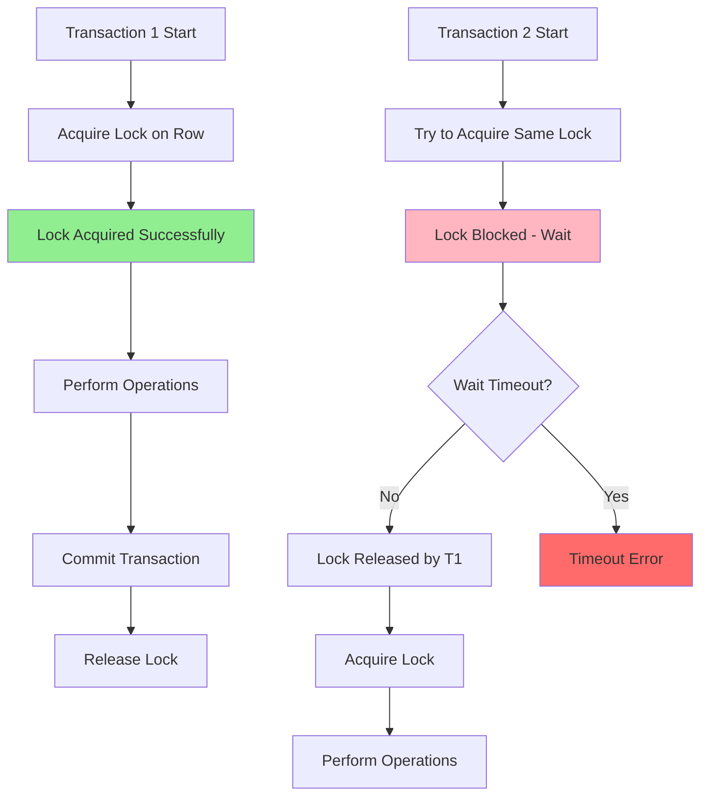

# 🔒 Pessimistic Lock trong NestJS

## 🔍 Pessimistic Lock là gì?

**Pessimistic Lock** là một kỹ thuật đồng bộ hóa dữ liệu trong database, hoạt động dựa trên nguyên tắc "khóa trước, xử lý sau". Trong NestJS ecosystem, Pessimistic Lock đóng vai trò quan trọng:

- **Exclusive Access**: Đảm bảo chỉ có một transaction có thể truy cập dữ liệu tại một thời điểm
- **Data Consistency**: Ngăn chặn race conditions và dirty reads
- **Immediate Blocking**: Block các transaction khác ngay khi lock được acquire
- **Database Level**: Được implement ở mức database, không phụ thuộc vào application logic

### 🔄 Cách hoạt động trong Database Ecosystem



**Lock Lifecycle & Execution Order:**

1. **Lock Acquisition**: Transaction yêu cầu lock trên specific rows/tables
2. **Blocking Phase**: Các transaction khác bị block khi try to access same data
3. **Processing Phase**: Transaction với lock thực hiện operations
4. **Lock Release**: Lock được release khi transaction commit/rollback
5. **Queue Processing**: Các transaction đang chờ được process theo thứ tự

### 🏗️ Lock Types và Levels

```typescript
// Lock Modes trong PostgreSQL/MySQL
enum LockMode {
  // Row-level locks
  FOR_UPDATE = 'FOR UPDATE', // Exclusive lock
  FOR_NO_KEY_UPDATE = 'FOR NO KEY UPDATE', // Allow concurrent index updates
  FOR_SHARE = 'FOR SHARE', // Shared lock
  FOR_KEY_SHARE = 'FOR KEY SHARE', // Weakest shared lock

  // Table-level locks (less common)
  ACCESS_EXCLUSIVE = 'ACCESS EXCLUSIVE',
  EXCLUSIVE = 'EXCLUSIVE',
  SHARE_UPDATE_EXCLUSIVE = 'SHARE UPDATE EXCLUSIVE',
}

// Lock Granularity
interface LockGranularity {
  ROW_LEVEL: 'Most common, locks specific rows'
  PAGE_LEVEL: 'Locks database pages (rare)'
  TABLE_LEVEL: 'Locks entire table (avoid in OLTP)'
  DATABASE_LEVEL: 'Locks entire database (maintenance only)'
}
```

---

## 🎯 Cách implement Pessimistic Lock

### 1. Basic Implementation với TypeORM

**Bước 1: Entity Setup**

```typescript
// src/entities/account.entity.ts
import { Entity, PrimaryGeneratedColumn, Column, CreateDateColumn, UpdateDateColumn, Version } from 'typeorm'

@Entity('accounts')
export class Account {
  @PrimaryGeneratedColumn('uuid')
  id: string

  @Column({ type: 'varchar', length: 255 })
  accountNumber: string

  @Column({ type: 'decimal', precision: 15, scale: 2, default: 0 })
  balance: number

  @Column({ type: 'varchar', length: 255 })
  ownerName: string

  @Column({ type: 'boolean', default: true })
  isActive: boolean

  @CreateDateColumn()
  createdAt: Date

  @UpdateDateColumn()
  updatedAt: Date

  // For optimistic locking (comparison later)
  @Version()
  version: number
}
```

**Bước 2: Repository với Pessimistic Lock**

```typescript
// src/repositories/account.repository.ts
import { Injectable } from '@nestjs/common'
import { InjectRepository } from '@nestjs/typeorm'
import { Repository, EntityManager } from 'typeorm'
import { Account } from '../entities/account.entity'

@Injectable()
export class AccountRepository {
  constructor(
    @InjectRepository(Account)
    private accountRepository: Repository<Account>,
  ) {}

  // Basic pessimistic lock - FOR UPDATE
  async findAndLockById(id: string, manager?: EntityManager): Promise<Account | null> {
    const repository = manager ? manager.getRepository(Account) : this.accountRepository

    return await repository
      .createQueryBuilder('account')
      .where('account.id = :id', { id })
      .setLock('pessimistic_write') // FOR UPDATE
      .getOne()
  }

  // Shared lock - FOR SHARE
  async findAndLockForRead(id: string, manager?: EntityManager): Promise<Account | null> {
    const repository = manager ? manager.getRepository(Account) : this.accountRepository

    return await repository
      .createQueryBuilder('account')
      .where('account.id = :id', { id })
      .setLock('pessimistic_read') // FOR SHARE
      .getOne()
  }

  // Lock with timeout
  async findAndLockWithTimeout(id: string, timeoutMs: number = 5000, manager?: EntityManager): Promise<Account | null> {
    const repository = manager ? manager.getRepository(Account) : this.accountRepository

    // PostgreSQL specific - NOWAIT option
    const query = repository.createQueryBuilder('account').where('account.id = :id', { id })

    // Set lock với timeout behavior
    if (process.env.DB_TYPE === 'postgres') {
      // PostgreSQL: Use NOWAIT or timeout
      return await query.setLock('pessimistic_write').getOne()
    } else {
      // MySQL: Use timeout hint
      return await query.setLock('pessimistic_write').getOne()
    }
  }

  // Lock multiple rows
  async findAndLockMultiple(ids: string[], manager?: EntityManager): Promise<Account[]> {
    const repository = manager ? manager.getRepository(Account) : this.accountRepository

    return await repository
      .createQueryBuilder('account')
      .where('account.id IN (:...ids)', { ids })
      .orderBy('account.id', 'ASC') // Important: consistent ordering to avoid deadlocks
      .setLock('pessimistic_write')
      .getMany()
  }

  // Update locked account
  async updateLockedAccount(id: string, updates: Partial<Account>, manager: EntityManager): Promise<Account> {
    const repository = manager.getRepository(Account)

    // Update the already locked account
    await repository.update(id, updates)

    // Return updated account
    return await repository.findOne({ where: { id } })
  }
}
```

### 2. Service Implementation với Transaction

```typescript
// src/services/banking.service.ts
import { Injectable, BadRequestException, ConflictException } from '@nestjs/common'
import { InjectRepository } from '@nestjs/typeorm'
import { DataSource, Repository } from 'typeorm'
import { AccountRepository } from '../repositories/account.repository'
import { Account } from '../entities/account.entity'

interface TransferRequest {
  fromAccountId: string
  toAccountId: string
  amount: number
  description?: string
}

@Injectable()
export class BankingService {
  constructor(
    private dataSource: DataSource,
    private accountRepository: AccountRepository,
  ) {}

  // Money transfer với pessimistic locking
  async transferMoney(transferRequest: TransferRequest): Promise<{
    success: boolean
    transactionId: string
    fromBalance: number
    toBalance: number
  }> {
    const { fromAccountId, toAccountId, amount, description } = transferRequest

    if (amount <= 0) {
      throw new BadRequestException('Transfer amount must be positive')
    }

    // Use database transaction với pessimistic lock
    return await this.dataSource.transaction(async (manager) => {
      try {
        // Step 1: Lock accounts trong consistent order để avoid deadlocks
        const accountIds = [fromAccountId, toAccountId].sort()
        const lockedAccounts = await this.accountRepository.findAndLockMultiple(accountIds, manager)

        if (lockedAccounts.length !== 2) {
          throw new BadRequestException('One or both accounts not found')
        }

        // Step 2: Identify source và destination accounts
        const fromAccount = lockedAccounts.find((acc) => acc.id === fromAccountId)
        const toAccount = lockedAccounts.find((acc) => acc.id === toAccountId)

        if (!fromAccount || !toAccount) {
          throw new BadRequestException('Invalid account configuration')
        }

        // Step 3: Validate account status
        if (!fromAccount.isActive || !toAccount.isActive) {
          throw new BadRequestException('One or both accounts are inactive')
        }

        // Step 4: Check sufficient balance
        if (fromAccount.balance < amount) {
          throw new BadRequestException(`Insufficient balance. Available: ${fromAccount.balance}, Required: ${amount}`)
        }

        // Step 5: Perform transfer (accounts are locked, safe to update)
        const newFromBalance = Number(fromAccount.balance) - amount
        const newToBalance = Number(toAccount.balance) + amount

        await this.accountRepository.updateLockedAccount(fromAccountId, { balance: newFromBalance }, manager)

        await this.accountRepository.updateLockedAccount(toAccountId, { balance: newToBalance }, manager)

        // Step 6: Log transaction (optional)
        const transactionId = await this.logTransaction(
          {
            fromAccountId,
            toAccountId,
            amount,
            description,
            fromBalanceBefore: fromAccount.balance,
            toBalanceBefore: toAccount.balance,
            fromBalanceAfter: newFromBalance,
            toBalanceAfter: newToBalance,
          },
          manager,
        )

        return {
          success: true,
          transactionId,
          fromBalance: newFromBalance,
          toBalance: newToBalance,
        }
      } catch (error) {
        // Transaction sẽ tự động rollback
        console.error('Transfer failed:', error.message)
        throw error
      }
    })
  }

  // Withdraw money với retry mechanism
  async withdrawMoney(
    accountId: string,
    amount: number,
    maxRetries: number = 3,
  ): Promise<{ success: boolean; newBalance: number }> {
    let retryCount = 0

    while (retryCount < maxRetries) {
      try {
        return await this.dataSource.transaction(async (manager) => {
          // Lock account for update
          const account = await this.accountRepository.findAndLockById(accountId, manager)

          if (!account) {
            throw new BadRequestException('Account not found')
          }

          if (!account.isActive) {
            throw new BadRequestException('Account is inactive')
          }

          if (account.balance < amount) {
            throw new BadRequestException(`Insufficient balance. Available: ${account.balance}`)
          }

          // Perform withdrawal
          const newBalance = Number(account.balance) - amount
          await this.accountRepository.updateLockedAccount(accountId, { balance: newBalance }, manager)

          return {
            success: true,
            newBalance,
          }
        })
      } catch (error) {
        retryCount++

        if (this.isLockTimeoutError(error)) {
          console.warn(`Lock timeout on attempt ${retryCount}, retrying...`)

          if (retryCount < maxRetries) {
            // Exponential backoff
            await this.sleep(Math.pow(2, retryCount) * 100)
            continue
          }
        }

        throw error
      }
    }

    throw new ConflictException('Unable to acquire lock after maximum retries')
  }

  // Batch operations với ordered locking
  async batchUpdateBalances(
    updates: Array<{
      accountId: string
      newBalance: number
    }>,
  ): Promise<{ success: boolean; updatedCount: number }> {
    // Sort by accountId để ensure consistent lock order
    const sortedUpdates = updates.sort((a, b) => a.accountId.localeCompare(b.accountId))
    const accountIds = sortedUpdates.map((update) => update.accountId)

    return await this.dataSource.transaction(async (manager) => {
      // Lock tất cả accounts cùng lúc
      const lockedAccounts = await this.accountRepository.findAndLockMultiple(accountIds, manager)

      if (lockedAccounts.length !== accountIds.length) {
        throw new BadRequestException('Some accounts not found')
      }

      // Validate all accounts trước khi update
      for (const account of lockedAccounts) {
        if (!account.isActive) {
          throw new BadRequestException(`Account ${account.id} is inactive`)
        }
      }

      // Perform batch updates
      let updatedCount = 0
      for (const update of sortedUpdates) {
        await this.accountRepository.updateLockedAccount(update.accountId, { balance: update.newBalance }, manager)
        updatedCount++
      }

      return {
        success: true,
        updatedCount,
      }
    })
  }

  private async logTransaction(data: any, manager: any): Promise<string> {
    // Implementation để log transaction details
    const transactionId = `txn-${Date.now()}-${Math.random().toString(36).substr(2, 9)}`
    // Save to transaction log table
    return transactionId
  }

  private isLockTimeoutError(error: any): boolean {
    // Check for database-specific lock timeout errors
    const lockTimeoutMessages = [
      'lock timeout',
      'deadlock detected',
      'could not obtain lock',
      'lock wait timeout exceeded',
    ]

    return lockTimeoutMessages.some((msg) => error.message?.toLowerCase().includes(msg))
  }

  private async sleep(ms: number): Promise<void> {
    return new Promise((resolve) => setTimeout(resolve, ms))
  }
}
```

### 3. Advanced Configuration

```typescript
// src/config/database.config.ts
import { TypeOrmModuleOptions } from '@nestjs/typeorm'

export function getDatabaseConfig(): TypeOrmModuleOptions {
  return {
    type: 'postgres',
    host: process.env.DB_HOST || 'localhost',
    port: parseInt(process.env.DB_PORT) || 5432,
    username: process.env.DB_USERNAME || 'postgres',
    password: process.env.DB_PASSWORD || 'password',
    database: process.env.DB_NAME || 'nestjs_db',

    // Connection pool settings for better lock handling
    extra: {
      // Maximum number of connections trong pool
      max: 20,

      // Minimum number of connections trong pool
      min: 5,

      // Maximum time to wait for connection (ms)
      acquireTimeoutMillis: 10000,

      // Maximum time a connection can be idle (ms)
      idleTimeoutMillis: 30000,

      // PostgreSQL specific settings
      statement_timeout: 30000, // Statement timeout
      lock_timeout: 10000, // Lock acquisition timeout
      idle_in_transaction_session_timeout: 60000, // Idle transaction timeout

      // Connection level settings
      application_name: 'nestjs-app',
    },

    // Enable query logging for debugging
    logging: process.env.NODE_ENV === 'development' ? ['query', 'error'] : ['error'],

    entities: [__dirname + '/../**/*.entity{.ts,.js}'],
    synchronize: process.env.NODE_ENV === 'development',
  }
}

// PostgreSQL specific lock configuration
export const POSTGRES_LOCK_CONFIG = {
  // Lock timeout settings
  LOCK_TIMEOUT: 10000, // 10 seconds
  STATEMENT_TIMEOUT: 30000, // 30 seconds
  IDLE_IN_TRANSACTION_TIMEOUT: 60000, // 60 seconds

  // Deadlock detection
  DEADLOCK_TIMEOUT: 1000, // 1 second

  // Lock monitoring queries
  ACTIVE_LOCKS_QUERY: `
    SELECT 
      l.locktype,
      l.database,
      l.relation,
      l.page,
      l.tuple,
      l.virtualxid,
      l.transactionid,
      l.classid,
      l.objid,
      l.objsubid,
      l.virtualtransaction,
      l.pid,
      l.mode,
      l.granted,
      a.usename,
      a.query,
      a.state,
      a.query_start,
      age(now(), a.query_start) AS duration
    FROM pg_locks l
    LEFT JOIN pg_stat_activity a ON l.pid = a.pid
    WHERE NOT l.granted
    ORDER BY a.query_start;
  `,

  BLOCKING_QUERIES: `
    SELECT DISTINCT
      bl.pid AS blocked_pid,
      bl.usename AS blocked_user,
      bl.query AS blocked_query,
      kl.pid AS blocking_pid,
      kl.usename AS blocking_user,
      kl.query AS blocking_query
    FROM pg_catalog.pg_locks bl
    JOIN pg_catalog.pg_stat_activity bl_act ON bl.pid = bl_act.pid
    JOIN pg_catalog.pg_locks kl ON bl.transactionid = kl.transactionid
    JOIN pg_catalog.pg_stat_activity kl_act ON kl.pid = kl_act.pid
    WHERE NOT bl.granted AND kl.granted;
  `,
}
```

---

## 💡 Các cách sử dụng thông dụng

### 1. E-commerce Inventory Management

```typescript
// src/services/inventory.service.ts
import { Injectable, BadRequestException } from '@nestjs/common'
import { DataSource } from 'typeorm'

@Injectable()
export class InventoryService {
  constructor(private dataSource: DataSource) {}

  // Reserve inventory items với pessimistic lock
  async reserveItems(
    items: Array<{
      productId: string
      quantity: number
    }>,
  ): Promise<{ reservationId: string; items: any[] }> {
    return await this.dataSource.transaction(async (manager) => {
      const reservedItems = []

      // Sort product IDs để consistent locking order
      const sortedItems = items.sort((a, b) => a.productId.localeCompare(b.productId))

      for (const item of sortedItems) {
        // Lock product inventory
        const inventory = await manager
          .createQueryBuilder()
          .select('inventory')
          .from('product_inventory', 'inventory')
          .where('inventory.product_id = :productId', { productId: item.productId })
          .setLock('pessimistic_write')
          .getRawOne()

        if (!inventory) {
          throw new BadRequestException(`Product ${item.productId} not found`)
        }

        if (inventory.available_quantity < item.quantity) {
          throw new BadRequestException(
            `Insufficient inventory for product ${item.productId}. ` +
              `Available: ${inventory.available_quantity}, Requested: ${item.quantity}`,
          )
        }

        // Update inventory
        await manager
          .createQueryBuilder()
          .update('product_inventory')
          .set({
            available_quantity: () => `available_quantity - ${item.quantity}`,
            reserved_quantity: () => `reserved_quantity + ${item.quantity}`,
          })
          .where('product_id = :productId', { productId: item.productId })
          .execute()

        reservedItems.push({
          productId: item.productId,
          quantity: item.quantity,
          reservedAt: new Date(),
        })
      }

      // Create reservation record
      const reservationId = `rsv-${Date.now()}-${Math.random().toString(36).substr(2, 9)}`

      await manager
        .createQueryBuilder()
        .insert()
        .into('inventory_reservations')
        .values({
          reservation_id: reservationId,
          items: JSON.stringify(reservedItems),
          status: 'active',
          expires_at: new Date(Date.now() + 15 * 60 * 1000), // 15 minutes
        })
        .execute()

      return {
        reservationId,
        items: reservedItems,
      }
    })
  }

  // Confirm reservation (convert to actual purchase)
  async confirmReservation(reservationId: string): Promise<{ success: boolean }> {
    return await this.dataSource.transaction(async (manager) => {
      // Lock reservation record
      const reservation = await manager
        .createQueryBuilder()
        .select('*')
        .from('inventory_reservations', 'res')
        .where('res.reservation_id = :reservationId', { reservationId })
        .andWhere('res.status = :status', { status: 'active' })
        .setLock('pessimistic_write')
        .getRawOne()

      if (!reservation) {
        throw new BadRequestException('Reservation not found or already processed')
      }

      if (new Date() > new Date(reservation.expires_at)) {
        throw new BadRequestException('Reservation has expired')
      }

      const items = JSON.parse(reservation.items)

      // Update inventory - move from reserved to sold
      for (const item of items) {
        await manager
          .createQueryBuilder()
          .update('product_inventory')
          .set({
            reserved_quantity: () => `reserved_quantity - ${item.quantity}`,
            sold_quantity: () => `sold_quantity + ${item.quantity}`,
          })
          .where('product_id = :productId', { productId: item.productId })
          .execute()
      }

      // Mark reservation as confirmed
      await manager
        .createQueryBuilder()
        .update('inventory_reservations')
        .set({ status: 'confirmed', confirmed_at: new Date() })
        .where('reservation_id = :reservationId', { reservationId })
        .execute()

      return { success: true }
    })
  }

  // Cancel reservation (release reserved inventory)
  async cancelReservation(reservationId: string): Promise<{ success: boolean }> {
    return await this.dataSource.transaction(async (manager) => {
      // Lock và get reservation
      const reservation = await manager
        .createQueryBuilder()
        .select('*')
        .from('inventory_reservations', 'res')
        .where('res.reservation_id = :reservationId', { reservationId })
        .andWhere('res.status = :status', { status: 'active' })
        .setLock('pessimistic_write')
        .getRawOne()

      if (!reservation) {
        return { success: false } // Already cancelled or confirmed
      }

      const items = JSON.parse(reservation.items)

      // Release reserved inventory
      for (const item of items) {
        await manager
          .createQueryBuilder()
          .update('product_inventory')
          .set({
            available_quantity: () => `available_quantity + ${item.quantity}`,
            reserved_quantity: () => `reserved_quantity - ${item.quantity}`,
          })
          .where('product_id = :productId', { productId: item.productId })
          .execute()
      }

      // Mark reservation as cancelled
      await manager
        .createQueryBuilder()
        .update('inventory_reservations')
        .set({ status: 'cancelled', cancelled_at: new Date() })
        .where('reservation_id = :reservationId', { reservationId })
        .execute()

      return { success: true }
    })
  }
}
```

### 2. Ticket Booking System

```typescript
// src/services/booking.service.ts
import { Injectable, BadRequestException, ConflictException } from '@nestjs/common'
import { DataSource } from 'typeorm'

@Injectable()
export class BookingService {
  constructor(private dataSource: DataSource) {}

  // Book seats với pessimistic lock
  async bookSeats(
    eventId: string,
    seatNumbers: string[],
    userId: string,
  ): Promise<{
    bookingId: string
    seats: any[]
    totalPrice: number
  }> {
    if (seatNumbers.length === 0) {
      throw new BadRequestException('No seats selected')
    }

    return await this.dataSource.transaction(async (manager) => {
      // Step 1: Lock event để check availability
      const event = await manager
        .createQueryBuilder()
        .select('event')
        .from('events', 'event')
        .where('event.id = :eventId', { eventId })
        .andWhere('event.status = :status', { status: 'active' })
        .andWhere('event.event_date > :now', { now: new Date() })
        .setLock('pessimistic_read') // Shared lock - allow concurrent reads
        .getRawOne()

      if (!event) {
        throw new BadRequestException('Event not found or not available')
      }

      // Step 2: Lock selected seats trong consistent order
      const sortedSeatNumbers = [...seatNumbers].sort()
      const seats = await manager
        .createQueryBuilder()
        .select('seat')
        .from('event_seats', 'seat')
        .where('seat.event_id = :eventId', { eventId })
        .andWhere('seat.seat_number IN (:...seatNumbers)', { seatNumbers: sortedSeatNumbers })
        .orderBy('seat.seat_number', 'ASC') // Consistent ordering
        .setLock('pessimistic_write') // Exclusive lock
        .getRawMany()

      if (seats.length !== seatNumbers.length) {
        throw new BadRequestException('Some seats not found')
      }

      // Step 3: Check seat availability
      const unavailableSeats = seats.filter((seat) => seat.status !== 'available')
      if (unavailableSeats.length > 0) {
        throw new ConflictException(`Seats not available: ${unavailableSeats.map((s) => s.seat_number).join(', ')}`)
      }

      // Step 4: Calculate total price
      const totalPrice = seats.reduce((sum, seat) => sum + Number(seat.price), 0)

      // Step 5: Create booking record
      const bookingId = `booking-${Date.now()}-${Math.random().toString(36).substr(2, 9)}`

      await manager
        .createQueryBuilder()
        .insert()
        .into('bookings')
        .values({
          booking_id: bookingId,
          event_id: eventId,
          user_id: userId,
          seats: JSON.stringify(
            seats.map((s) => ({
              seatNumber: s.seat_number,
              price: s.price,
            })),
          ),
          total_price: totalPrice,
          status: 'confirmed',
          booking_date: new Date(),
          expires_at: new Date(Date.now() + 15 * 60 * 1000), // 15 minutes để payment
        })
        .execute()

      // Step 6: Mark seats as booked
      await manager
        .createQueryBuilder()
        .update('event_seats')
        .set({
          status: 'booked',
          booked_by: userId,
          booking_id: bookingId,
          booked_at: new Date(),
        })
        .where('event_id = :eventId', { eventId })
        .andWhere('seat_number IN (:...seatNumbers)', { seatNumbers: sortedSeatNumbers })
        .execute()

      return {
        bookingId,
        seats: seats.map((seat) => ({
          seatNumber: seat.seat_number,
          price: seat.price,
          section: seat.section,
        })),
        totalPrice,
      }
    })
  }

  // Handle concurrent booking attempts
  async bookSeatsWithRetry(
    eventId: string,
    seatNumbers: string[],
    userId: string,
    maxRetries: number = 3,
  ): Promise<any> {
    let lastError: Error

    for (let attempt = 1; attempt <= maxRetries; attempt++) {
      try {
        return await this.bookSeats(eventId, seatNumbers, userId)
      } catch (error) {
        lastError = error

        if (error instanceof ConflictException) {
          // Seats taken - try to suggest alternatives
          const alternatives = await this.suggestAlternativeSeats(eventId, seatNumbers.length)

          throw new ConflictException(`Requested seats not available. Alternative seats: ${alternatives.join(', ')}`)
        }

        if (this.isLockTimeoutError(error) && attempt < maxRetries) {
          // Wait và retry
          await this.sleep(Math.pow(2, attempt) * 100)
          continue
        }

        throw error
      }
    }

    throw lastError
  }

  // Suggest alternative seats when booking fails
  async suggestAlternativeSeats(eventId: string, quantity: number): Promise<string[]> {
    // Find available seats
    const availableSeats = await this.dataSource
      .createQueryBuilder()
      .select('seat.seat_number')
      .from('event_seats', 'seat')
      .where('seat.event_id = :eventId', { eventId })
      .andWhere('seat.status = :status', { status: 'available' })
      .orderBy('seat.price', 'ASC') // Suggest cheaper seats first
      .limit(quantity)
      .getRawMany()

    return availableSeats.map((seat) => seat.seat_number)
  }

  private isLockTimeoutError(error: any): boolean {
    const lockErrorMessages = ['could not obtain lock', 'lock timeout', 'deadlock detected']

    return lockErrorMessages.some((msg) => error.message?.toLowerCase().includes(msg))
  }

  private async sleep(ms: number): Promise<void> {
    return new Promise((resolve) => setTimeout(resolve, ms))
  }
}
```

### 3. Counter và Sequential ID Generation

```typescript
// src/services/counter.service.ts
import { Injectable } from '@nestjs/common'
import { DataSource } from 'typeorm'

@Injectable()
export class CounterService {
  constructor(private dataSource: DataSource) {}

  // Generate sequential invoice numbers
  async generateInvoiceNumber(prefix: string = 'INV'): Promise<string> {
    return await this.dataSource.transaction(async (manager) => {
      const currentYear = new Date().getFullYear()
      const counterId = `${prefix}-${currentYear}`

      // Lock counter row
      let counter = await manager
        .createQueryBuilder()
        .select('counter')
        .from('counters', 'counter')
        .where('counter.id = :counterId', { counterId })
        .setLock('pessimistic_write')
        .getRawOne()

      if (!counter) {
        // Create new counter for this year
        await manager
          .createQueryBuilder()
          .insert()
          .into('counters')
          .values({
            id: counterId,
            current_value: 1,
            created_at: new Date(),
          })
          .execute()

        return `${prefix}-${currentYear}-000001`
      }

      // Increment counter
      const newValue = counter.current_value + 1
      await manager
        .createQueryBuilder()
        .update('counters')
        .set({ current_value: newValue })
        .where('id = :counterId', { counterId })
        .execute()

      // Format number với leading zeros
      const paddedNumber = newValue.toString().padStart(6, '0')
      return `${prefix}-${currentYear}-${paddedNumber}`
    })
  }

  // Batch generate multiple sequential numbers
  async generateBatchNumbers(prefix: string, quantity: number): Promise<string[]> {
    if (quantity <= 0 || quantity > 1000) {
      throw new Error('Quantity must be between 1 and 1000')
    }

    return await this.dataSource.transaction(async (manager) => {
      const currentYear = new Date().getFullYear()
      const counterId = `${prefix}-${currentYear}`

      // Lock counter
      let counter = await manager
        .createQueryBuilder()
        .select('counter')
        .from('counters', 'counter')
        .where('counter.id = :counterId', { counterId })
        .setLock('pessimistic_write')
        .getRawOne()

      if (!counter) {
        // Create new counter
        await manager
          .createQueryBuilder()
          .insert()
          .into('counters')
          .values({
            id: counterId,
            current_value: quantity,
            created_at: new Date(),
          })
          .execute()

        // Generate numbers 1 to quantity
        const numbers = []
        for (let i = 1; i <= quantity; i++) {
          const paddedNumber = i.toString().padStart(6, '0')
          numbers.push(`${prefix}-${currentYear}-${paddedNumber}`)
        }
        return numbers
      }

      // Generate numbers từ current+1 to current+quantity
      const startValue = counter.current_value + 1
      const endValue = counter.current_value + quantity

      await manager
        .createQueryBuilder()
        .update('counters')
        .set({ current_value: endValue })
        .where('id = :counterId', { counterId })
        .execute()

      const numbers = []
      for (let i = startValue; i <= endValue; i++) {
        const paddedNumber = i.toString().padStart(6, '0')
        numbers.push(`${prefix}-${currentYear}-${paddedNumber}`)
      }

      return numbers
    })
  }

  // Reset counter (admin operation)
  async resetCounter(counterId: string, newValue: number = 0): Promise<void> {
    await this.dataSource.transaction(async (manager) => {
      // Lock counter
      const counter = await manager
        .createQueryBuilder()
        .select('counter')
        .from('counters', 'counter')
        .where('counter.id = :counterId', { counterId })
        .setLock('pessimistic_write')
        .getRawOne()

      if (!counter) {
        throw new Error('Counter not found')
      }

      await manager
        .createQueryBuilder()
        .update('counters')
        .set({
          current_value: newValue,
          last_reset: new Date(),
        })
        .where('id = :counterId', { counterId })
        .execute()
    })
  }
}
```

---

## ⚠️ Các vấn đề thường gặp

### 1. Deadlock Issues

**❌ Vấn đề: Circular Wait Deadlocks**

```typescript
// ❌ Transaction A locks Account 1, then tries to lock Account 2
// ❌ Transaction B locks Account 2, then tries to lock Account 1
// Result: Deadlock!

// Transaction A
await this.lockAccount('account-1')
await this.lockAccount('account-2') // Waits for B

// Transaction B (concurrent)
await this.lockAccount('account-2')
await this.lockAccount('account-1') // Waits for A - DEADLOCK!
```

**✅ Giải pháp: Consistent Lock Ordering**

```typescript
// ✅ Always lock resources trong same order
async transferMoney(fromId: string, toId: string, amount: number) {
  return await this.dataSource.transaction(async (manager) => {
    // Sort IDs để ensure consistent order
    const accountIds = [fromId, toId].sort()

    // Lock trong consistent order
    const lockedAccounts = await this.accountRepository.findAndLockMultiple(
      accountIds,
      manager
    )

    // Process transfer safely
    const fromAccount = lockedAccounts.find(acc => acc.id === fromId)
    const toAccount = lockedAccounts.find(acc => acc.id === toId)

    // Safe to proceed
  })
}

// ✅ Alternative: Use timeout với retry
async transferWithTimeout(fromId: string, toId: string, amount: number) {
  const maxRetries = 3
  let retryCount = 0

  while (retryCount < maxRetries) {
    try {
      return await this.dataSource.transaction(async (manager) => {
        // Set query timeout
        await manager.query('SET LOCAL statement_timeout = 5000') // 5 seconds

        // Attempt transfer
        return await this.performTransfer(fromId, toId, amount, manager)
      })

    } catch (error) {
      if (this.isDeadlockError(error)) {
        retryCount++
        await this.sleep(Math.random() * 100) // Random backoff
        continue
      }
      throw error
    }
  }

  throw new Error('Transfer failed after maximum retries due to deadlocks')
}
```

### 2. Lock Timeout Problems

**❌ Vấn đề: Long-running Transactions**

```typescript
// ❌ Transaction holds lock too long
await this.dataSource.transaction(async (manager) => {
  const account = await this.accountRepository.findAndLockById(id, manager)

  // Expensive operations while holding lock
  await this.callExternalAPI() // 30 seconds
  await this.processLargeDataset() // 60 seconds
  await this.sendEmail() // 10 seconds

  // Other transactions blocked for 100+ seconds!
  await this.updateAccount(account, manager)
})
```

**✅ Giải pháp: Minimize Lock Duration**

```typescript
// ✅ Prepare data first, then lock briefly
async updateAccountOptimized(id: string, updates: any) {
  // Step 1: Prepare all data outside transaction
  const processedData = await this.prepareUpdateData(updates)
  const externalData = await this.callExternalAPI()

  // Step 2: Quick transaction với minimal lock time
  return await this.dataSource.transaction(async (manager) => {
    const account = await this.accountRepository.findAndLockById(id, manager)

    // Quick validation và update
    this.validateAccount(account)
    await this.accountRepository.updateLockedAccount(
      id,
      { ...processedData, ...externalData },
      manager
    )

    return account
  })

  // Step 3: Post-processing outside transaction
  await this.sendNotification(id)
}

// ✅ Use lock timeout settings
async updateWithTimeout(id: string, updates: any) {
  return await this.dataSource.transaction(async (manager) => {
    // Set transaction-specific timeout
    await manager.query('SET LOCAL lock_timeout = 5000') // 5 seconds

    try {
      const account = await this.accountRepository.findAndLockById(id, manager)
      return await this.performUpdate(account, updates, manager)

    } catch (error) {
      if (this.isLockTimeoutError(error)) {
        throw new ConflictException('Resource busy, please try again later')
      }
      throw error
    }
  })
}
```

### 3. Performance Degradation

**❌ Vấn đề: Too Many Concurrent Locks**

```typescript
// ❌ High concurrency with many locks
// 100+ concurrent users trying to update same resources
async processOrders() {
  const orders = await this.getOrdersToProcess() // 1000 orders

  // Process all orders concurrently - BAD!
  await Promise.all(orders.map(order =>
    this.processOrderWithLock(order.id) // Each acquires locks
  ))
}
```

**✅ Giải pháp: Batch Processing với Limited Concurrency**

```typescript
// ✅ Controlled concurrency với batching
async processOrdersOptimized() {
  const orders = await this.getOrdersToProcess()
  const batchSize = 10 // Process 10 orders at a time

  for (let i = 0; i < orders.length; i += batchSize) {
    const batch = orders.slice(i, i + batchSize)

    // Process batch với limited concurrency
    await Promise.all(batch.map(order =>
      this.processOrderWithLock(order.id)
    ))

    // Brief pause between batches
    await this.sleep(50)
  }
}

// ✅ Queue-based processing
@Injectable()
export class OrderProcessingService {
  private processingQueue = new Map<string, Promise<any>>()

  async processOrder(orderId: string): Promise<any> {
    // Check if already processing
    if (this.processingQueue.has(orderId)) {
      return await this.processingQueue.get(orderId)
    }

    // Start processing
    const processingPromise = this.performOrderProcessing(orderId)
    this.processingQueue.set(orderId, processingPromise)

    try {
      const result = await processingPromise
      return result
    } finally {
      this.processingQueue.delete(orderId)
    }
  }

  private async performOrderProcessing(orderId: string) {
    return await this.dataSource.transaction(async (manager) => {
      const order = await this.findAndLockOrder(orderId, manager)
      return await this.processLockedOrder(order, manager)
    })
  }
}
```

### 4. Memory Leaks với Long-lived Connections

**❌ Vấn đề: Connection Pool Exhaustion**

```typescript
// ❌ Transactions not properly released
async problematicMethod() {
  const queryRunner = this.dataSource.createQueryRunner()
  await queryRunner.connect()
  await queryRunner.startTransaction()

  try {
    // Some operations
    const result = await queryRunner.manager.find(Account)

    // Early return without cleanup - BAD!
    if (result.length === 0) {
      return null // Connection not released!
    }

    await queryRunner.commitTransaction()
    return result

  } catch (error) {
    await queryRunner.rollbackTransaction()
    throw error
  }
  // Missing finally block để cleanup
}
```

**✅ Giải pháp: Proper Resource Management**

```typescript
// ✅ Always cleanup resources
async properMethod() {
  const queryRunner = this.dataSource.createQueryRunner()

  try {
    await queryRunner.connect()
    await queryRunner.startTransaction()

    const result = await queryRunner.manager.find(Account)

    if (result.length === 0) {
      await queryRunner.rollbackTransaction()
      return null
    }

    await queryRunner.commitTransaction()
    return result

  } catch (error) {
    if (queryRunner.isTransactionActive) {
      await queryRunner.rollbackTransaction()
    }
    throw error

  } finally {
    // Always release connection
    await queryRunner.release()
  }
}

// ✅ Better: Use transaction manager
async bestMethod() {
  return await this.dataSource.transaction(async (manager) => {
    // TypeORM automatically handles connection cleanup
    const result = await manager.find(Account)

    if (result.length === 0) {
      throw new Error('No accounts found') // Auto rollback
    }

    return result // Auto commit
  })
}

// ✅ Monitor connection pool
@Injectable()
export class DatabaseHealthService {
  constructor(private dataSource: DataSource) {}

  async getConnectionPoolStats() {
    const driver = this.dataSource.driver as any

    return {
      totalConnections: driver.pool?.totalCount || 0,
      activeConnections: driver.pool?.activeCount || 0,
      idleConnections: driver.pool?.idleCount || 0,
      waitingClients: driver.pool?.waitingCount || 0,
    }
  }

  @Cron('*/30 * * * * *') // Every 30 seconds
  async monitorConnections() {
    const stats = await this.getConnectionPoolStats()

    if (stats.waitingClients > 5) {
      console.warn('High number of waiting database connections:', stats)
    }

    if (stats.activeConnections > 15) {
      console.warn('High number of active database connections:', stats)
    }
  }
}
```

---

## 🔧 Advanced Patterns

### 1. Lock Escalation Strategy

```typescript
// src/services/lock-escalation.service.ts
import { Injectable } from '@nestjs/common'
import { DataSource } from 'typeorm'

export enum LockLevel {
  ROW = 'ROW',
  PAGE = 'PAGE',
  TABLE = 'TABLE',
}

@Injectable()
export class LockEscalationService {
  constructor(private dataSource: DataSource) {}

  // Smart lock escalation based on data volume
  async performBulkUpdate(
    tableName: string,
    updates: any[],
    batchSize: number = 1000,
  ): Promise<{ updatedCount: number; lockLevel: LockLevel }> {
    const totalRecords = updates.length

    // Decision logic for lock escalation
    if (totalRecords < 100) {
      // Small update - use row-level locks
      return await this.performRowLevelUpdate(tableName, updates)
    } else if (totalRecords < 5000) {
      // Medium update - batch processing với row locks
      return await this.performBatchUpdate(tableName, updates, batchSize)
    } else {
      // Large update - consider table lock
      return await this.performTableLevelUpdate(tableName, updates)
    }
  }

  private async performRowLevelUpdate(
    tableName: string,
    updates: any[],
  ): Promise<{ updatedCount: number; lockLevel: LockLevel }> {
    return await this.dataSource.transaction(async (manager) => {
      let updatedCount = 0

      // Sort IDs để consistent ordering
      const sortedUpdates = updates.sort((a, b) => a.id.localeCompare(b.id))

      for (const update of sortedUpdates) {
        await manager
          .createQueryBuilder()
          .update(tableName)
          .set(update.data)
          .where('id = :id', { id: update.id })
          .execute()

        updatedCount++
      }

      return { updatedCount, lockLevel: LockLevel.ROW }
    })
  }

  private async performBatchUpdate(
    tableName: string,
    updates: any[],
    batchSize: number,
  ): Promise<{ updatedCount: number; lockLevel: LockLevel }> {
    let totalUpdated = 0

    for (let i = 0; i < updates.length; i += batchSize) {
      const batch = updates.slice(i, i + batchSize)

      await this.dataSource.transaction(async (manager) => {
        // Lock batch của rows
        const ids = batch.map((update) => update.id).sort()

        await manager
          .createQueryBuilder()
          .select('id')
          .from(tableName, 'entity')
          .where('id IN (:...ids)', { ids })
          .setLock('pessimistic_write')
          .getRawMany()

        // Perform batch update
        for (const update of batch) {
          await manager
            .createQueryBuilder()
            .update(tableName)
            .set(update.data)
            .where('id = :id', { id: update.id })
            .execute()

          totalUpdated++
        }
      })

      // Brief pause between batches
      await this.sleep(10)
    }

    return { updatedCount: totalUpdated, lockLevel: LockLevel.ROW }
  }

  private async performTableLevelUpdate(
    tableName: string,
    updates: any[],
  ): Promise<{ updatedCount: number; lockLevel: LockLevel }> {
    return await this.dataSource.transaction(async (manager) => {
      // Acquire table-level lock
      await manager.query(`LOCK TABLE ${tableName} IN EXCLUSIVE MODE`)

      let updatedCount = 0

      // Perform all updates without individual row locks
      for (const update of updates) {
        await manager
          .createQueryBuilder()
          .update(tableName)
          .set(update.data)
          .where('id = :id', { id: update.id })
          .execute()

        updatedCount++
      }

      return { updatedCount, lockLevel: LockLevel.TABLE }
    })
  }

  private async sleep(ms: number): Promise<void> {
    return new Promise((resolve) => setTimeout(resolve, ms))
  }
}
```

### 2. Lock Monitoring và Alerting

```typescript
// src/services/lock-monitor.service.ts
import { Injectable, Logger } from '@nestjs/common'
import { DataSource } from 'typeorm'
import { Cron } from '@nestjs/schedule'

interface LockInfo {
  pid: number
  lockType: string
  relation: string
  mode: string
  granted: boolean
  query: string
  duration: string
  blockingPid?: number
}

@Injectable()
export class LockMonitorService {
  private readonly logger = new Logger(LockMonitorService.name)

  constructor(private dataSource: DataSource) {}

  // Monitor locks every 30 seconds
  @Cron('*/30 * * * * *')
  async monitorLocks() {
    try {
      const activeLocks = await this.getActiveLocks()
      const blockedQueries = await this.getBlockedQueries()

      // Alert on long-running locks
      const longRunningLocks = activeLocks.filter(
        (lock) => this.parseDuration(lock.duration) > 60000, // 1 minute
      )

      if (longRunningLocks.length > 0) {
        this.logger.warn(`Found ${longRunningLocks.length} long-running locks`, {
          locks: longRunningLocks,
        })
      }

      // Alert on blocked queries
      if (blockedQueries.length > 0) {
        this.logger.error(`Found ${blockedQueries.length} blocked queries`, {
          blockedQueries,
        })

        // Auto-kill long-blocked queries (careful!)
        await this.handleBlockedQueries(blockedQueries)
      }
    } catch (error) {
      this.logger.error('Failed to monitor locks', error.stack)
    }
  }

  async getActiveLocks(): Promise<LockInfo[]> {
    const query = `
      SELECT 
        l.pid,
        l.locktype,
        l.relation::regclass::text as relation,
        l.mode,
        l.granted,
        a.query,
        age(now(), a.query_start) as duration
      FROM pg_locks l
      LEFT JOIN pg_stat_activity a ON l.pid = a.pid
      WHERE l.pid != pg_backend_pid()
        AND a.query IS NOT NULL
        AND a.state = 'active'
      ORDER BY a.query_start;
    `

    const result = await this.dataSource.query(query)
    return result.map((row) => ({
      pid: row.pid,
      lockType: row.locktype,
      relation: row.relation,
      mode: row.mode,
      granted: row.granted,
      query: row.query,
      duration: row.duration,
    }))
  }

  async getBlockedQueries(): Promise<any[]> {
    const query = `
      SELECT DISTINCT
        blocked.pid AS blocked_pid,
        blocked.usename AS blocked_user,
        blocked.query AS blocked_query,
        blocking.pid AS blocking_pid,
        blocking.usename AS blocking_user,
        blocking.query AS blocking_query,
        age(now(), blocked.query_start) as blocked_duration
      FROM pg_catalog.pg_locks blocked_locks
      JOIN pg_catalog.pg_stat_activity blocked ON blocked_locks.pid = blocked.pid
      JOIN pg_catalog.pg_locks blocking_locks ON (
        blocked_locks.locktype = blocking_locks.locktype
        AND blocked_locks.database IS NOT DISTINCT FROM blocking_locks.database
        AND blocked_locks.relation IS NOT DISTINCT FROM blocking_locks.relation
        AND blocked_locks.page IS NOT DISTINCT FROM blocking_locks.page
        AND blocked_locks.tuple IS NOT DISTINCT FROM blocking_locks.tuple
        AND blocked_locks.virtualxid IS NOT DISTINCT FROM blocking_locks.virtualxid
        AND blocked_locks.transactionid IS NOT DISTINCT FROM blocking_locks.transactionid
        AND blocked_locks.classid IS NOT DISTINCT FROM blocking_locks.classid
        AND blocked_locks.objid IS NOT DISTINCT FROM blocking_locks.objid
        AND blocked_locks.objsubid IS NOT DISTINCT FROM blocking_locks.objsubid
        AND blocked_locks.pid != blocking_locks.pid
      )
      JOIN pg_catalog.pg_stat_activity blocking ON blocking_locks.pid = blocking.pid
      WHERE NOT blocked_locks.granted
        AND blocking_locks.granted;
    `

    return await this.dataSource.query(query)
  }

  private async handleBlockedQueries(blockedQueries: any[]) {
    for (const blocked of blockedQueries) {
      const blockedDurationMs = this.parseDuration(blocked.blocked_duration)

      // Kill queries blocked for more than 5 minutes
      if (blockedDurationMs > 5 * 60 * 1000) {
        this.logger.warn(`Killing long-blocked query`, {
          blockedPid: blocked.blocked_pid,
          blockedQuery: blocked.blocked_query,
          blockedDuration: blocked.blocked_duration,
        })

        try {
          await this.dataSource.query('SELECT pg_cancel_backend($1)', [blocked.blocked_pid])
        } catch (error) {
          this.logger.error(`Failed to cancel blocked query ${blocked.blocked_pid}`, error)
        }
      }
    }
  }

  // Generate lock analysis report
  async generateLockReport(durationMinutes: number = 60): Promise<any> {
    const startTime = new Date(Date.now() - durationMinutes * 60 * 1000)

    // This would typically query a lock history table
    // For now, return current lock stats
    const activeLocks = await this.getActiveLocks()
    const blockedQueries = await this.getBlockedQueries()

    const report = {
      timestamp: new Date(),
      reportPeriod: `${durationMinutes} minutes`,
      summary: {
        totalActiveLocks: activeLocks.length,
        totalBlockedQueries: blockedQueries.length,
        longRunningLocks: activeLocks.filter((lock) => this.parseDuration(lock.duration) > 60000).length,
      },
      topLockTypes: this.aggregateLockTypes(activeLocks),
      longestQueries: activeLocks
        .sort((a, b) => this.parseDuration(b.duration) - this.parseDuration(a.duration))
        .slice(0, 10),
      blockedQueries: blockedQueries.slice(0, 10),
    }

    this.logger.log('Lock analysis report generated', report)
    return report
  }

  private parseDuration(duration: string): number {
    // Parse PostgreSQL interval format to milliseconds
    const match = duration.match(/(\d+):(\d+):(\d+)\.(\d+)/)
    if (!match) return 0

    const [, hours, minutes, seconds, milliseconds] = match
    return (
      parseInt(hours) * 60 * 60 * 1000 +
      parseInt(minutes) * 60 * 1000 +
      parseInt(seconds) * 1000 +
      parseInt(milliseconds)
    )
  }

  private aggregateLockTypes(locks: LockInfo[]): any[] {
    const typeCount = new Map<string, number>()

    locks.forEach((lock) => {
      const key = `${lock.lockType}-${lock.mode}`
      typeCount.set(key, (typeCount.get(key) || 0) + 1)
    })

    return Array.from(typeCount.entries())
      .map(([type, count]) => ({ type, count }))
      .sort((a, b) => b.count - a.count)
  }
}
```

---

## 📝 Best Practices

### ✅ DO's

**1. Use Consistent Lock Ordering**

```typescript
// ✅ Always lock resources trong same order
const sortedIds = [id1, id2, id3].sort()
const lockedEntities = await repository.findAndLockMultiple(sortedIds)
```

**2. Keep Transactions Short**

```typescript
// ✅ Minimize lock duration
// Prepare data first
const processedData = await this.prepareData()

// Quick transaction
await this.dataSource.transaction(async (manager) => {
  const entity = await this.lockAndUpdate(id, processedData, manager)
  return entity
})
```

**3. Use Appropriate Lock Types**

```typescript
// ✅ Use shared locks for read-only operations
const entity = await repository
  .createQueryBuilder()
  .setLock('pessimistic_read') // FOR SHARE
  .where('id = :id', { id })
  .getOne()
```

**4. Implement Timeout và Retry Logic**

```typescript
// ✅ Handle lock timeouts gracefully
try {
  return await this.performWithLock(id)
} catch (error) {
  if (this.isLockTimeoutError(error)) {
    await this.sleep(100)
    return await this.performWithLock(id) // Retry once
  }
  throw error
}
```

### ❌ DON'Ts

**1. Hold Locks During External Calls**

```typescript
// ❌ Never call external APIs while holding locks
await this.dataSource.transaction(async (manager) => {
  const account = await this.lockAccount(id, manager)
  await this.callExternalAPI() // BAD - blocks other transactions
  await this.updateAccount(account, manager)
})
```

**2. Use Pessimistic Locks for Read-Heavy Operations**

```typescript
// ❌ Don't use exclusive locks for read operations
const data = await repository
  .createQueryBuilder()
  .setLock('pessimistic_write') // BAD - blocks concurrent reads
  .getMany()
```

**3. Ignore Deadlock Potential**

```typescript
// ❌ Random lock ordering can cause deadlocks
await this.lockAccount(randomId1)
await this.lockAccount(randomId2) // Potential deadlock
```

---

## 🚨 Common Pitfalls

### 1. Lock Timeout Misconfiguration

**❌ Pitfall: No timeout strategy**

```typescript
// ❌ No timeout - can wait forever
const entity = await repository.findAndLock(id) // May hang indefinitely
```

**✅ Solution: Proper timeout configuration**

```typescript
// ✅ Set appropriate timeouts
const app = await NestFactory.create(AppModule, {
  // Database connection timeouts
  extra: {
    statement_timeout: 30000, // 30 seconds
    lock_timeout: 10000, // 10 seconds
    idle_in_transaction_session_timeout: 60000, // 1 minute
  },
})
```

### 2. Memory Leaks từ Long Transactions

**❌ Pitfall: Forgotten transaction cleanup**

```typescript
// ❌ Transaction not properly closed
const queryRunner = dataSource.createQueryRunner()
await queryRunner.startTransaction()
// ... operations ...
// Missing: await queryRunner.commitTransaction()
// Missing: await queryRunner.release()
```

**✅ Solution: Always use proper cleanup**

```typescript
// ✅ Use transaction manager (auto cleanup)
await dataSource.transaction(async (manager) => {
  // Operations here - auto commit/rollback/cleanup
})
```

### 3. Lock Granularity Mismatch

**❌ Pitfall: Too coarse locking**

```typescript
// ❌ Locking entire table for single row update
await manager.query('LOCK TABLE accounts IN EXCLUSIVE MODE')
await manager.update(Account, { id }, { balance: newBalance })
```

**✅ Solution: Use appropriate granularity**

```typescript
// ✅ Row-level locking
const account = await repository.createQueryBuilder().setLock('pessimistic_write').where('id = :id', { id }).getOne()
```

---

## 📋 Tóm tắt

### 🎯 Key Takeaways

1. **Exclusive Access**: Pessimistic locks provide immediate data protection
2. **Deadlock Prevention**: Always use consistent lock ordering
3. **Performance Impact**: Keep lock duration minimal
4. **Timeout Handling**: Implement proper timeout và retry strategies
5. **Resource Management**: Always cleanup connections và transactions
6. **Monitoring**: Track lock performance và blocking queries

### 🚀 When to Use Pessimistic Lock

**✅ Ideal for:**

- Financial transactions (money transfers, payments)
- Inventory management (stock updates)
- Sequential ID generation
- Critical data integrity scenarios
- Low to medium concurrency systems

**❌ Avoid for:**

- High-read, low-write scenarios
- Long-running operations
- Systems với very high concurrency
- Operations với frequent external API calls

### 🔄 Implementation Strategy

1. **Start Simple**: Use basic pessimistic locks for critical operations
2. **Add Monitoring**: Implement lock monitoring và alerting
3. **Optimize Performance**: Minimize lock duration và scope
4. **Handle Failures**: Add timeout, retry, và error handling
5. **Scale Carefully**: Consider alternatives for high-concurrency scenarios

---

**🔒 Với Pessimistic Lock, bạn có thể đảm bảo data consistency một cách immediate và reliable trong các critical business operations!**
