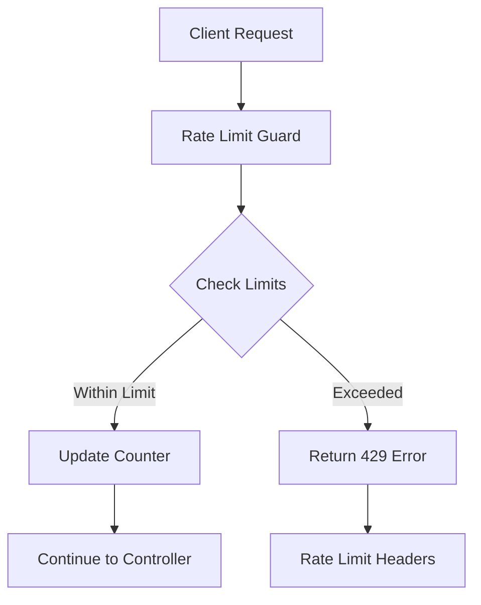

# 🚦 Rate Limiting trong NestJS

## 🔍 Rate Limiting là gì?

**Rate Limiting** là kỹ thuật bảo vệ API bằng cách giới hạn số lượng requests mà client có thể gửi trong một khoảng thời gian nhất định. Trong ecosystem NestJS, Rate Limiting đóng vai trò quan trọng:

- **API Protection**: Bảo vệ khỏi DDoS attacks và abuse
- **Resource Management**: Kiểm soát server load và tài nguyên
- **Fair Usage**: Đảm bảo công bằng giữa các users
- **Business Logic**: Implement business rules (free vs premium users)

### 🔄 Cách hoạt động trong NestJS Ecosystem



**Execution Order & Lifecycle:**

1. **Request Interception**: Rate limit guard intercepts incoming requests
2. **Identifier Extraction**: Extract client identifier (IP, user ID, API key)
3. **Limit Checking**: Check current usage against defined limits
4. **Counter Update**: Increment request counter if within limits
5. **Response Headers**: Add rate limit headers to response
6. **Error Handling**: Return 429 Too Many Requests if exceeded

### 🏗️ Kiến trúc và Storage Options

```typescript
// Rate Limiting Storage Strategies
interface RateLimitStorage {
  InMemory: 'Fast but not persistent, single instance only'
  Redis: 'Persistent, distributed, recommended for production'
  Database: 'Persistent but slower, good for audit trails'
  Hybrid: 'Combination of multiple strategies'
}
```

---

## 🎯 Cách implement Rate Limiting

### 1. Basic Implementation với @nestjs/throttler

**Bước 1: Cài đặt dependencies**

```bash
npm install --save @nestjs/throttler
npm install --save redis @nestjs-modules/ioredis
```

**Bước 2: Basic Setup**

```typescript
// src/app.module.ts
import { Module } from '@nestjs/common'
import { ThrottlerModule, ThrottlerGuard } from '@nestjs/throttler'
import { APP_GUARD } from '@nestjs/core'

@Module({
  imports: [
    // Basic in-memory rate limiting
    ThrottlerModule.forRoot([
      {
        name: 'short',
        ttl: 1000, // 1 second
        limit: 3, // 3 requests per second
      },
      {
        name: 'medium',
        ttl: 10000, // 10 seconds
        limit: 20, // 20 requests per 10 seconds
      },
      {
        name: 'long',
        ttl: 60000, // 1 minute
        limit: 100, // 100 requests per minute
      },
    ]),
  ],
  providers: [
    {
      provide: APP_GUARD,
      useClass: ThrottlerGuard, // Apply globally
    },
  ],
})
export class AppModule {}
```

**Bước 3: Controller Level Configuration**

```typescript
// src/users/users.controller.ts
import { Controller, Get, Post, Body } from '@nestjs/common'
import { Throttle, SkipThrottle } from '@nestjs/throttler'

@Controller('users')
export class UsersController {
  @Get()
  @SkipThrottle() // Skip rate limiting for this endpoint
  async findAll() {
    return []
  }

  @Post()
  @Throttle({ default: { limit: 5, ttl: 60000 } }) // 5 requests per minute
  async create(@Body() createUserDto: any) {
    // Implementation
  }

  @Post('login')
  @Throttle({ default: { limit: 3, ttl: 60000 } }) // Stricter for login
  async login(@Body() loginDto: any) {
    // Implementation
  }

  @Post('forgot-password')
  @Throttle({ default: { limit: 1, ttl: 300000 } }) // 1 request per 5 minutes
  async forgotPassword(@Body() forgotPasswordDto: any) {
    // Implementation
  }
}
```

### 2. Advanced Implementation với Redis

```typescript
// src/rate-limit/rate-limit.module.ts
import { Module } from '@nestjs/common'
import { ThrottlerModule } from '@nestjs/throttler'
import { ThrottlerStorageRedisService } from 'nestjs-throttler-storage-redis'
import Redis from 'ioredis'

@Module({
  imports: [
    ThrottlerModule.forRootAsync({
      useFactory: () => ({
        throttlers: [
          {
            name: 'short',
            ttl: 1000,
            limit: 3,
          },
          {
            name: 'medium',
            ttl: 10000,
            limit: 20,
          },
          {
            name: 'long',
            ttl: 60000,
            limit: 100,
          },
        ],
        storage: new ThrottlerStorageRedisService(
          new Redis({
            host: process.env.REDIS_HOST || 'localhost',
            port: parseInt(process.env.REDIS_PORT) || 6379,
            password: process.env.REDIS_PASSWORD,
            db: parseInt(process.env.REDIS_RATE_LIMIT_DB) || 1,
            keyPrefix: 'rate-limit:', // Redis key prefix
            retryDelayOnFailover: 100,
            enableReadyCheck: true,
            maxRetriesPerRequest: 3,
          }),
        ),
      }),
    }),
  ],
})
export class RateLimitModule {}
```

### 3. Custom Rate Limiting Strategy

```typescript
// src/rate-limit/custom-rate-limit.guard.ts
import { Injectable, ExecutionContext } from '@nestjs/common'
import { ThrottlerGuard, ThrottlerException } from '@nestjs/throttler'
import { Request } from 'express'

@Injectable()
export class CustomRateLimitGuard extends ThrottlerGuard {
  // Custom key generator based on user type and endpoint
  protected async generateKeys(context: ExecutionContext, suffix: string, name: string): Promise<Array<string>> {
    const request = context.switchToHttp().getRequest<Request>()
    const user = request.user as any

    // Different keys for different user types
    if (user) {
      // Authenticated users: rate limit by user ID
      return [`user:${user.id}:${suffix}`]
    } else {
      // Anonymous users: rate limit by IP
      const ip = this.getClientIP(request)
      return [`ip:${ip}:${suffix}`]
    }
  }

  // Custom limit based on user subscription
  protected async getThrottlerLimits(context: ExecutionContext, throttlerName: string) {
    const request = context.switchToHttp().getRequest<Request>()
    const user = request.user as any

    // Get base limits
    const baseConfig = await super.getThrottlerLimits(context, throttlerName)

    if (!user) {
      // Anonymous users get reduced limits
      return baseConfig.map((config) => ({
        ...config,
        limit: Math.floor(config.limit * 0.5), // 50% of base limit
      }))
    }

    // Premium users get higher limits
    if (user.subscription === 'premium') {
      return baseConfig.map((config) => ({
        ...config,
        limit: config.limit * 3, // 3x limit for premium users
      }))
    }

    // Pro users get higher limits
    if (user.subscription === 'pro') {
      return baseConfig.map((config) => ({
        ...config,
        limit: config.limit * 2, // 2x limit for pro users
      }))
    }

    // Free users get base limits
    return baseConfig
  }

  // Enhanced error handling
  protected async throwThrottlingException(
    context: ExecutionContext,
    throttlerLimitDetail: { totalHits: number; timeToExpire: number; limit: number },
  ): Promise<void> {
    const request = context.switchToHttp().getRequest<Request>()
    const response = context.switchToHttp().getResponse()

    // Add rate limit headers
    response.setHeader('X-RateLimit-Limit', throttlerLimitDetail.limit)
    response.setHeader(
      'X-RateLimit-Remaining',
      Math.max(0, throttlerLimitDetail.limit - throttlerLimitDetail.totalHits),
    )
    response.setHeader('X-RateLimit-Reset', Math.ceil(throttlerLimitDetail.timeToExpire / 1000))
    response.setHeader('Retry-After', Math.ceil(throttlerLimitDetail.timeToExpire / 1000))

    // Log rate limit violations
    console.warn('Rate limit exceeded', {
      ip: this.getClientIP(request),
      userId: request.user?.id,
      endpoint: request.path,
      method: request.method,
      userAgent: request.get('User-Agent'),
      limit: throttlerLimitDetail.limit,
      hits: throttlerLimitDetail.totalHits,
      resetTime: throttlerLimitDetail.timeToExpire,
    })

    throw new ThrottlerException('Rate limit exceeded. Please try again later.')
  }

  private getClientIP(request: Request): string {
    return (request.ip ||
      request.connection.remoteAddress ||
      request.socket.remoteAddress ||
      (request.connection as any)?.socket?.remoteAddress ||
      request.headers['x-forwarded-for'] ||
      request.headers['x-real-ip'] ||
      'unknown') as string
  }
}
```

### 4. Multi-tier Rate Limiting

```typescript
// src/rate-limit/multi-tier-rate-limit.service.ts
import { Injectable } from '@nestjs/common'
import { Redis } from 'ioredis'
import { InjectRedis } from '@nestjs-modules/ioredis'

interface RateLimitTier {
  name: string
  requests: number
  windowSize: number // in seconds
  burst?: number // allowed burst requests
}

interface RateLimitResult {
  allowed: boolean
  limit: number
  remaining: number
  resetTime: number
  retryAfter?: number
}

@Injectable()
export class MultiTierRateLimitService {
  constructor(@InjectRedis() private redis: Redis) {}

  private readonly tiers: Record<string, RateLimitTier[]> = {
    // Anonymous users
    anonymous: [
      { name: 'second', requests: 2, windowSize: 1 },
      { name: 'minute', requests: 10, windowSize: 60 },
      { name: 'hour', requests: 100, windowSize: 3600 },
      { name: 'day', requests: 1000, windowSize: 86400 },
    ],

    // Free tier users
    free: [
      { name: 'second', requests: 5, windowSize: 1 },
      { name: 'minute', requests: 50, windowSize: 60 },
      { name: 'hour', requests: 1000, windowSize: 3600 },
      { name: 'day', requests: 10000, windowSize: 86400 },
    ],

    // Pro tier users
    pro: [
      { name: 'second', requests: 10, windowSize: 1 },
      { name: 'minute', requests: 200, windowSize: 60 },
      { name: 'hour', requests: 5000, windowSize: 3600 },
      { name: 'day', requests: 100000, windowSize: 86400 },
    ],

    // Premium tier users
    premium: [
      { name: 'second', requests: 20, windowSize: 1 },
      { name: 'minute', requests: 500, windowSize: 60 },
      { name: 'hour', requests: 15000, windowSize: 3600 },
      { name: 'day', requests: 500000, windowSize: 86400 },
    ],
  }

  async checkRateLimit(identifier: string, tier: string = 'anonymous', endpoint?: string): Promise<RateLimitResult> {
    const tierConfig = this.tiers[tier] || this.tiers.anonymous

    // Check all tiers (second, minute, hour, day)
    for (const config of tierConfig) {
      const key = `rate_limit:${tier}:${identifier}:${endpoint || 'global'}:${config.name}`
      const result = await this.checkSingleTier(key, config)

      if (!result.allowed) {
        return result
      }
    }

    // All tiers passed
    return {
      allowed: true,
      limit: tierConfig[0].requests,
      remaining: tierConfig[0].requests - 1,
      resetTime: Math.floor(Date.now() / 1000) + tierConfig[0].windowSize,
    }
  }

  private async checkSingleTier(key: string, config: RateLimitTier): Promise<RateLimitResult> {
    const now = Math.floor(Date.now() / 1000)
    const windowStart = now - config.windowSize

    // Use Redis sliding window log
    const pipe = this.redis.pipeline()

    // Remove expired entries
    pipe.zremrangebyscore(key, 0, windowStart)

    // Count current requests in window
    pipe.zcard(key)

    // Add current request
    pipe.zadd(key, now, `${now}-${Math.random()}`)

    // Set expiration
    pipe.expire(key, config.windowSize + 1)

    const results = await pipe.exec()
    const currentRequests = results[1][1] as number

    const allowed = currentRequests < config.requests
    const remaining = Math.max(0, config.requests - currentRequests - 1)
    const resetTime = now + config.windowSize

    if (!allowed) {
      // Remove the request we just added since it's not allowed
      await this.redis.zrem(key, `${now}-${Math.random()}`)

      return {
        allowed: false,
        limit: config.requests,
        remaining: 0,
        resetTime,
        retryAfter: this.calculateRetryAfter(key, config),
      }
    }

    return {
      allowed: true,
      limit: config.requests,
      remaining,
      resetTime,
    }
  }

  private async calculateRetryAfter(key: string, config: RateLimitTier): Promise<number> {
    // Get the oldest request in the current window
    const oldestRequests = await this.redis.zrange(key, 0, 0, 'WITHSCORES')

    if (oldestRequests.length === 0) {
      return 1
    }

    const oldestTimestamp = parseInt(oldestRequests[1])
    const now = Math.floor(Date.now() / 1000)

    return Math.max(1, oldestTimestamp + config.windowSize - now)
  }

  // Get current usage statistics
  async getUsageStats(
    identifier: string,
    tier: string = 'anonymous',
  ): Promise<Record<string, { current: number; limit: number; remaining: number; resetTime: number }>> {
    const tierConfig = this.tiers[tier] || this.tiers.anonymous
    const stats: Record<string, any> = {}

    for (const config of tierConfig) {
      const key = `rate_limit:${tier}:${identifier}:global:${config.name}`
      const now = Math.floor(Date.now() / 1000)
      const windowStart = now - config.windowSize

      // Count current requests
      await this.redis.zremrangebyscore(key, 0, windowStart)
      const current = await this.redis.zcard(key)

      stats[config.name] = {
        current,
        limit: config.requests,
        remaining: Math.max(0, config.requests - current),
        resetTime: now + config.windowSize,
      }
    }

    return stats
  }
}
```

---

## 💡 Các cách sử dụng thông dụng

### 1. API Endpoint Specific Limits

```typescript
// src/api/api.controller.ts
import { Controller, Get, Post, Query } from '@nestjs/common'
import { Throttle } from '@nestjs/throttler'

@Controller('api')
export class ApiController {
  // Search endpoints - higher limits for better UX
  @Get('search')
  @Throttle({ default: { limit: 30, ttl: 60000 } }) // 30 searches per minute
  async search(@Query('q') query: string) {
    // Implementation
  }

  // Data creation - moderate limits
  @Post('data')
  @Throttle({ default: { limit: 10, ttl: 60000 } }) // 10 creates per minute
  async createData(@Body() data: any) {
    // Implementation
  }

  // Report generation - strict limits (expensive operation)
  @Post('reports')
  @Throttle({ default: { limit: 2, ttl: 300000 } }) // 2 reports per 5 minutes
  async generateReport(@Body() reportDto: any) {
    // Implementation
  }

  // File upload - very strict limits
  @Post('upload')
  @Throttle({ default: { limit: 5, ttl: 3600000 } }) // 5 uploads per hour
  async uploadFile(@UploadedFile() file: Express.Multer.File) {
    // Implementation
  }

  // Public endpoints - basic protection
  @Get('public/stats')
  @Throttle({ default: { limit: 100, ttl: 60000 } }) // 100 requests per minute
  async getPublicStats() {
    // Implementation
  }
}
```

### 2. User Subscription Based Limits

```typescript
// src/auth/subscription-rate-limit.decorator.ts
import { SetMetadata } from '@nestjs/common'

export interface SubscriptionLimits {
  free: { limit: number; ttl: number }
  pro: { limit: number; ttl: number }
  premium: { limit: number; ttl: number }
}

export const SubscriptionThrottle = (limits: SubscriptionLimits) => SetMetadata('subscription-throttle', limits)

// src/auth/subscription-rate-limit.guard.ts
import { Injectable, ExecutionContext } from '@nestjs/common'
import { Reflector } from '@nestjs/core'
import { ThrottlerGuard } from '@nestjs/throttler'

@Injectable()
export class SubscriptionRateLimitGuard extends ThrottlerGuard {
  constructor(private reflector: Reflector) {
    super()
  }

  protected async getThrottlerLimits(context: ExecutionContext) {
    const subscriptionLimits = this.reflector.get<SubscriptionLimits>('subscription-throttle', context.getHandler())

    if (!subscriptionLimits) {
      return super.getThrottlerLimits(context)
    }

    const request = context.switchToHttp().getRequest()
    const user = request.user
    const subscription = user?.subscription || 'free'

    const limit = subscriptionLimits[subscription] || subscriptionLimits.free

    return [
      {
        name: 'subscription',
        ...limit,
      },
    ]
  }
}

// Usage
@Controller('premium-features')
export class PremiumController {
  @Post('ai-analysis')
  @SubscriptionThrottle({
    free: { limit: 5, ttl: 86400000 }, // 5 per day
    pro: { limit: 50, ttl: 86400000 }, // 50 per day
    premium: { limit: 500, ttl: 86400000 }, // 500 per day
  })
  async aiAnalysis(@Body() data: any) {
    // AI analysis implementation
  }

  @Post('bulk-export')
  @SubscriptionThrottle({
    free: { limit: 1, ttl: 604800000 }, // 1 per week
    pro: { limit: 10, ttl: 86400000 }, // 10 per day
    premium: { limit: 100, ttl: 86400000 }, // 100 per day
  })
  async bulkExport(@Body() exportDto: any) {
    // Bulk export implementation
  }
}
```

### 3. Dynamic Rate Limiting với Business Logic

```typescript
// src/rate-limit/dynamic-rate-limit.service.ts
import { Injectable } from '@nestjs/common'

interface DynamicLimitConfig {
  baseLimit: number
  baseTtl: number
  multipliers: {
    userVerified: number
    accountAge: number // days
    reputationScore: number
    timeOfDay: number
  }
}

@Injectable()
export class DynamicRateLimitService {
  async calculateDynamicLimit(user: any, config: DynamicLimitConfig): Promise<{ limit: number; ttl: number }> {
    let limitMultiplier = 1
    let ttlMultiplier = 1

    // Verified users get higher limits
    if (user.isVerified) {
      limitMultiplier *= config.multipliers.userVerified
    }

    // Account age bonus (older accounts get higher limits)
    const accountAgeDays = this.getAccountAgeDays(user.createdAt)
    if (accountAgeDays > 30) {
      limitMultiplier *= Math.min(config.multipliers.accountAge, 3) // Max 3x
    }

    // Reputation score bonus
    if (user.reputationScore > 80) {
      limitMultiplier *= config.multipliers.reputationScore
    }

    // Time of day adjustments (lower limits during peak hours)
    const currentHour = new Date().getHours()
    const isPeakHour = currentHour >= 9 && currentHour <= 17 // 9 AM - 5 PM
    if (isPeakHour) {
      limitMultiplier *= config.multipliers.timeOfDay
      ttlMultiplier *= 0.8 // Shorter windows during peak
    }

    // User behavior analysis
    const behaviorMultiplier = await this.getBehaviorMultiplier(user.id)
    limitMultiplier *= behaviorMultiplier

    return {
      limit: Math.floor(config.baseLimit * limitMultiplier),
      ttl: Math.floor(config.baseTtl * ttlMultiplier),
    }
  }

  private getAccountAgeDays(createdAt: Date): number {
    const now = new Date()
    const diffTime = Math.abs(now.getTime() - createdAt.getTime())
    return Math.ceil(diffTime / (1000 * 60 * 60 * 24))
  }

  private async getBehaviorMultiplier(userId: string): Promise<number> {
    // Analyze user behavior patterns
    // - Low error rate: higher limits
    // - Consistent usage: higher limits
    // - Abuse history: lower limits

    const behaviorData = await this.getUserBehaviorData(userId)

    let multiplier = 1

    // Low error rate bonus
    if (behaviorData.errorRate < 0.05) {
      multiplier *= 1.2
    }

    // Consistent usage bonus
    if (behaviorData.consistentUsage) {
      multiplier *= 1.1
    }

    // Abuse penalty
    if (behaviorData.abuseScore > 0.7) {
      multiplier *= 0.3
    }

    return multiplier
  }

  private async getUserBehaviorData(userId: string) {
    // Implementation would fetch from analytics database
    return {
      errorRate: 0.02,
      consistentUsage: true,
      abuseScore: 0.1,
    }
  }
}
```

### 4. Rate Limiting với Webhook Protection

```typescript
// src/webhooks/webhook-rate-limit.guard.ts
import { Injectable, ExecutionContext } from '@nestjs/common'
import { ThrottlerGuard } from '@nestjs/throttler'
import { Request } from 'express'

@Injectable()
export class WebhookRateLimitGuard extends ThrottlerGuard {
  protected async generateKeys(context: ExecutionContext, suffix: string): Promise<Array<string>> {
    const request = context.switchToHttp().getRequest<Request>()

    // For webhooks, rate limit by sender ID or API key
    const apiKey = request.headers['x-api-key'] as string
    const webhookId = request.headers['x-webhook-id'] as string
    const signature = request.headers['x-webhook-signature'] as string

    if (apiKey) {
      return [`webhook:api-key:${apiKey}:${suffix}`]
    }

    if (webhookId) {
      return [`webhook:id:${webhookId}:${suffix}`]
    }

    if (signature) {
      // Extract sender from signature
      const sender = this.extractSenderFromSignature(signature)
      return [`webhook:sender:${sender}:${suffix}`]
    }

    // Fallback to IP-based limiting
    const ip = this.getClientIP(request)
    return [`webhook:ip:${ip}:${suffix}`]
  }

  private extractSenderFromSignature(signature: string): string {
    // Implementation depends on your signature format
    // For example, if using HMAC with known senders
    return 'unknown'
  }

  private getClientIP(request: Request): string {
    return request.ip || request.connection.remoteAddress || 'unknown'
  }
}

// src/webhooks/webhooks.controller.ts
@Controller('webhooks')
export class WebhooksController {
  @Post('payment/stripe')
  @Throttle({ default: { limit: 100, ttl: 60000 } }) // 100 webhooks per minute
  @UseGuards(WebhookRateLimitGuard)
  async handleStripeWebhook(@Body() payload: any) {
    // Stripe webhook handling
  }

  @Post('notification/sendgrid')
  @Throttle({ default: { limit: 200, ttl: 60000 } }) // 200 webhooks per minute
  @UseGuards(WebhookRateLimitGuard)
  async handleSendGridWebhook(@Body() payload: any) {
    // SendGrid webhook handling
  }

  @Post('integration/:providerId')
  @Throttle({ default: { limit: 50, ttl: 60000 } }) // 50 webhooks per minute per provider
  @UseGuards(WebhookRateLimitGuard)
  async handleGenericWebhook(@Param('providerId') providerId: string, @Body() payload: any) {
    // Generic webhook handling
  }
}
```

---

## ⚠️ Các vấn đề thường gặp

### 1. Memory Leaks với In-Memory Storage

**Vấn đề:**

```typescript
// ❌ In-memory storage có thể cause memory leaks
@Module({
  imports: [
    ThrottlerModule.forRoot([
      {
        ttl: 60000,
        limit: 100,
        // Không có storage config - sử dụng memory mặc định
      },
    ]),
  ],
})
export class AppModule {}
```

**Giải pháp:**

```typescript
// ✅ Sử dụng Redis storage cho production
@Module({
  imports: [
    ThrottlerModule.forRootAsync({
      useFactory: () => ({
        throttlers: [{ ttl: 60000, limit: 100 }],
        storage: new ThrottlerStorageRedisService(new Redis(process.env.REDIS_URL)),
      }),
    }),
  ],
})
export class AppModule {}

// ✅ Hoặc implement custom cleanup cho memory storage
class MemoryStorageWithCleanup {
  private storage = new Map()
  private cleanupInterval: NodeJS.Timeout

  constructor() {
    // Cleanup expired entries every 5 minutes
    this.cleanupInterval = setInterval(
      () => {
        this.cleanup()
      },
      5 * 60 * 1000,
    )
  }

  private cleanup() {
    const now = Date.now()
    for (const [key, value] of this.storage.entries()) {
      if (value.expires < now) {
        this.storage.delete(key)
      }
    }
  }
}
```

### 2. Distributed Systems Synchronization

**Vấn đề:**

```typescript
// ❌ Multiple servers với separate rate limiting
// Server A: User makes 100 requests
// Server B: Same user makes 100 more requests
// Total: 200 requests but each server thinks it's within 100 limit
```

**Giải pháp:**

```typescript
// ✅ Centralized Redis storage
const redisStorage = new ThrottlerStorageRedisService(
  new Redis({
    host: 'redis-cluster.example.com',
    port: 6379,
    // Redis Cluster configuration
    enableOfflineQueue: false,
    retryDelayOnFailover: 100,
  }),
)

// ✅ Hoặc implement consensus-based rate limiting
class ConsensusRateLimitService {
  async checkLimit(key: string, limit: number, ttl: number): Promise<boolean> {
    // Query multiple Redis instances
    const promises = this.redisInstances.map((redis) =>
      redis.eval(
        `
        local current = redis.call('GET', KEYS[1]) or 0
        if current < tonumber(ARGV[1]) then
          redis.call('INCR', KEYS[1])
          redis.call('EXPIRE', KEYS[1], ARGV[2])
          return 1
        else
          return 0
        end
      `,
        1,
        key,
        limit,
        ttl,
      ),
    )

    const results = await Promise.all(promises)

    // Majority consensus
    const allowedCount = results.filter((r) => r === 1).length
    return allowedCount > this.redisInstances.length / 2
  }
}
```

### 3. Load Balancer và Proxy Issues

**Vấn đề:**

```typescript
// ❌ IP-based rate limiting không hoạt động with proxies
protected generateKeys(context: ExecutionContext): string[] {
  const request = context.switchToHttp().getRequest()
  return [request.ip] // Always returns proxy IP
}
```

**Giải pháp:**

```typescript
// ✅ Proper IP extraction through proxies
protected generateKeys(context: ExecutionContext): string[] {
  const request = context.switchToHttp().getRequest()

  // Extract real client IP through proxy headers
  const clientIP = this.getClientIP(request)

  return [clientIP]
}

private getClientIP(request: any): string {
  // Try multiple headers in order of preference
  const headers = [
    'cf-connecting-ip',      // Cloudflare
    'x-forwarded-for',       // Standard proxy header
    'x-real-ip',             // Nginx
    'x-client-ip',           // Apache
    'x-forwarded',           // Proxy
    'x-cluster-client-ip',   // Cluster
    'forwarded-for',         // Proxy
    'forwarded',             // RFC 7239
  ]

  for (const header of headers) {
    const value = request.headers[header]
    if (value) {
      // X-Forwarded-For can contain multiple IPs, take the first
      const ip = Array.isArray(value) ? value[0] : value.split(',')[0]
      return ip.trim()
    }
  }

  return request.connection?.remoteAddress ||
         request.socket?.remoteAddress ||
         request.ip ||
         'unknown'
}
```

### 4. Rate Limit Header Inconsistency

**Vấn đề:**

```typescript
// ❌ Không consistent rate limit headers
// Client không biết còn bao nhiêu requests left
```

**Giải pháp:**

```typescript
// ✅ Standardized rate limit headers
@Injectable()
export class RateLimitHeaderInterceptor implements NestInterceptor {
  intercept(context: ExecutionContext, next: CallHandler): Observable<any> {
    const response = context.switchToHttp().getResponse()

    return next.handle().pipe(
      tap(() => {
        // Add standard rate limit headers
        const rateLimitInfo = this.getRateLimitInfo(context)

        response.setHeader('X-RateLimit-Limit', rateLimitInfo.limit)
        response.setHeader('X-RateLimit-Remaining', rateLimitInfo.remaining)
        response.setHeader('X-RateLimit-Reset', rateLimitInfo.reset)
        response.setHeader('X-RateLimit-Used', rateLimitInfo.used)

        // Add additional headers for different time windows
        response.setHeader('X-RateLimit-Limit-Minute', rateLimitInfo.minuteLimit)
        response.setHeader('X-RateLimit-Remaining-Minute', rateLimitInfo.minuteRemaining)
      }),
    )
  }

  private getRateLimitInfo(context: ExecutionContext) {
    // Implementation to get current rate limit status
    return {
      limit: 100,
      remaining: 95,
      reset: Math.floor(Date.now() / 1000) + 60,
      used: 5,
      minuteLimit: 100,
      minuteRemaining: 95,
    }
  }
}
```

---

## 🔧 Advanced Patterns

### 1. Token Bucket Algorithm Implementation

```typescript
// src/rate-limit/token-bucket.service.ts
interface TokenBucket {
  capacity: number
  tokens: number
  refillRate: number // tokens per second
  lastRefill: number
}

@Injectable()
export class TokenBucketService {
  private buckets = new Map<string, TokenBucket>()

  async consume(
    key: string,
    tokens: number = 1,
    capacity: number = 10,
    refillRate: number = 1,
  ): Promise<{ allowed: boolean; tokensRemaining: number; waitTime?: number }> {
    let bucket = this.buckets.get(key)

    if (!bucket) {
      bucket = {
        capacity,
        tokens: capacity,
        refillRate,
        lastRefill: Date.now(),
      }
      this.buckets.set(key, bucket)
    }

    // Refill tokens based on time passed
    this.refillTokens(bucket)

    if (bucket.tokens >= tokens) {
      bucket.tokens -= tokens
      return {
        allowed: true,
        tokensRemaining: bucket.tokens,
      }
    } else {
      // Calculate wait time for required tokens
      const tokensNeeded = tokens - bucket.tokens
      const waitTime = Math.ceil((tokensNeeded / bucket.refillRate) * 1000) // ms

      return {
        allowed: false,
        tokensRemaining: bucket.tokens,
        waitTime,
      }
    }
  }

  private refillTokens(bucket: TokenBucket): void {
    const now = Date.now()
    const timePassed = (now - bucket.lastRefill) / 1000 // seconds
    const tokensToAdd = Math.floor(timePassed * bucket.refillRate)

    if (tokensToAdd > 0) {
      bucket.tokens = Math.min(bucket.capacity, bucket.tokens + tokensToAdd)
      bucket.lastRefill = now
    }
  }

  // Get bucket status for monitoring
  getBucketStatus(key: string): TokenBucket | null {
    const bucket = this.buckets.get(key)
    if (bucket) {
      this.refillTokens(bucket)
    }
    return bucket
  }

  // Cleanup expired buckets
  cleanup(): void {
    const now = Date.now()
    const expirationTime = 5 * 60 * 1000 // 5 minutes

    for (const [key, bucket] of this.buckets.entries()) {
      if (now - bucket.lastRefill > expirationTime) {
        this.buckets.delete(key)
      }
    }
  }
}
```

### 2. Sliding Window Counter

```typescript
// src/rate-limit/sliding-window.service.ts
@Injectable()
export class SlidingWindowService {
  constructor(@InjectRedis() private redis: Redis) {}

  async checkLimit(
    key: string,
    limit: number,
    windowSizeMs: number,
    precision: number = 10, // Number of sub-windows
  ): Promise<{
    allowed: boolean
    current: number
    limit: number
    resetTime: number
  }> {
    const now = Date.now()
    const subWindowSize = windowSizeMs / precision
    const currentWindow = Math.floor(now / subWindowSize)

    // Clean up old windows and count current requests
    const pipeline = this.redis.pipeline()

    // Remove windows older than our tracking period
    const oldestWindow = currentWindow - precision
    pipeline.zremrangebyscore(key, 0, oldestWindow)

    // Get count of requests in current sliding window
    pipeline.zcard(key)

    // Add current request
    pipeline.zadd(key, currentWindow, `${now}-${Math.random()}`)

    // Set expiration
    pipeline.expire(key, Math.ceil(windowSizeMs / 1000) + 1)

    const results = await pipeline.exec()
    const currentCount = results[1][1] as number

    const allowed = currentCount < limit

    if (!allowed) {
      // Remove the request we just added
      await this.redis.zrem(key, `${now}-${Math.random()}`)
    }

    return {
      allowed,
      current: currentCount,
      limit,
      resetTime: Math.ceil((currentWindow + 1) * subWindowSize),
    }
  }
}
```

### 3. Adaptive Rate Limiting

```typescript
// src/rate-limit/adaptive-rate-limit.service.ts
interface AdaptiveConfig {
  baseLimit: number
  minLimit: number
  maxLimit: number
  increaseFactor: number
  decreaseFactor: number
  adaptationWindow: number // seconds
}

@Injectable()
export class AdaptiveRateLimitService {
  private configs = new Map<string, AdaptiveConfig & { currentLimit: number; lastAdaptation: number }>()

  async getAdaptiveLimit(
    key: string,
    baseConfig: AdaptiveConfig,
    currentLoad: number, // 0-1 representing system load
    errorRate: number, // 0-1 representing error rate
  ): Promise<number> {
    let config = this.configs.get(key)

    if (!config) {
      config = {
        ...baseConfig,
        currentLimit: baseConfig.baseLimit,
        lastAdaptation: Date.now(),
      }
      this.configs.set(key, config)
    }

    const now = Date.now()
    const timeSinceLastAdaptation = now - config.lastAdaptation

    // Only adapt if enough time has passed
    if (timeSinceLastAdaptation >= config.adaptationWindow * 1000) {
      const newLimit = this.calculateNewLimit(config, currentLoad, errorRate)

      config.currentLimit = Math.max(config.minLimit, Math.min(config.maxLimit, newLimit))
      config.lastAdaptation = now

      console.log(`Adaptive rate limit for ${key}: ${config.currentLimit} (load: ${currentLoad}, errors: ${errorRate})`)
    }

    return config.currentLimit
  }

  private calculateNewLimit(
    config: AdaptiveConfig & { currentLimit: number },
    load: number,
    errorRate: number,
  ): number {
    let adjustment = 1

    // Decrease limit if system is under stress
    if (load > 0.8 || errorRate > 0.1) {
      adjustment = config.decreaseFactor
    }
    // Increase limit if system is doing well
    else if (load < 0.5 && errorRate < 0.02) {
      adjustment = config.increaseFactor
    }

    return Math.floor(config.currentLimit * adjustment)
  }

  // Get system metrics for adaptation
  async getSystemMetrics(): Promise<{ load: number; errorRate: number }> {
    // Implementation would collect real metrics
    return {
      load: Math.random() * 0.8, // Simulated load
      errorRate: Math.random() * 0.05, // Simulated error rate
    }
  }
}
```

### 4. Circuit Breaker Integration

```typescript
// src/rate-limit/circuit-breaker-rate-limit.service.ts
enum CircuitState {
  CLOSED = 'closed',
  OPEN = 'open',
  HALF_OPEN = 'half-open',
}

interface CircuitBreaker {
  state: CircuitState
  failureCount: number
  successCount: number
  lastFailureTime: number
  timeout: number
  threshold: number
}

@Injectable()
export class CircuitBreakerRateLimitService {
  private circuits = new Map<string, CircuitBreaker>()

  async checkWithCircuitBreaker(
    key: string,
    operation: () => Promise<any>,
    rateLimitConfig: { limit: number; window: number },
  ): Promise<{ allowed: boolean; result?: any; error?: string }> {
    // First check rate limit
    const rateLimitResult = await this.checkRateLimit(key, rateLimitConfig)

    if (!rateLimitResult.allowed) {
      return { allowed: false, error: 'Rate limit exceeded' }
    }

    // Then check circuit breaker
    const circuit = this.getOrCreateCircuit(key)

    if (circuit.state === CircuitState.OPEN) {
      if (Date.now() - circuit.lastFailureTime > circuit.timeout) {
        circuit.state = CircuitState.HALF_OPEN
        circuit.successCount = 0
      } else {
        return { allowed: false, error: 'Circuit breaker open' }
      }
    }

    try {
      const result = await operation()

      // Success - update circuit state
      circuit.successCount++
      circuit.failureCount = Math.max(0, circuit.failureCount - 1)

      if (circuit.state === CircuitState.HALF_OPEN && circuit.successCount >= 3) {
        circuit.state = CircuitState.CLOSED
        circuit.failureCount = 0
      }

      return { allowed: true, result }
    } catch (error) {
      // Failure - update circuit state
      circuit.failureCount++
      circuit.lastFailureTime = Date.now()

      if (circuit.failureCount >= circuit.threshold) {
        circuit.state = CircuitState.OPEN
      }

      return { allowed: false, error: error.message }
    }
  }

  private getOrCreateCircuit(key: string): CircuitBreaker {
    if (!this.circuits.has(key)) {
      this.circuits.set(key, {
        state: CircuitState.CLOSED,
        failureCount: 0,
        successCount: 0,
        lastFailureTime: 0,
        timeout: 60000, // 1 minute
        threshold: 5, // 5 failures to open
      })
    }

    return this.circuits.get(key)!
  }

  private async checkRateLimit(key: string, config: { limit: number; window: number }): Promise<{ allowed: boolean }> {
    // Implementation of rate limit check
    return { allowed: true } // Simplified
  }
}
```

---

## 📝 Best Practices

### ✅ DO's

**1. Layered Rate Limiting**

```typescript
// ✅ Multiple layers of protection
@Controller('api')
export class ApiController {
  @Post('expensive-operation')
  @Throttle({ default: { limit: 1, ttl: 60000 } }) // 1 per minute per user
  @Throttle({ long: { limit: 10, ttl: 3600000 } }) // 10 per hour per user
  @Throttle({ daily: { limit: 100, ttl: 86400000 } }) // 100 per day per user
  async expensiveOperation() {
    // Implementation
  }
}
```

**2. Graceful Error Messages**

```typescript
// ✅ Informative error responses
@Injectable()
export class CustomThrottlerGuard extends ThrottlerGuard {
  protected async throwThrottlingException(context: ExecutionContext, throttlerLimitDetail: any) {
    const response = context.switchToHttp().getResponse()

    response.status(429).json({
      statusCode: 429,
      error: 'Too Many Requests',
      message: `Rate limit exceeded. Try again in ${Math.ceil(throttlerLimitDetail.timeToExpire / 1000)} seconds.`,
      retryAfter: Math.ceil(throttlerLimitDetail.timeToExpire / 1000),
      limit: throttlerLimitDetail.limit,
      remaining: 0,
      resetTime: new Date(Date.now() + throttlerLimitDetail.timeToExpire).toISOString(),
    })
  }
}
```

**3. Monitoring và Alerting**

```typescript
// ✅ Comprehensive monitoring
@Injectable()
export class RateLimitMonitoringService {
  @EventPattern('rate-limit.exceeded')
  async handleRateLimitExceeded(data: any) {
    // Log for analysis
    console.warn('Rate limit exceeded', {
      ip: data.ip,
      endpoint: data.endpoint,
      limit: data.limit,
      timestamp: new Date().toISOString(),
    })

    // Alert if abuse detected
    if (data.violationCount > 10) {
      await this.alertingService.sendAlert({
        type: 'RATE_LIMIT_ABUSE',
        severity: 'HIGH',
        details: data,
      })
    }

    // Update metrics
    this.metricsService.increment('rate_limit.violations', {
      endpoint: data.endpoint,
      ip: data.ip,
    })
  }
}
```

### ❌ DON'Ts

**1. Single Global Limit**

```typescript
// ❌ Same limit for all endpoints
@Module({
  imports: [
    ThrottlerModule.forRoot([
      { ttl: 60000, limit: 100 }, // Same for everything
    ]),
  ],
})
export class AppModule {}
```

**2. No Differentiation**

```typescript
// ❌ No user type differentiation
@Post('premium-feature')
@Throttle({ default: { limit: 5, ttl: 60000 } }) // Same for all users
async premiumFeature() {
  // Should have different limits for premium vs free users
}
```

**3. Missing Headers**

```typescript
// ❌ No rate limit information in responses
throw new HttpException('Too Many Requests', 429) // No additional info
```

### 🎯 Configuration Best Practices

**1. Environment-specific Configs**

```typescript
// ✅ Different limits per environment
@Module({
  imports: [
    ThrottlerModule.forRootAsync({
      useFactory: () => {
        const isProduction = process.env.NODE_ENV === 'production'
        const isDevelopment = process.env.NODE_ENV === 'development'

        return {
          throttlers: [
            {
              name: 'short',
              ttl: 1000,
              limit: isDevelopment ? 1000 : isProduction ? 10 : 50,
            },
            {
              name: 'medium',
              ttl: 60000,
              limit: isDevelopment ? 10000 : isProduction ? 100 : 500,
            },
          ],
        }
      },
    }),
  ],
})
export class AppModule {}
```

**2. Business Logic Integration**

```typescript
// ✅ Rate limits tied to business rules
class SubscriptionRateLimits {
  static readonly FREE = {
    apiCalls: { limit: 1000, window: 86400000 }, // 1k per day
    uploads: { limit: 10, window: 86400000 }, // 10 per day
    exports: { limit: 1, window: 604800000 }, // 1 per week
  }

  static readonly PRO = {
    apiCalls: { limit: 10000, window: 86400000 }, // 10k per day
    uploads: { limit: 100, window: 86400000 }, // 100 per day
    exports: { limit: 10, window: 86400000 }, // 10 per day
  }

  static readonly ENTERPRISE = {
    apiCalls: { limit: 100000, window: 86400000 }, // 100k per day
    uploads: { limit: 1000, window: 86400000 }, // 1k per day
    exports: { limit: 100, window: 86400000 }, // 100 per day
  }
}
```

---

## 🚨 Common Pitfalls

### 1. Race Conditions

**❌ Pitfall: Concurrent Request Handling**

```typescript
// ❌ Race condition với concurrent requests
async checkLimit(key: string): Promise<boolean> {
  const current = await this.redis.get(key) || 0
  if (current >= this.limit) {
    return false
  }

  // Race condition here - multiple requests can pass the check
  await this.redis.incr(key)
  return true
}
```

**✅ Solution: Atomic Operations**

```typescript
// ✅ Atomic Redis operations
async checkLimit(key: string, limit: number, ttl: number): Promise<boolean> {
  const result = await this.redis.eval(`
    local current = redis.call('GET', KEYS[1]) or 0
    if current < tonumber(ARGV[1]) then
      local newval = redis.call('INCR', KEYS[1])
      if newval == 1 then
        redis.call('EXPIRE', KEYS[1], ARGV[2])
      end
      return 1
    else
      return 0
    end
  `, 1, key, limit, ttl)

  return result === 1
}
```

### 2. Key Collisions

**❌ Pitfall: Poor Key Design**

```typescript
// ❌ Keys có thể collision
const key = `${userId}:${endpoint}` // Thiếu namespace, có thể conflict
```

**✅ Solution: Hierarchical Keys**

```typescript
// ✅ Well-structured keys
const generateKey = (type: string, identifier: string, scope: string) => {
  return `rate_limit:v1:${type}:${identifier}:${scope}`
}

// Examples:
// rate_limit:v1:user:123:api_calls
// rate_limit:v1:ip:192.168.1.1:auth_attempts
// rate_limit:v1:api_key:abc123:webhook_delivery
```

### 3. Memory Leaks

**❌ Pitfall: Unbounded Growth**

```typescript
// ❌ Map grows indefinitely
class InMemoryStorage {
  private storage = new Map()

  set(key: string, value: any) {
    this.storage.set(key, value) // Never cleaned up
  }
}
```

**✅ Solution: TTL và Cleanup**

```typescript
// ✅ Proper cleanup mechanisms
class InMemoryStorageWithTTL {
  private storage = new Map<string, { value: any; expires: number }>()
  private cleanupInterval: NodeJS.Timeout

  constructor() {
    this.cleanupInterval = setInterval(() => this.cleanup(), 60000)
  }

  set(key: string, value: any, ttlMs: number) {
    this.storage.set(key, {
      value,
      expires: Date.now() + ttlMs,
    })
  }

  private cleanup() {
    const now = Date.now()
    for (const [key, entry] of this.storage.entries()) {
      if (entry.expires < now) {
        this.storage.delete(key)
      }
    }
  }

  destroy() {
    if (this.cleanupInterval) {
      clearInterval(this.cleanupInterval)
    }
    this.storage.clear()
  }
}
```

### 4. Configuration Mistakes

**❌ Pitfall: Inconsistent Windows**

```typescript
// ❌ Windows không aligned
const config = [
  { name: 'short', ttl: 1000, limit: 5 }, // 1 second
  { name: 'medium', ttl: 7000, limit: 30 }, // 7 seconds (awkward)
  { name: 'long', ttl: 90000, limit: 200 }, // 1.5 minutes (not aligned)
]
```

**✅ Solution: Aligned Time Windows**

```typescript
// ✅ Clean, aligned time windows
const config = [
  { name: 'second', ttl: 1000, limit: 5 }, // 1 second
  { name: 'minute', ttl: 60000, limit: 300 }, // 1 minute
  { name: 'hour', ttl: 3600000, limit: 10000 }, // 1 hour
  { name: 'day', ttl: 86400000, limit: 100000 }, // 1 day
]
```

---

## 📋 Tóm tắt

### 🎯 Key Takeaways

1. **Layered Defense**: Sử dụng multiple time windows và limits
2. **User Differentiation**: Different limits cho different user types
3. **Redis for Scale**: Use Redis storage cho distributed systems
4. **Proper Headers**: Always include rate limit information
5. **Monitoring**: Track violations và performance impacts
6. **Graceful Degradation**: Informative error messages

### 🚀 When to Use Rate Limiting

**✅ Essential for:**

- Public APIs với external access
- Authentication endpoints (prevent brute force)
- Resource-intensive operations
- File upload/download endpoints
- Payment processing APIs
- Webhook endpoints

**❌ Consider carefully for:**

- Internal service-to-service calls
- Health check endpoints
- Static content delivery
- Real-time features requiring high frequency

### 🔄 Integration Strategy

1. **Development**: Lenient limits for testing
2. **Staging**: Production-like limits
3. **Production**: Strict limits với monitoring
4. **Monitoring**: Comprehensive alerting và dashboards
5. **Business Rules**: Tie limits to subscription tiers

---

**🛡️ Với Rate Limiting, bạn có thể bảo vệ API khỏi abuse và đảm bảo fair usage cho tất cả users!**
